### 4.1. Strategic-Level Domain-Driven Design

Esta sección describe cómo el diseño orientado al dominio (DDD) guio la arquitectura estratégica de nuestra solución. Nos enfocamos en segmentar el sistema en contextos delimitados (Bounded Contexts) para mejorar la organización del desarrollo. Mediante el uso de Event Storming y Bounded Context Canvases, definimos con precisión el alcance y las interacciones de cada componente. Como resultado, logramos una estructura de software totalmente alineada con las necesidades reales del negocio.

#### 4.1.1. Design-Level EventStorming
El proceso de modelado comenzó con una fase de descubrimiento deliberado mediante una dinámica de lluvia de ideas. Durante esta actividad, se utilizaron notas adhesivas de color naranja para representar los Domain Events (eventos de dominio). Estos elementos son fundamentales, ya que capturan hechos significativos que ocurren dentro del sistema y reflejan cambios de estado críticos para el negocio. Esta identificación visual permitió al equipo mapear la cronología de los procesos e identificar los puntos de interacción más relevantes de la aplicación.

##### 4.1.1.1. Candidate Context Discovery
Esta sección describe la dinámica de los procesos de negocio mediante el flujo de eventos. Al identificar los pivotal events, logramos detectar los puntos de cambio donde una responsabilidad termina y otra comienza, lo que resulta fundamental para la creación de los Bounded Contexts. Esta delimitación estratégica permite estructurar el dominio de forma coherente, facilitando el desarrollo modular y permitiendo que el software escale de manera ordenada según las necesidades de la organización.

### Identity & Access Management BC

### Payment Management BC
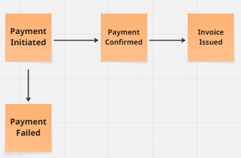

### IoT Monitoring and Notifications BC
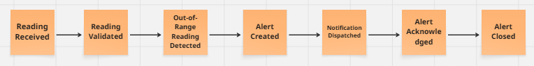

### Space Management BC
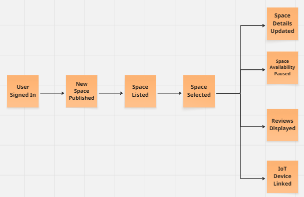

### Report Management BC
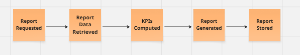
 

A partir de esto, fuimos agrupando aquellos que tenían vínculos más cercanos y separamos los que apenas interactuaban, marcando así límites de consistencia más claros.

### 4.1.1.2. Domain Message Flows Modeling

Posteriormente, se procedió a definir la interconexión estratégica de los bounded contexts delimitados en las fases previas. Este proceso se centró en la identificación y mapeo de eventos de dominio clave, los cuales actúan como el tejido conectivo de la arquitectura distribuida. Al establecer estos puntos de enlace, se garantizó una comunicación asíncrona y desacoplada, permitiendo que el flujo de información entre contextos sea fluido, coherente y respete las reglas de negocio de cada área.

## IAM (Identity and Access Management) - El Punto de Entrada --> Space Management (Gestión de Equipos) - La Configuración

## Space Management (Gestión de Equipos) - La Configuración --> Payment Management - La Activación del Servicio

## Payment Management - La Activación del Servicio --> IoT Monitoring and Notifications - El Core Operativo

## IoT Monitoring and Notifications - El Core Operativo --> Reports and Advanced Features - La Inteligencia de Negocio

 ### 4.1.1.3. Bounded Context Canvases

La separación en bounded contexts permite reducir la complejidad, facilitar la escalabilidad y mantener la coherencia del modelo, garantizando que cada parte del sistema responda a objetivos específicos sin generar dependencias innecesarias.

En Sentrya, los bounded contexts identificados fueron los siguientes:

Registro y Autenticación de Usuario (IAM): Encargado de la validación de identidades de propietarios y técnicos, garantizando el acceso seguro a la infraestructura de remodelación e IoT privada.

Gestión de Espacios (Space Management): Núcleo operativo que organiza la infraestructura física y digital de los espacios, permitiendo definir layouts, gestionar el inventario y vincular dispositivos inteligentes.

Monitoreo y Notificaciones IoT: Responsable de procesar la telemetría de los sensores en tiempo real, identificar anomalías técnicas mediante la detección de incidentes y distribuir alertas automáticas ante eventos relevantes .

Gestión de Pagos (Payment Management): Especializado en el ciclo de vida financiero de las transacciones de remodelación, incluyendo el procesamiento de cobros, reembolsos y la emisión de facturas legales.

Informes y Funciones Avanzadas (Reports): Orientado al procesamiento de datos operativos y financieros para generar métricas de eficiencia, informes de sostenibilidad y tableros de control ejecutivo.

Cada uno de estos bounded contexts se detalla a continuación a través de su canvas, explicando su descripción, clasificación estratégica, roles, comunicaciones entrantes y salientes, lenguaje ubicuo y decisiones de negocio clave.

### Identity & Access Management BC

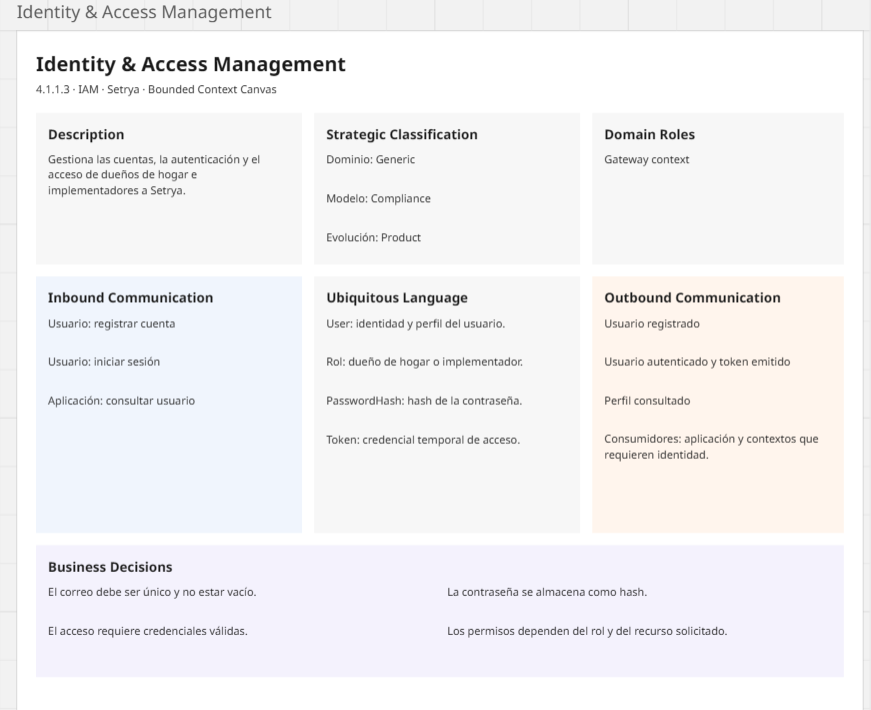

### Space Management BC

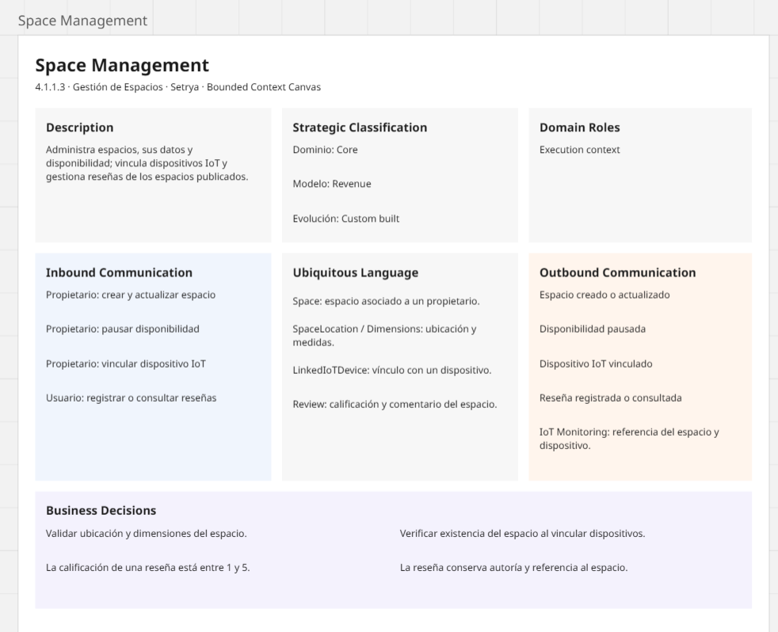

### Iot Monitoring and Notification BC

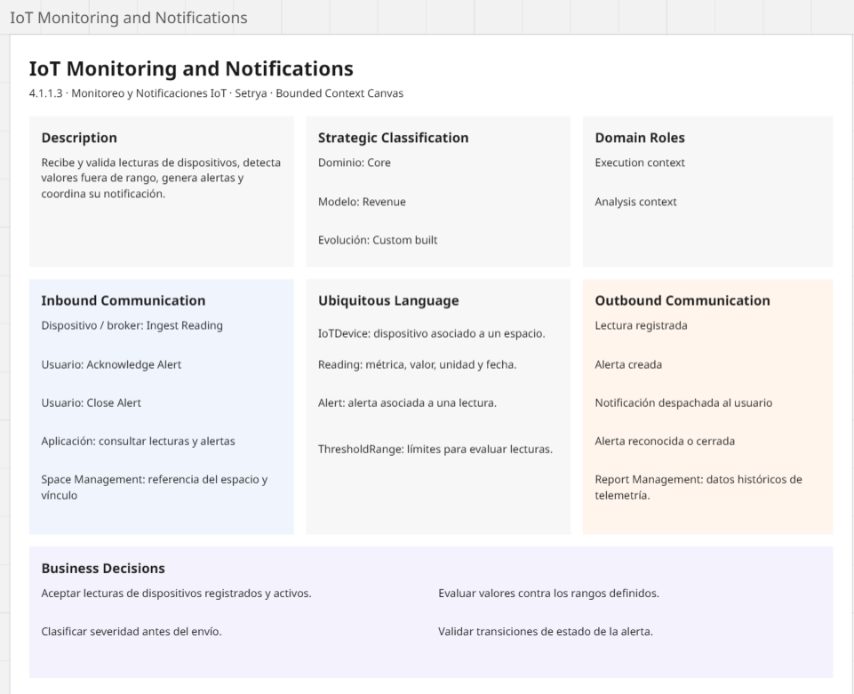

### Payment Management BC

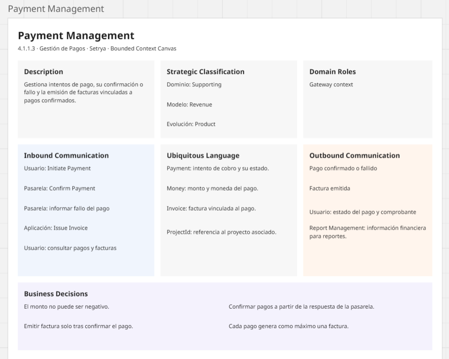

### Reports & Advanced Features BC

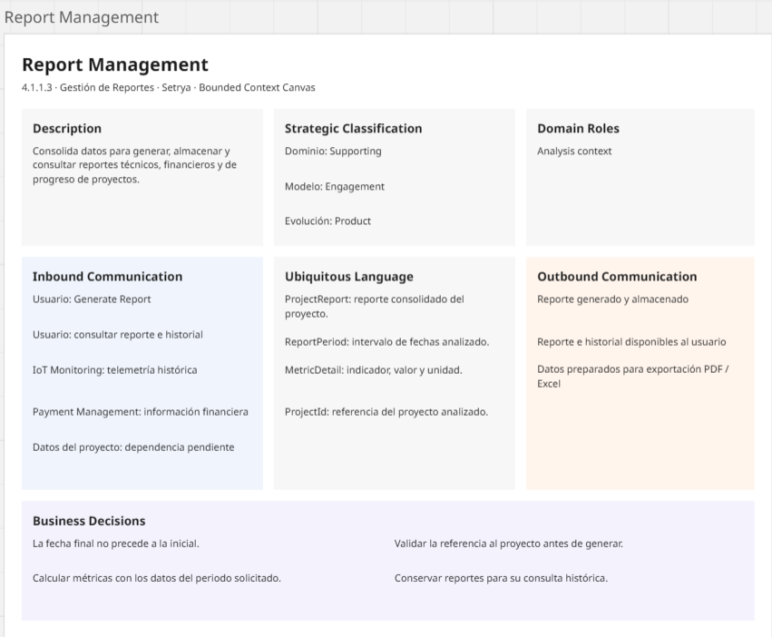

### 4.1.2 Context Mapping
El Context Mapping de Sentrya permite representar la organización general del dominio del sistema y la manera en que sus distintas partes se relacionan entre sí. Esta vista ayuda a delimitar responsabilidades, reducir el acoplamiento y entender con mayor claridad cómo se distribuyen los procesos principales de la solución.
Se identificaron los siguientes bounded context en el sistema:

**Identity & Access Management**

Se encarga del registro, autenticación y control de acceso de los usuarios. Su función principal es permitir que el usuario cree su cuenta, inicie sesión y acceda al sistema de forma segura según su rol. A partir de este contexto se habilita el ingreso a las demás funcionalidades de la plataforma. 

**Space Management**

Se encarga de la gestión de espacios dentro de la plataforma. Aquí se registran, publican, actualizan y administran los espacios que formarán parte del flujo principal del negocio. También concentra la lógica base sobre la cual se conectan los procesos de remodelación, monitoreo y contratación de servicios. 

**Payment Management**

Administra los pagos, cobros, suscripciones y comprobantes relacionados con los servicios contratados en Sentrya. Su función es controlar la parte financiera del sistema y dar trazabilidad a las operaciones económicas asociadas a remodelaciones o servicios del espacio. 

**IoT Monitoring & Notifications**

Se encarga del monitoreo de lecturas, detección de incidentes y envío de notificaciones. Su objetivo es registrar eventos relacionados con el espacio o con el proceso de remodelación, identificar anomalías y comunicar alertas a los usuarios cuando sea necesario. 

**Reports & Advanced Features**

Se encarga de la generación de reportes, métricas e información analítica. Su función es tomar datos producidos por otros contextos y transformarlos en información útil para seguimiento, supervisión y apoyo a la toma de decisiones.

|Destino |Origen |Tipo de relación |Comentario |
|-------|----------|-------------|------------|
|Space Management |Identity & Access Management |Shared Kernel |La gestión de espacios requiere que el usuario esté autenticado y tenga un rol válido dentro del sistema. Por ello, ambos contextos comparten una base mínima de identidad sin mezclar sus responsabilidades. |
|Payment Management |Space Management |Customer/Supplier |Payment Management necesita información generada en Space Management, como espacios, servicios contratados o remodelaciones asociadas, para procesar los cobros y pagos del sistema. |
|IoT Monitoring & Notifications |Space Management |Customer/Supplier |El monitoreo y las notificaciones dependen de un espacio previamente registrado en la plataforma. Por eso, Space Management provee la base del espacio y IoT Monitoring & Notifications usa esa información para gestionar lecturas, alertas e incidentes. |
|Reports & Advanced Features |Payment Management |Conformist |Reports & Advanced Features consume la información financiera generada por Payment Management para construir reportes e indicadores sin modificar el modelo original. |
|Reports & Advanced Features |IoT Monitoring & Notifications |Conformist |Reports & Advanced Features también consume la información producida por IoT Monitoring & Notifications, como alertas, incidentes o eventos, para generar análisis y vistas de seguimiento. |

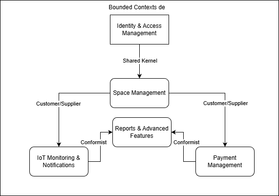

### Identity & Access Management BC

### Payment Management BC

### Iot Monitoring and Notification

### Space Management BC

### Reports & Advanced Features BC

### 4.1.3 Software Architecture
La arquitectura de software de Sentrya ha sido planteada para soportar los procesos principales del negocio de forma organizada y desacoplada. La solución parte de una aplicación móvil desde la cual los usuarios interactúan con la plataforma para gestionar espacios, contratar servicios de remodelación, monitorear el avance del proyecto, recibir alertas y consultar reportes. Para responder a estas necesidades, el sistema se apoya en un backend centralizado que concentra la lógica del negocio y coordina la interacción con los distintos módulos funcionales, como autenticación, gestión de espacios, pagos, monitoreo IoT, notificaciones y reportes. Además, la arquitectura contempla la integración con servicios externos necesarios para el procesamiento de pagos, la generación de comprobantes electrónicos, el envío de correos y la recepción de lecturas o eventos provenientes del entorno monitoreado. Esta organización permite que la solución mantenga una estructura clara, facilite la evolución de sus funcionalidades y soporte de manera consistente el flujo principal de Sentrya.

#### 4.1.3.1. Software Architecture System Landscape Diagram
El diagrama System Landscape de Sentrya presenta una visión general del ecosistema de la solución, identificando sus usuarios principales y los sistemas con los que interactúa. Los dueños de hogar utilizan la plataforma para administrar sus espacios y consultar información de dispositivos, alertas, pagos y reportes, mientras que los implementadores de hogares inteligentes participan en la vinculación de dispositivos y la supervisión de las instalaciones autorizadas. Sentrya centraliza estas funcionalidades mediante sus interfaces web y móvil y se integra con el entorno IoT para recibir mediciones, con una pasarela de pagos para procesar transacciones y con un servicio de correo para enviar notificaciones y comprobantes. Asimismo, se representa un servicio de facturación electrónica como integración propuesta, pendiente de concretar en el diseño táctico. Esta vista delimita los participantes y las relaciones generales del ecosistema, sin detallar los contenedores ni los componentes internos de la plataforma.

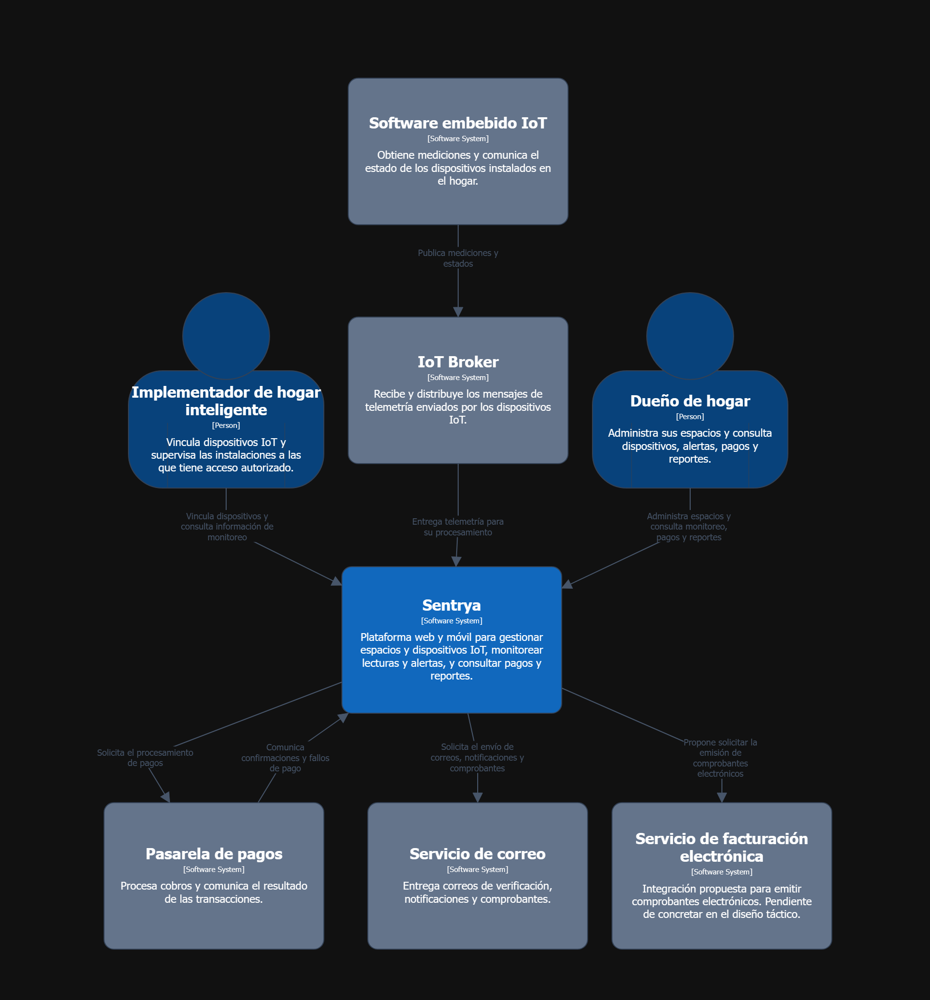

#### 4.1.3.2. Software Architecture Context Level Diagram
El diagrama de contexto de Sentrya representa la plataforma como un único sistema y muestra sus relaciones con los usuarios y sistemas externos que participan directamente en su funcionamiento. Los dueños de hogar utilizan la solución para administrar sus espacios y consultar dispositivos, lecturas, alertas, pagos y reportes. Por su parte, los implementadores de hogares inteligentes vinculan dispositivos y consultan información de monitoreo de las instalaciones autorizadas. Sentrya recibe telemetría mediante un broker IoT, solicita el procesamiento de transacciones a una pasarela de pagos y utiliza un servicio de correo para enviar notificaciones y comprobantes. También contempla una integración propuesta con un servicio de facturación electrónica, pendiente de concretar en el diseño táctico. Esta vista permite identificar los límites de la plataforma y sus dependencias externas, sin detallar su organización interna.

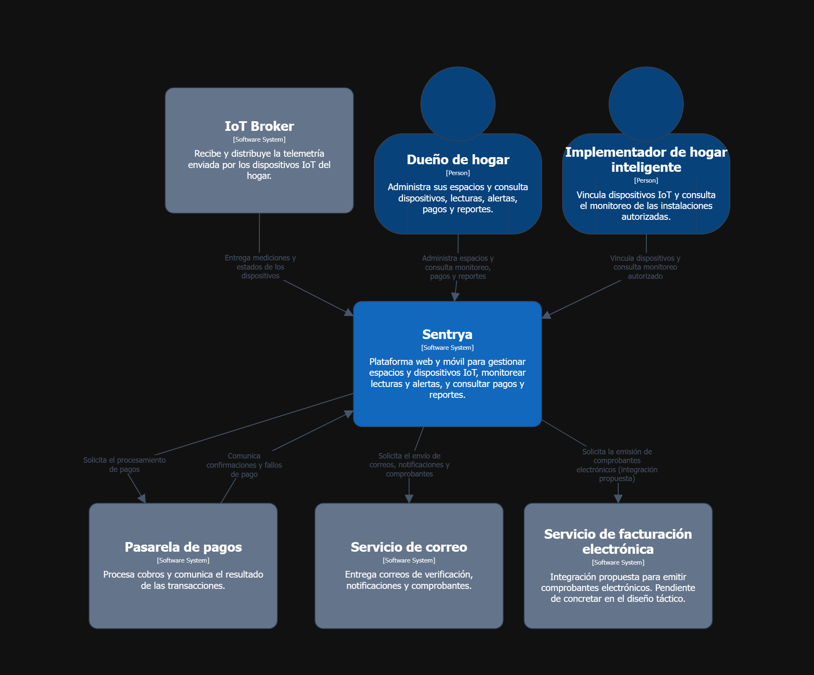

#### 4.1.3.3. Software Architecture Container Level Diagrams
El diagrama de contenedores de Sentrya presenta la organización interna de la plataforma y las responsabilidades de sus principales unidades de software. Los dueños de hogar y los implementadores acceden a las funcionalidades mediante una aplicación móvil y una aplicación web, mientras que la landing page proporciona información general sobre la solución. Ambas aplicaciones se comunican con un API Gateway, que dirige las solicitudes hacia los servicios de identidad y acceso, gestión de espacios, gestión de pagos, gestión de reportes y monitoreo y notificaciones IoT. En esta propuesta, dichos servicios se representan como aplicaciones independientes que utilizan una base de datos relacional común para persistir su información. El servicio de monitoreo recibe las lecturas del entorno IoT y procesa las alertas, mientras que los servicios correspondientes se integran con proveedores externos de pagos y correo. La facturación electrónica externa se mantiene como una integración propuesta, pendiente de concretar en el diseño táctico. Asimismo, la obtención de datos de proyectos para pagos y reportes constituye una dependencia pendiente de delimitar en el apartado 4.2.
 

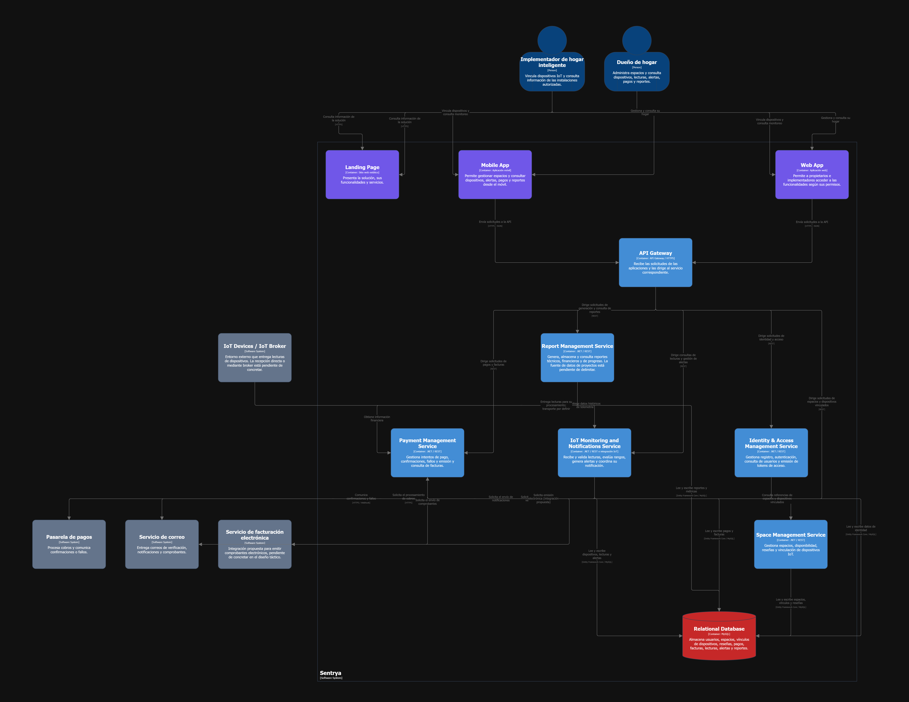

#### 4.1.3.4. Software Architecture Deployment Diagrams.
El diagrama presenta una vista resumida del despliegue propuesto de Sentrya. La aplicación móvil se ejecuta en los dispositivos de los usuarios, mientras que la aplicación web y la Landing Page se alojan en infraestructura web. En la plataforma cloud se encuentra el entorno backend, que aloja el API Gateway y los servicios de identidad y acceso, espacios, pagos, reportes, y monitoreo IoT y notificaciones. Estos servicios utilizan una base de datos relacional MySQL para la persistencia de información.

Para facilitar su lectura, el diagrama agrupa el despliegue del backend en un único nodo y omite las integraciones externas, descritas en los diagramas de contexto y contenedores. Esta agrupación representa su entorno de alojamiento y no modifica la separación funcional de los servicios.

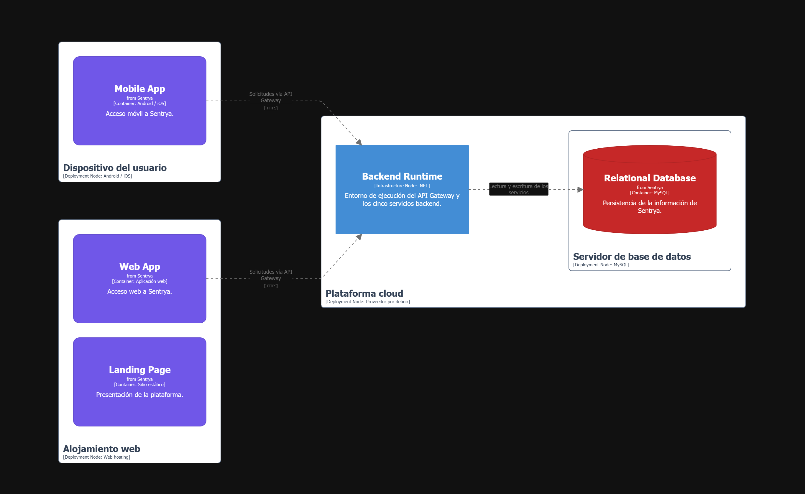

# 4.2. Tactical-Level Domain-Driven Design

## 4.2.1. Bounded Context IAM

### 4.2.1.1. Domain Layer

La capa de dominio de IAM encapsula la lógica de negocio central para la gestión de identidades y seguridad, asegurando que las reglas de autenticación y autorización sean independientes de las tecnologías externas.

### Aggregates

| **Atributo** | **Nombre**  | **Descripción**                                       |
| ------------ | --------- | ----------------------------------------------------- |
| Aggregate Root         | User      | Representa al usuario autenticado en el sistema, conteniendo su identidad y el hash de su contraseña para validación segura.       |

**Métodos:**
- User (Constructor): Además de inicializar las propiedades del usuario, este método realiza una validación de negocio crítica al asegurar que el correo electrónico no esté vacío antes de crear la instancia.
### Value Objects

| **Atributo** | **Nombre**  | **Descripción**                                       |
| ------------ | --------- | ----------------------------------------------------- |
| Value        | Username      | Identificador único de texto utilizado por el usuario para acceder al sistema.      |
| Value        | PasswordHash      | Representación segura de la contraseña tras pasar por un algoritmo de encriptación.      |

### Commands & Queries

| **Atributo** | **Nombre**  | **Tipo**                                       |
| ------------ | --------- | ----------------------------------------------------- |
| Username, Password        | RegisterUserCommand      | Command      |
| Username, Password        | LoginQuery      | Query      |
| UserId        | GetUserByIdQuery      | Query      |

### Domain Services

| **Nombre** | **Funcion**  | **Metodos**                                       |
| ------------ | --------- | ----------------------------------------------------- |
| IPasswordHashingService        | Define el contrato para el cifrado y verificación de contraseñas de seguridad.      | HashPassword, VerifyPassword      |
| ITokenGenerationService        | Define el contrato para la generación de tokens de acceso (JWT) para sesiones autenticadas.      | GenerateToken      |

**Métodos:**

- IPasswordHashingService.HashPassword: Recibe la contraseña en texto plano ingresada por el usuario y la transforma en una cadena cifrada (hash) mediante un algoritmo criptográfico para su almacenamiento seguro.
- IPasswordHashingService.VerifyPassword: Compara una contraseña ingresada en texto claro contra un hash previamente almacenado para verificar si coinciden, permitiendo así el acceso al sistema.
- ITokenGenerationService.GenerateToken: Utiliza la información del objeto User autenticado para generar un token de seguridad (usualmente JWT), el cual servirá como credencial temporal para autorizar las peticiones del cliente en la plataforma.
### Repositories

| **Nombre** | **Descripción**                                     |
| ------------ | --------- |
| IUserRepository        | Interfaz para la persistencia y recuperación de datos de los agregados User.     |

En la Domain Layer de Sentrya, específicamente dentro del Bounded Context de IAM, hemos definido la gestión de identidades bajo un modelo de Domain-Driven Design (DDD). Estas entidades y objetos de valor representan las reglas de negocio fundamentales del sistema de autenticación y autorización para la plataforma de remodelación IoT. La clase User actúa como el Agregado raíz que centraliza la información del perfil y su asociación con roles específicos (como customer o perfiles técnicos), garantizando que el acceso y las credenciales se validen estrictamente a través de servicios de dominio como IPasswordHashingService e ITokenGenerationService. Finalmente, la recuperación y persistencia de estas identidades se gestiona mediante repositorios especializados como IUserRepository.
 
---

### 4.2.1.2. Interface Layer

En la Interface Layer de Sentrya, específicamente para el contexto de IAM, se han definido los puntos de entrada para la comunicación externa. Esta capa utiliza controladores REST, recursos (DTOs) y ensambladores para desacoplar el modelo de dominio de las representaciones externas, facilitando el registro y la autenticación de los usuarios de forma segura.

### Resources

| **Nombre** | **Descripción**  |  
| ------------ | --------- | 
| RegisterUserResource        | DTO que encapsula los datos de entrada (Email, Password, FullName, Phone) para el registro de un nuevo usuario.      | 
| LoginResource        | DTO que contiene las credenciales necesarias (Email, Password) para validar el acceso al sistema.      | 
| UserResource        | DTO de salida que representa la información pública del usuario (ID, Nombre, Email, Rol) tras una consulta exitosa.     | 
| AuthenticatedUserResource        | Recurso que devuelve el token JWT generado y la información básica del usuario tras un inicio de sesión correcto.      | 

### Controllers

| **Nombre** | **Método HTTP**  | **Parámetro / Resource**  | **Descripción** |
| ------------ | --------- | --------- | --------- |
| UsersController        | POST    |RegisterUserResource   | Expone el endpoint para crear una nueva cuenta de usuario en la plataforma.   |
| UsersController        | POST     |  LoginResource |  Gestiona la autenticación, verificando las credenciales y devolviendo el token de acceso.  |
| UsersController        | GET     |  UserId |  Recupera la información detallada de un usuario específico mediante su identificador.  |

### Transformers / Assemblers

| **Nombre** | **Descripción**  |  
| ------------ | --------- | 
| UserResourceFromEntityAssembler        | Se encarga de convertir la entidad de dominio User en un objeto UserResource para su envío a través de la API.     | 
| RegisterUserCommandFromResourceAssembler        | Transforma los datos recibidos en el RegisterUserResource en un comando RegisterUserCommand procesable por la capa de aplicación.      | 

En la Interface Layer de Sentrya, específicamente para el contexto de IAM, los controladores son los encargados de recibir las solicitudes HTTP, dirigirlas a los servicios apropiados y devolver una respuesta adecuada. Estos controladores no contienen reglas de negocio, sino que delegan el procesamiento a la capa de dominio o a los servicios de aplicación, actuando como una interfaz entre los usuarios y la lógica del negocio. Los controladores presentados permiten gestionar el registro de nuevos usuarios y la autenticación segura mediante credenciales dentro de la plataforma de remodelación IoT.
 
---

### 4.2.1.3. Application Layer

En la Application Layer de Sentrya, específicamente para el contexto de IAM, los handlers son los encargados de procesar los comandos y consultas, orquestando la lógica necesaria para cumplir con los casos de uso del sistema. Estos handlers actúan como mediadores entre la interfaz y el dominio, asegurando que las operaciones de registro y autenticación se realicen siguiendo las reglas de negocio establecidas. Los componentes presentados permiten orquestar la seguridad y los perfiles de usuario dentro de la plataforma de remodelación IoT.

|Nombre|Descripcion|Resumen de Logica|
|------|---------|------|
| RegisterUserCommandHandler        | Procesa la creación de nuevas cuentas de usuario.      | Valida que el email no esté en uso, cifra la contraseña usando el servicio de hashing, instancia el agregado User y persiste los cambios a través del repositorio y la unidad de trabajo. | 
| LoginQueryHandler        | Gestiona el proceso de inicio de sesión y autenticación.     | Busca al usuario por email, verifica la validez de la contraseña comparándola con el hash almacenado y genera un token JWT para sesiones seguras. | 
| GetUserByIdQueryHandler        | Recupera la información de un usuario específico.     | Consulta al repositorio de usuarios mediante un identificador único y devuelve un DTO con la información pública y técnica del perfil. | 

### Internal DTOs (Data Transfer Objects)

| **Nombre** | **Descripción**  |  
|------------|------------------|
| UserDto        | Objeto que transporta la información pública y operativa del usuario, incluyendo su rol y foto de perfil.     | 
| AuthenticationDto        | DTO especializado que encapsula la información básica del usuario junto con el token JWT tras una autenticación exitosa.      | 
 
---

### 4.2.1.4. Infrastructure Layer

En la Infrastructure Layer de Sentrya, específicamente para el contexto de IAM, se implementan los detalles técnicos y las integraciones con marcos de trabajo externos. Esta capa se encarga de la persistencia de datos mediante Entity Framework Core (EFC), configurando las entidades del dominio para su mapeo con la base de datos, y de la implementación de los servicios de seguridad como el cifrado de contraseñas y la generación de tokens JWT. Estos componentes aseguran que la lógica de negocio se ejecute sobre una infraestructura robusta y escalable dentro de la plataforma de remodelación IoT.

### Persistence (Repositories Implementation)

| **Nombre** | **Descripción**  |   Tecnologías / Herramientas  |
| ------------ | --------- | --------- | 
| UserRepository        | Implementación concreta de IUserRepository que utiliza EFC para realizar operaciones CRUD sobre la tabla de usuarios.      | Entity Framework Core, LINQ. | 
| UserConfiguration        | Define el mapeo detallado entre la entidad User y la tabla de base de datos, incluyendo restricciones y tipos de datos.     | Fluent API (EFC). | 

### Security Services Implementation

| **Nombre** | **Descripción**  |   Resumen de Implementación  |
| ------------ | --------- | --------- | 
| PasswordHashingService        | Implementación técnica encargada de proteger las contraseñas de los usuarios.      | Utiliza algoritmos de cifrado estándar para generar hashes seguros y validar contraseñas durante el acceso. | 
| TokenGenerationService        |Servicio responsable de la gestión de identidades en tránsito mediante tokens de seguridad.     | Implementa la generación de tokens JWT (JSON Web Tokens), codificando la información del usuario y su rol para la autorización de peticiones. | 

### 4.2.1.5. Bounded Context Software Architecture Component Level Diagrams

### 4.2.1.6. Bounded Context Software Architecture Code Level Diagrams

### 4.2.1.6.1. Bounded Context Domain Layer Class Diagrams

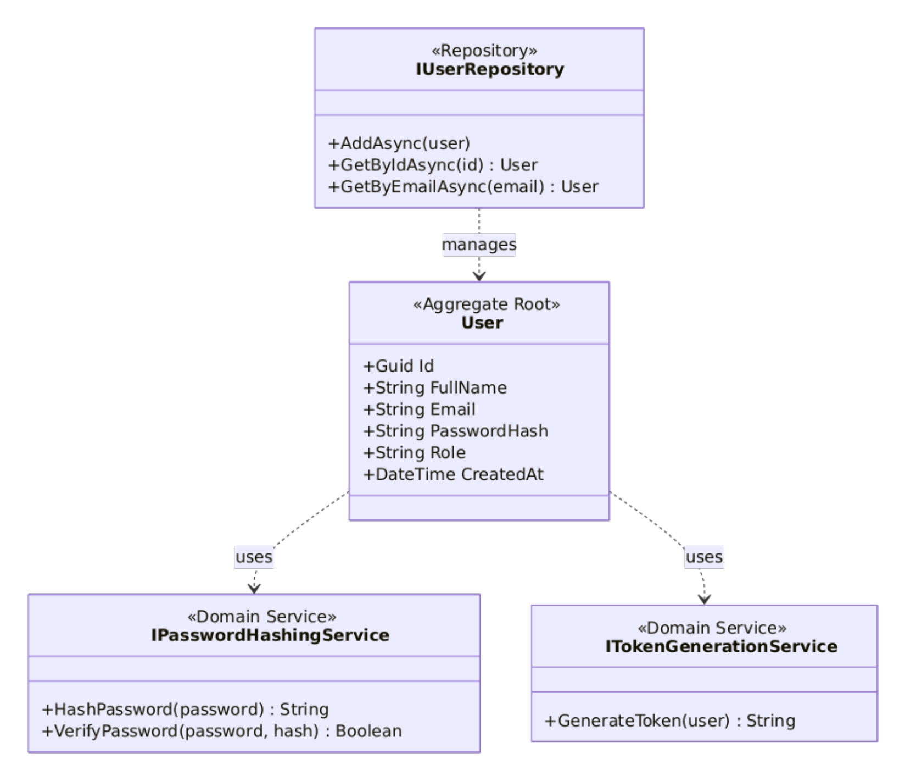

### 4.2.1.6.2. Bounded Context Database Design Diagrams
El diseño de la base de datos para el contexto de IAM se ha normalizado para garantizar la integridad de las identidades y la seguridad de la información financiera. Se compone de dos tablas principales relacionadas mediante una clave foránea.

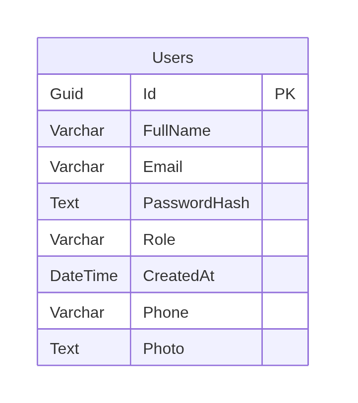

## 4.2.2. Bounded Context: Payment Management

### 4.2.2.1. Domain Layer

La Domain Layer es el núcleo que orquesta y gestiona las reglas de negocio relacionadas con las transacciones financieras y la facturación de servicios en la plataforma Sentrya. En este contexto, entidades como **Payment** e **Invoice**, junto con los objetos de valor y servicios de validación, permiten gestionar el ciclo de vida de los pagos por proyectos de remodelación e infraestructura IoT.

**Objetivo:**

La capa de dominio tiene como objetivo representar las entidades y servicios fundamentales del procesamiento de pagos, cubriendo desde la iniciación de la transacción hasta la emisión de comprobantes fiscales, asegurando la integridad de los montos y la trazabilidad de cada cobro.

## 1. Aggregate: Payment

**Descripción:**

El agregado Payment actúa como la raíz del modelo y encapsula todos los datos y comportamientos relacionados con una transacción económica dentro del sistema. Representa un intento de cobro y contiene la información necesaria para interactuar con pasarelas de pago externas.

### Atributos

| Atributo           | Tipo   | Descripción                                                                 |
|--------------------|--------|-----------------------------------------------------------------------------|
| id                 | Guid   | Identificador único del pago (autogenerado).                               |
| projectId          | Guid   | Identificador del proyecto de remodelación asociado al pago.               |
| amount             | Money  | Objeto de valor que contiene el monto y la moneda.                         |
| status             | String | Estado actual del pago (PENDING, COMPLETED, FAILED).                       |
| externalReference  | String | Código de referencia devuelto por la pasarela de pagos.                    |
| createdAt          | Date   | Fecha de creación del registro de pago.                                    |

### Métodos

- `confirm(String reference)`: Cambia el estado a COMPLETED y vincula la referencia externa.
- `fail(String reason)`: Marca la transacción como fallida y registra el motivo.
- `calculateTax()`: Calcula los impuestos aplicables según el monto total del proyecto.

---

## 2. Value Object: Money

**Descripción:**

El objeto de valor Money representa una cantidad monetaria validada. Es un objeto embebido que asegura que los cálculos financieros se realicen con la precisión correcta y bajo la misma denominación monetaria.

### Atributos

| Atributo | Tipo    | Descripción                     |
|----------|--------|---------------------------------|
| amount   | Decimal | Cantidad numérica del pago.     |
| currency | String  | Código de moneda (ej. USD, PEN).|

### Métodos

- `Money(Decimal amount, String currency)`: Constructor que valida que el monto no sea negativo.
- `add(Money other)`: Suma otro objeto Money validando que la moneda sea idéntica.
- `getFormatted()`: Retorna el monto con el símbolo de moneda correspondiente.

---

## 3. Aggregate: Invoice

**Descripción:**

Representa el documento legal de facturación emitido tras un pago exitoso. Define los permisos y responsabilidades asociados a la documentación fiscal del sistema.

### Atributos

| Atributo      | Tipo   | Descripción                                                   |
|---------------|--------|---------------------------------------------------------------|
| id            | Guid   | Identificador único de la factura.                            |
| paymentId     | Guid   | Referencia al pago confirmado que genera la factura.          |
| invoiceNumber | String | Serie y número correlativo legal del documento.               |
| issuedAt      | Date   | Fecha de emisión de la factura.                               |

### Métodos

- `generateNumber()`: Genera el correlativo legal basado en la serie configurada.
- `voidInvoice()`: Marca la factura como anulada en caso de devoluciones.

---

## 4. Domain Service: PaymentCommandService

**Descripción:**

El servicio PaymentCommandService encapsula las reglas de negocio complejas que involucran la validación de transacciones y la comunicación lógica con el dominio de proyectos.

### Métodos

- `processTransaction(Payment payment)`: Valida la viabilidad de la transacción antes de su persistencia.
- `validatePaymentMethod(Guid methodId)`: Verifica que el método de pago seleccionado esté activo y sea compatible.

---

## 5. Repository: IPaymentRepository

**Descripción:**

El IPaymentRepository es una abstracción para la persistencia de las transacciones en la base de datos, permitiendo realizar operaciones de consulta y guardado de manera efectiva.

### Métodos

- `save(Payment payment)`: Guarda un nuevo pago o actualiza uno existente.
- `findById(Guid id)`: Recupera un pago por su identificador único.
- `findByProjectId(Guid projectId)`: Recupera el historial de pagos asociados a un proyecto.

En la Domain Layer de Sentrya, hemos definido los flujos financieros bajo un modelo de Domain-Driven Design (DDD). Estas entidades y objetos de valor representan las reglas de negocio fundamentales para el procesamiento de cobros y facturación. La clase Payment se asocia con los proyectos de remodelación, y se valida la integridad de los montos a través de servicios como PaymentCommandService y repositorios como IPaymentRepository.

## 4.2.2.2. Interface Layer

La Interface Layer es la capa que expone los endpoints de la aplicación, permitiendo la interacción entre los clientes y el sistema de pagos de Sentrya. Los controladores son responsables de recibir las peticiones, validarlas y coordinar con los servicios correspondientes para ejecutar las transacciones financieras.

En esta capa, no se implementan reglas de negocio, sino que se coordina la comunicación entre las solicitudes de los usuarios y la lógica del dominio.

---

## Controlador: PaymentsController

**Descripción:**

El PaymentsController maneja los endpoints relacionados con la iniciación y el seguimiento de pagos por servicios de remodelación e instalaciones IoT.

### Endpoints

| Método | Ruta                                   | Descripción |
|--------|----------------------------------------|-------------|
| POST   | /api/v1/payments                       | Maneja la solicitud para iniciar un nuevo pago. Recibe un objeto CreatePaymentResource, lo convierte en un comando y llama al servicio de aplicación. Devuelve el recurso del pago creado o un error 400. |
| GET    | /api/v1/payments/{paymentId}           | Recupera la información detallada de un pago específico mediante su ID. Si existe, lo convierte en un recurso y lo devuelve; de lo contrario, retorna un error 404. |
| GET    | /api/v1/projects/{projectId}/payments  | Obtiene el historial de pagos asociados a un proyecto de remodelación específico. |

### Dependencias

- **IPaymentCommandService**: Servicio que maneja los comandos de creación y confirmación de transacciones.
- **IPaymentQueryService**: Servicio encargado de gestionar las consultas de historial de pagos.
- **CreatePaymentCommandFromResourceAssembler**: Utilidad para convertir el recurso de entrada en un comando procesable.
- **PaymentResourceFromEntityAssembler**: Utilidad para convertir la entidad de dominio Payment en un recurso de respuesta para el cliente.

---

## Controlador: InvoicesController

**Descripción:**

El InvoicesController maneja los endpoints relacionados con la obtención y visualización de documentos fiscales electrónicos.

### Endpoints

| Método | Ruta                                   | Descripción |
|--------|----------------------------------------|-------------|
| GET    | /api/v1/invoices/{invoiceId}           | Maneja la solicitud para obtener una factura específica. Llama al servicio de consultas y devuelve el recurso de la factura para su visualización o descarga. |
| GET    | /api/v1/users/{userId}/invoices        | Recupera todas las facturas emitidas para un usuario en particular, permitiendo el seguimiento de sus gastos en la plataforma. |

### Dependencias

- **IInvoiceQueryService**: Servicio encargado de manejar las búsquedas y recuperación de facturas.
- **InvoiceResourceFromEntityAssembler**: Utilidad para transformar las entidades de factura en recursos JSON para la API.

---

## Flujo de Trabajo

### Procesamiento de Pagos
Los usuarios pueden iniciar un pago a través de la API, lo que invoca a los servicios de comando para registrar la transacción y validar los montos con la pasarela externa.

### Gestión de Facturas
Una vez que un pago es confirmado, el sistema genera automáticamente una factura que puede ser consultada por los usuarios y administradores a través del endpoint de facturación.

### Historial por Proyecto
Los administradores pueden consultar todos los pagos realizados dentro del contexto de un proyecto de remodelación IoT para asegurar que el presupuesto se esté ejecutando correctamente.

---

En esta capa de Sentrya, los controladores son los encargados de recibir las solicitudes HTTP, dirigirlas a los servicios apropiados y devolver una respuesta adecuada.

Estos controladores no contienen reglas de negocio, sino que delegan el procesamiento a la capa de dominio o los servicios, actuando como una interfaz entre los clientes (propietarios y técnicos) y la lógica financiera del negocio.

Los controladores presentados permiten gestionar la transaccionalidad económica y la emisión de comprobantes dentro del sistema.

## 4.2.2.3. Application Layer

Esta capa actúa como un orquestador. Recibe comandos y consultas de la capa de interfaz y coordina la ejecución de la lógica del negocio financiero. Es el "intermediario" que traduce las peticiones de los usuarios en acciones del dominio, asegurando que las transacciones y la facturación de servicios IoT se apliquen correctamente.

---

## 1. Servicios de Comando y Consulta (Handlers)

Las implementaciones de los Handlers son responsables de las transacciones (escribir datos) y las consultas (leer datos), respectivamente. Estos servicios usan los repositorios para interactuar con el dominio.

### Handlers

| Nombre                          | Descripción                                                                 | Resumen de Lógica |
|---------------------------------|-----------------------------------------------------------------------------|-------------------|
| CreatePaymentCommandHandler     | Gestiona la creación de una nueva intención de pago en el sistema.         | Valida el ProjectId, instancia el objeto Money, crea el agregado Payment en estado pendiente y lo persiste mediante el repositorio. |
| ConfirmPaymentCommandHandler    | Procesa la confirmación de éxito desde la pasarela externa.                | Recupera el pago, invoca el método confirm() del dominio para cambiar el estado y dispara el evento para la generación de la factura. |
| GetPaymentByIdQueryHandler      | Recupera la información detallada de una transacción.                      | Consulta el IPaymentRepository utilizando el identificador único y devuelve el DTO correspondiente. |
| IssueInvoiceCommandHandler      | Orquesta la generación de documentos fiscales.                             | Verifica que el pago esté completado, genera el correlativo legal para la Invoice y guarda el registro fiscal en la base de datos. |

---

## 2. DTOs Internos (Data Transfer Objects)

Estos objetos se utilizan para transportar datos entre las capas de aplicación e interfaz, manteniendo el dominio limpio de preocupaciones de presentación.

### DTOs

| Nombre                   | Descripción |
|--------------------------|-------------|
| PaymentDto              | Contiene la información operativa del pago, incluyendo el estado, monto y referencia externa para uso interno. |
| InvoiceDto              | Encapsula los datos fiscales necesarios para generar la representación visual o PDF de la factura. |
| TransactionSummaryDto   | Provee una vista simplificada de los movimientos financieros asociados a un proyecto de remodelación. |

---

## 3. Servicios Externos (Outbound Services)

Se utilizan para manejar operaciones técnicas que no forman parte de la lógica de negocio principal, permitiendo que el dominio permanezca enfocado en las reglas financieras de Sentrya.

### Servicios

- **ExternalPaymentGatewayService**: Interfaz que define la comunicación técnica con la pasarela de pagos (ej. Stripe o Culqi) para procesar el cobro real.
- **EmailNotificationService**: Servicio encargado de enviar el comprobante de pago y la factura al correo electrónico del cliente una vez confirmada la operación.

---

En la Application Layer de Sentrya, se implementa el patrón MediatR para desacoplar la intención de la ejecución. Los handlers orquestan el flujo financiero, asegurando que cada pago sea validado y que la facturación electrónica se dispare solo cuando el dominio confirma la transacción. La lógica se valida a través de servicios de aplicación y se persiste mediante los repositorios definidos en la infraestructura.

## 4.2.2.4. Infrastructure Layer

En la Infrastructure Layer de Sentrya, específicamente para el contexto de Payment Management, se implementan los detalles técnicos y las integraciones con marcos de trabajo externos necesarios para la persistencia financiera.

Esta capa se encarga de:
- La gestión de datos mediante Entity Framework Core (EFC).
- La configuración del mapeo de transacciones y facturas con la base de datos MySQL.
- La implementación de servicios de comunicación con pasarelas de pago externas.

Estos componentes aseguran que la lógica financiera se ejecute sobre una infraestructura segura y auditable.

---

## 1. Persistence (Repositories Implementation)

| Nombre                | Descripción                                                                 | Tecnologías / Herramientas |
|-----------------------|-----------------------------------------------------------------------------|-----------------------------|
| PaymentRepository     | Implementación concreta de IPaymentRepository que utiliza EFC para gestionar el almacenamiento de transacciones. | Entity Framework Core, LINQ |
| InvoiceRepository     | Implementación de IInvoiceRepository encargada de persistir los comprobantes fiscales generados por el sistema. | Entity Framework Core |
| PaymentConfiguration  | Define el mapeo detallado entre la entidad Payment y la tabla payments, incluyendo restricciones de precisión para el monto. | Fluent API (EFC) |
| InvoiceConfiguration  | Configura el esquema de base de datos para la entidad Invoice, asegurando la unicidad del número de factura correlativo. | Fluent API (EFC) |

---

## 2. External / Technical Services Implementation

| Nombre                  | Descripción                                                                 | Resumen de Implementación |
|--------------------------|-----------------------------------------------------------------------------|---------------------------|
| StripeGatewayService     | Implementación técnica para la comunicación con la pasarela de pagos externa (Stripe/Culqi). | Utiliza el SDK de la pasarela para procesar el cargo y recibir webhooks de confirmación. |
| PdfInvoiceGenerator      | Servicio técnico responsable de transformar los datos de la factura en un archivo digital. | Implementa la generación de documentos PDF utilizando bibliotecas de renderizado para el cliente. |

## 4.2.2.5. Bounded Context Software Architecture Component Level Diagrams

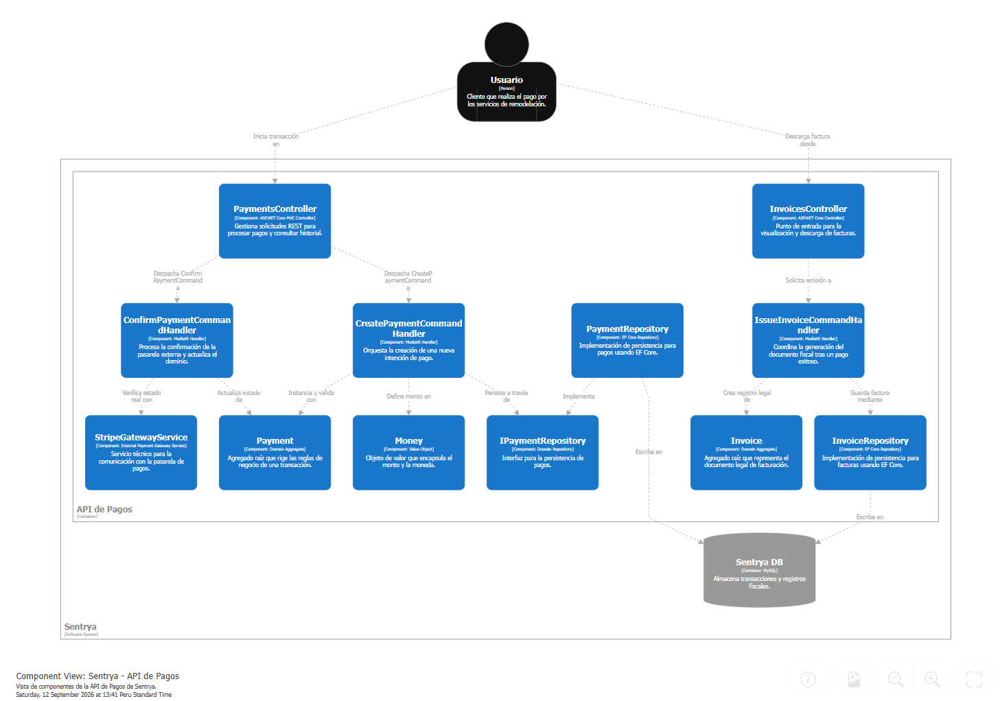

### 4.2.2.6. Bounded Context Software Architecture Code Level Diagrams

### 4.2.2.6.1.  Bounded Context Domain Layer Class Diagrams

El diagrama de clases de la capa de dominio describe la estructura lógica del modelo de negocio financiero. El diseño se centra en el agregado raíz Payment, que rige el flujo transaccional, y el agregado Invoice, que gestiona la documentación fiscal. Se utiliza el objeto de valor Money para garantizar la precisión monetaria.

## Descripción de Elementos del Diagrama

### Payment (Aggregate Root)

Clase principal que encapsula el estado de la transacción.

Características:
- Actúa como **raíz del agregado**.
- Gestiona el ciclo de vida del pago.
- Estados posibles:
    - Pending
    - Completed
    - Failed

Métodos principales:
- `confirm()`: Marca el pago como completado.
- `fail()`: Marca el pago como fallido.

---

### Invoice (Aggregate Root)

Representa el comprobante legal de cobro generado tras un pago exitoso.

Características:
- Se genera automáticamente luego de la confirmación del pago.
- Contiene el número correlativo de facturación.
- Mantiene la trazabilidad legal de la transacción.

---

### Money (Value Object)

Objeto inmutable que representa una cantidad monetaria.

Características:
- Contiene:
    - Monto decimal
    - Código de moneda (ISO 4217)
- Evita errores en cálculos entre distintas divisas.
- Se compara por valor, no por identidad.

---

### Interfaces de Repositorio

#### IPaymentRepository

Define el contrato para la persistencia de pagos.

Responsabilidades:
- Guardar transacciones.
- Recuperar pagos por ID.
- Consultar pagos por proyecto.

---

#### IInvoiceRepository

Define el contrato para la persistencia de facturas.

Responsabilidades:
- Almacenar comprobantes fiscales.
- Recuperar facturas por ID o por pago.
- Mantener la integridad de los registros financieros.

---

## Relación General del Modelo

- **Payment** puede generar una **Invoice** (relación 1:1).
- **Money** es un objeto de valor utilizado dentro de **Payment**.
- Los repositorios abstraen la persistencia de ambos agregados.

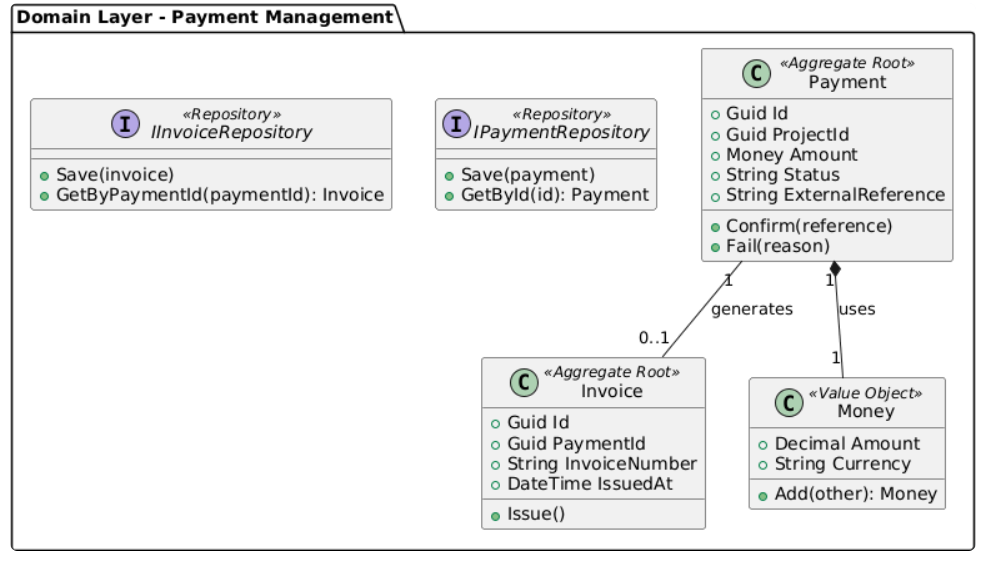

### 4.2.2.6.2. Bounded Context Database Design Diagrams

El diseño de la base de datos para el contexto de Payment Management se ha normalizado para gestionar de manera eficiente el flujo de cobros y la emisión de facturas. El esquema físico garantiza que cada transacción esté vinculada a un proyecto de remodelación y que la documentación fiscal sea inalterable una vez generada.

## Tabla: Payments

Esta tabla registra todos los intentos de pago y transacciones completadas dentro de la plataforma.

| Campo             | Tipo de Dato        | Restricción | Descripción |
|------------------|--------------------|-------------|-------------|
| Id               | Guid / Binary(16)  | PK          | Identificador único de la transacción. |
| ProjectId        | Guid / Binary(16)  | FK          | Referencia al proyecto de remodelación asociado. |
| Amount           | Decimal(18,2)      | Not Null    | Monto de la operación financiera. |
| Currency         | Varchar(10)        | Not Null    | Código de la moneda (ej. "USD", "PEN"). |
| Status           | Varchar(50)        | Not Null    | Estado del pago (Pending, Completed, Failed). |
| ExternalReference| Varchar(255)       | Nullable    | ID de seguimiento provisto por la pasarela de pagos. |
| CreatedAt        | DateTime           | Not Null    | Fecha y hora de creación del registro. |

---

## Tabla: Invoices

Almacena la información de los comprobantes fiscales electrónicos generados tras un pago exitoso.

| Campo         | Tipo de Dato        | Restricción   | Descripción |
|--------------|--------------------|---------------|-------------|
| Id           | Guid / Binary(16)  | PK            | Identificador único de la factura. |
| PaymentId    | Guid / Binary(16)  | FK, Unique    | Referencia al pago que originó la factura. |
| InvoiceNumber| Varchar(100)       | Unique        | Número correlativo legal del documento. |
| IssuedAt     | DateTime           | Not Null      | Fecha de emisión oficial del comprobante. |

---

## Relaciones de Integridad

### Relación Payments - Invoices (1:1)

- Un **Payment** puede generar **una única Invoice**.
- Se establece mediante la clave foránea **PaymentId** en la tabla **Invoices**.
- La restricción **Unique** garantiza que no existan múltiples facturas para un mismo pago.

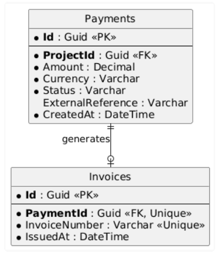

## 4.2.3. Bounded Context: Report Management

## 4.2.3.1. Domain Layer

La Domain Layer en el contexto de Report Management es la encargada de definir la lógica para la agregación de datos y la generación de conocimiento analítico.

A diferencia de otros contextos, este no suele modificar el estado de los proyectos, sino que extrae información para transformarla en métricas clave de desempeño (KPIs) sobre el avance de las remodelaciones y el funcionamiento de los dispositivos IoT.

## 1. Aggregate: ProjectReport

**Descripción:**

Es el agregado raíz que representa un reporte consolidado de un proyecto de remodelación. Contiene el resumen de costos, avances y cumplimiento de cronograma.

### Atributos

| Atributo    | Tipo      | Descripción |
|------------|-----------|-------------|
| id         | Guid      | Identificador único del reporte. |
| projectId  | Guid      | Referencia al proyecto analizado. |
| reportType | String    | Tipo de reporte (Progreso, Financiero, Técnico). |
| generatedAt| DateTime  | Fecha y hora de generación. |
| content    | JSON/Text | Información detallada de los indicadores calculados. |

### Métodos

- `generateSummary()`: Calcula el porcentaje de avance basado en las tareas completadas del proyecto.
- `exportToFormat(String format)`: Prepara la estructura de datos para ser exportada (PDF, Excel).

---

## 2. Value Object: ReportPeriod

**Descripción:**

Objeto de valor que define el rango de tiempo específico que abarca el reporte, asegurando que las fechas de inicio y fin sean lógicas y válidas.

### Atributos

| Atributo  | Tipo     | Descripción |
|----------|----------|-------------|
| startDate| DateTime | Fecha de inicio del análisis. |
| endDate  | DateTime | Fecha de fin del análisis. |

### Métodos

- `isValidRange()`: Verifica que la fecha de fin no sea anterior a la de inicio.
- `getDurationInDays()`: Calcula la cantidad de días analizados en el reporte.

---

## 3. Entity: MetricDetail

**Descripción:**

Entidad que representa un indicador específico dentro de un reporte, como "Consumo Energético" o "Días de retraso".

### Atributos

| Atributo | Tipo   | Descripción |
|----------|--------|-------------|
| id       | Guid   | Identificador de la métrica. |
| name     | String | Nombre del indicador. |
| value    | Double | Valor numérico obtenido. |
| unit     | String | Unidad de medida (ej. "%", "kWh"). |

---

## 4. Domain Service: IReportGenerationService

**Descripción:**

Define el contrato para la lógica compleja de agregación que requiere consultar múltiples fuentes de datos (Proyectos, Pagos e IoT) para construir un reporte integral.

### Métodos

- `calculateProjectKPIs(Guid projectId)`: Ejecuta algoritmos de análisis para determinar el rendimiento del proyecto.
- `aggregateIotData(Guid infrastructureId)`: Consolida los datos históricos de los sensores para el reporte técnico.

---

## 5. Repository: IProjectReportRepository

**Descripción:**

Interfaz que define las operaciones de persistencia para los reportes generados, permitiendo su consulta histórica.

### Métodos

- `save(ProjectReport report)`: Almacena un reporte generado.
- `findByProjectId(Guid projectId)`: Recupera el historial de reportes de un proyecto específico.
- `deleteOldReports(DateTime expirationDate)`: Limpieza de reportes antiguos.

---

En la Domain Layer de Sentrya, el contexto de Report Management utiliza los principios de DDD para asegurar que la generación de reportes sea consistente y precisa. Al separar la lógica de cálculo en servicios de dominio y utilizar objetos de valor como ReportPeriod, se garantiza que la analítica de los proyectos de remodelación IoT sea confiable para la gestión operativa.

## 4.2.3.2. Interface Layer

La Interface Layer en el contexto de Report Management es la encargada de exponer los puntos de acceso (endpoints) para que los usuarios (técnicos y propietarios) puedan solicitar y consultar reportes analíticos.

Esta capa se asegura de que las peticiones HTTP sean válidas y las transforma en comandos o consultas que la capa de aplicación pueda procesar, devolviendo finalmente la información en formatos legibles (Resources/DTOs).

---

## Controlador: ReportsController

**Descripción:**

Este controlador centraliza las operaciones para la generación y recuperación de informes técnicos y financieros de los proyectos de remodelación IoT.

### Endpoints

| Método | Ruta                                   | Descripción |
|--------|----------------------------------------|-------------|
| POST   | /api/v1/reports                        | Recibe una solicitud para generar un nuevo reporte mediante un CreateReportResource. Transforma la petición en un comando de generación y devuelve el reporte procesado. |
| GET    | /api/v1/reports/{reportId}             | Permite obtener el contenido detallado de un reporte específico utilizando su identificador único. |
| GET    | /api/v1/projects/{projectId}/reports   | Recupera el listado histórico de todos los reportes generados para un proyecto de remodelación en particular. |

---

## Dependencias y Transformaciones

- **CreateReportCommandFromResourceAssembler**: Componente encargado de convertir los datos de la solicitud (como el tipo de reporte y el rango de fechas) en un comando de aplicación.
- **ReportResourceFromEntityAssembler**: Utilidad que transforma la entidad de dominio ProjectReport en un recurso JSON estructurado para el cliente.
- **IReportCommandService / IReportQueryService**: Interfaces que desacoplan el controlador de la ejecución lógica de los reportes.

---

## Recursos de Interfaz (DTOs de Entrada/Salida)

| Recurso                | Descripción |
|------------------------|-------------|
| CreateReportResource   | Contiene los parámetros necesarios para la generación (ej. projectId, reportType, startDate, endDate). |
| ReportResource         | Estructura de salida que incluye los KPIs calculados, el resumen ejecutivo y la fecha de generación. |

---

## Flujo de Comunicación

1. El cliente envía una petición **POST** indicando que desea un reporte de "Consumo IoT" para el mes actual.
2. El ReportsController valida la estructura de la petición y utiliza un Assembler para crear el comando interno.
3. La petición se despacha a la capa de aplicación.
4. Una vez generado el reporte, el controlador devuelve un **ReportResource** con un estado HTTP **201 (Created)**.

---

En esta capa de Sentrya, los controladores actúan como el puente entre el mundo exterior y la lógica analítica del sistema. Al seguir el patrón de Clean Architecture, se garantiza que los controladores solo se encarguen de la comunicación HTTP, delegando toda la complejidad del cálculo de métricas a las capas internas de Application y Domain.

## 4.2.3.3. Application Layer

La Application Layer actúa como el motor de orquestación del contexto de reportes. Su función principal es recibir los comandos de generación y las consultas de visualización, coordinando la recolección de datos desde el dominio y otros contextos (como IoT o Proyectos) para transformar información cruda en métricas de valor para el usuario final.

---

## 1. Servicios de Comando y Consulta (Handlers)

En esta sección se definen los Handlers que procesan la lógica de aplicación. Al utilizar MediatR, estos componentes desacoplan la recepción de la solicitud de su ejecución técnica.

### Handlers

| Nombre                              | Descripción                                                     | Resumen de Lógica |
|-------------------------------------|-----------------------------------------------------------------|-------------------|
| GenerateProjectReportCommandHandler | Coordina la creación de un nuevo reporte analítico.             | Valida la existencia del proyecto, solicita al IReportGenerationService el cálculo de los KPIs y persiste el resultado en el repositorio. |
| GetReportByIdQueryHandler           | Recupera un reporte específico por su identificador.            | Consulta el IProjectReportRepository y mapea la entidad de dominio a un DTO de respuesta. |
| GetReportsByProjectIdQueryHandler   | Obtiene el historial de reportes de un proyecto.                | Filtra los registros en la base de datos por el ProjectId y devuelve una colección estructurada. |
| DeleteOldReportsCommandHandler      | Realiza el mantenimiento del historial de reportes.             | Ejecuta una lógica de limpieza basada en la fecha de expiración definida en la configuración del sistema. |

---

## 2. DTOs Internos (Data Transfer Objects)

Estos objetos facilitan el transporte de información entre capas, asegurando que la estructura interna de las entidades de dominio no se exponga directamente a la interfaz.

### DTOs

| Nombre           | Descripción |
|------------------|-------------|
| ReportDto        | Contiene el resumen ejecutivo del reporte, incluyendo los metadatos de generación y el estado del análisis. |
| KpiSummaryDto    | Encapsula los indicadores clave calculados (ej. porcentaje de avance, eficiencia energética, desviación presupuestaria). |
| ReportListDto    | Estructura optimizada para la visualización de listas históricas en el dashboard de Sentrya. |

---

## 3. Servicios Externos (Outbound Services)

Representan las interfaces de comunicación con sistemas o componentes fuera del control directo del dominio de reportes.

### Servicios

- **ProjectDataClient**: Interfaz utilizada para obtener datos en tiempo real del Bounded Context de Project Management (tareas, fechas, hitos).
- **IotTelemetryAggregator**: Servicio encargado de recopilar y promediar los datos históricos de los sensores IoT para incluirlos en los reportes técnicos.
- **ExportService (PDF/Excel)**: Componente técnico de infraestructura que transforma los datos del reporte en archivos descargables para el usuario.

---

En la Application Layer de Sentrya, la lógica se centra en la transformación de datos. Los Command Handlers aseguran que los reportes se generen siguiendo las reglas de negocio del dominio, mientras que los Query Handlers optimizan la entrega de información para que los propietarios y técnicos puedan monitorear el estado de sus proyectos de remodelación de manera eficiente.

## 4.2.3.4. Infrastructure Layer

En la Infrastructure Layer de Sentrya, específicamente para el contexto de Report Management, se implementan los detalles técnicos necesarios para la persistencia de los análisis generados y la integración con herramientas de exportación de datos.

Esta capa:
- Utiliza Entity Framework Core (EFC) para mapear los reportes en la base de datos MySQL.
- Permite almacenar información analítica consolidada.
- Provee servicios técnicos para exportar datos en formatos descargables.

## 1. Persistence (Repositories Implementation)

| Nombre                     | Descripción                                                                 | Tecnologías / Herramientas |
|----------------------------|-----------------------------------------------------------------------------|-----------------------------|
| ProjectReportRepository    | Implementación concreta de IProjectReportRepository que gestiona el almacenamiento y recuperación de informes históricos. | Entity Framework Core, LINQ |
| ReportConfiguration        | Define el mapeo detallado de la entidad ProjectReport, configurando el almacenamiento de los KPIs en formato JSON dentro de la base de datos. | Fluent API (EFC) |
| MetricDetailConfiguration  | Configura la persistencia de los detalles individuales de las métricas asociadas a cada reporte. | Fluent API (EFC) |

---

## 2. External / Technical Services Implementation

| Nombre               | Descripción                                                                 | Resumen de Implementación |
|----------------------|-----------------------------------------------------------------------------|---------------------------|
| ExcelReportExporter  | Servicio técnico que transforma los datos del dominio en hojas de cálculo para análisis externo. | Utiliza bibliotecas como ClosedXML para generar archivos .xlsx. |
| IotTelemetryClient   | Implementación técnica para la obtención de datos históricos de sensores desde el módulo de infraestructura. | Realiza peticiones internas o consultas a la base de datos de telemetría. |

## 4.2.3.5. Bounded Context Software Architecture Component Level Diagrams

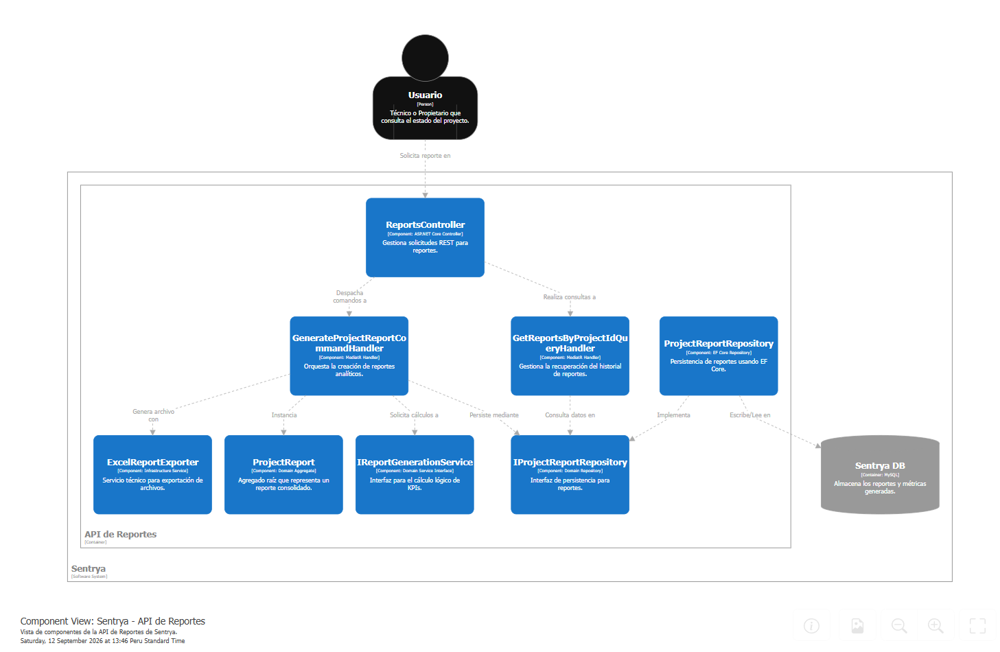

## 4.2.3.6. Bounded Context Software Architecture Code Level Diagrams

## 4.2.3.6.1. Bounded Context Domain Layer Class Diagrams

Descripción de Elementos del Diagrama

ProjectReport (Aggregate Root)

Es la entidad principal que representa un informe consolidado. Encapsula metadatos como el tipo de reporte (Técnico, Financiero o de Progreso) y la fecha de generación.

- Actúa como **raíz del agregado**.
- Gestiona la consistencia interna del reporte.
- Posee una relación de **composición** con sus métricas (MetricDetail).

---

MetricDetail (Entity)

Representa un indicador específico calculado dentro de un reporte.

Ejemplos:
- "Eficiencia Energética"
- "Porcentaje de Avance"

Características:
- Tiene identidad propia dentro del agregado.
- Contiene:
    - Valor numérico
    - Unidad de medida
- Depende del ciclo de vida del **ProjectReport**.

---

ReportPeriod (Value Object)

Objeto inmutable que define el rango de tiempo analizado en el reporte.

Características:
- Contiene:
    - Fecha de inicio
    - Fecha de fin
- Garantiza la validez del intervalo temporal.
- No posee identidad propia (se compara por valor).

---

IReportGenerationService (Domain Service)

Interfaz que define el contrato para los algoritmos de cálculo de reportes.

Responsabilidades:
- Interactuar con otros contextos (Proyectos, IoT, Pagos).
- Extraer y procesar datos.
- Construir el agregado **ProjectReport** con métricas calculadas.

---

IProjectReportRepository (Repository Interface)

Define los métodos necesarios para la persistencia de los reportes.

Responsabilidades:
- Almacenar reportes generados.
- Recuperar reportes por **ProjectId**.
- Mantener historial de análisis.

---

## Relación General del Modelo

- **ProjectReport** contiene múltiples **MetricDetail** (1:N).
- **ReportPeriod** es un objeto de valor utilizado por el reporte.
- **IReportGenerationService** construye el agregado.
- **IProjectReportRepository** gestiona su persistencia.

---

## Nota

Este modelo sigue los principios de **Domain-Driven Design (DDD)**:
- Separación clara entre entidades y objetos de valor.
- Uso de agregados para mantener consistencia.
- Servicios de dominio para lógica compleja.

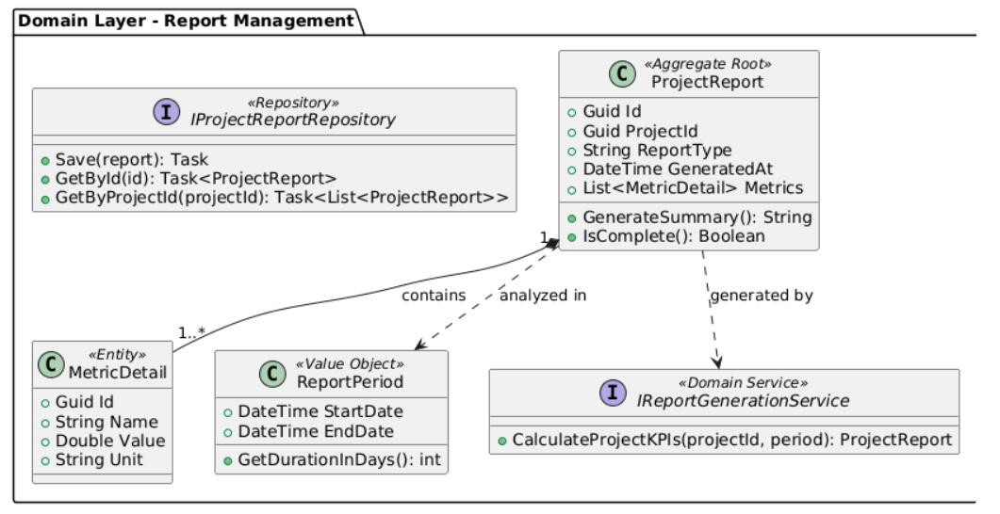

## 4.2.3.6.2. Bounded Context Database Design Diagrams

El esquema de base de datos para Report Management se ha diseñado para ofrecer una trazabilidad completa de los análisis realizados sobre los proyectos de remodelación.

La estructura permite almacenar datos agregados de sensores IoT y estados de obra, organizándolos en tablas relacionales que optimizan la consulta histórica de métricas de desempeño.

---

## Tabla: ProjectReports

Esta tabla almacena los metadatos de cada informe generado en la plataforma.

| Campo        | Tipo de Dato        | Restricción | Descripción |
|-------------|--------------------|-------------|-------------|
| Id          | Guid / Binary(16)  | PK          | Identificador único del reporte. |
| ProjectId   | Guid / Binary(16)  | FK          | Referencia al proyecto analizado (vínculo con Project BC). |
| ReportType  | Varchar(50)        | Not Null    | Categoría del informe (ej. "Técnico", "Financiero"). |
| GeneratedAt | DateTime           | Not Null    | Marca de tiempo exacta de la creación del informe. |

---

## Tabla: MetricDetails

Contiene los valores específicos de los indicadores calculados que componen un reporte.

| Campo     | Tipo de Dato        | Restricción | Descripción |
|----------|--------------------|-------------|-------------|
| Id       | Guid / Binary(16)  | PK          | Identificador único de la métrica. |
| ReportId | Guid / Binary(16)  | FK          | Referencia al reporte contenedor (Tabla ProjectReports). |
| Name     | Varchar(100)       | Not Null    | Nombre del indicador (ej. "Energy Efficiency"). |
| Value    | Double             | Not Null    | Valor numérico del KPI obtenido. |
| Unit     | Varchar(20)        | Not Null    | Unidad de medida (ej. "%", "kWh", "Days"). |

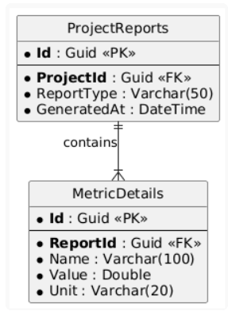

## 4.2.4. Bounded Context: Space Management

### 4.2.4.1. Domain Layer

La Domain Layer es el núcleo que gestiona las reglas de negocio relacionadas con la administración de espacios dentro de la plataforma Sentrya. En este contexto, entidades como Space y LinkedIoTDevice, junto con objetos de valor y servicios de dominio, permiten registrar espacios, actualizar su información, controlar su disponibilidad y vincular dispositivos IoT para el monitoreo posterior. Adicionalmente, el agregado Review permite a los usuarios calificar y comentar los espacios publicados.

Objetivo:

La capa de dominio tiene como objetivo representar los elementos fundamentales para la gestión de espacios, cubriendo desde la publicación de un nuevo espacio hasta la actualización de sus detalles, el control de su disponibilidad y la recopilación de retroalimentación de los usuarios a través de reseñas.

## 1. Aggregate: Space

**Descripción:**

El agregado Space actúa como la raíz del modelo y encapsula la información principal de un espacio registrado en Sentrya. Representa el ambiente físico que será publicado, editado, pausado o monitoreado dentro del sistema.

### Atributos

| Atributo           | Tipo   | Descripción                                                                 |
|--------------------|--------|-----------------------------------------------------------------------------|
| id                 | Guid   | Identificador único del espacio.                            |
| ownerId          | Guid   | Identificador del usuario propietario del espacio.               |
| name             | String  | Nombre del espacio registrado.                    |
| description             | String | Descripción general del espacio.                    |
| location  | SpaceLocation | Objeto de valor que representa la ubicación del espacio.           |
| dimensions          | SpaceDimensions   | Objeto de valor que representa las dimensiones físicas del espacio.                                   |
| status  | String | Estado actual del espacio: publicado, pausado o no disponible.                 |
| createdAt          | DateTime   | Fecha de creación del registro del espacio.                                  |

### Métodos

- `publish()` : Cambia el estado del espacio a publicado cuando contiene la información necesaria.
- `updateDetails(name, description, location)`: Actualiza los datos principales del espacio.
- `pauseAvailability()`: Pausa temporalmente la disponibilidad del espacio.
- `linkIoTDevice(device)` : Asocia un dispositivo IoT al espacio para permitir su monitoreo.
---

## 2. Value Object: SpaceLocation

**Descripción:**

El objeto de valor SpaceLocation representa la ubicación del espacio registrado. Permite mantener agrupados los datos relacionados con dirección, distrito y ciudad.

### Atributos

| Atributo | Tipo    | Descripción                     |
|----------|--------|---------------------------------|
| address   | String | Dirección principal del espacio.     |
| district | String  | Distrito donde se ubica el espacio. |
| city | String  | Ciudad correspondiente al espacio. |

### Métodos

- `getFullAddress()` : Retorna la dirección completa del espacio en formato legible.
- `isValid()` : Valida que la ubicación cuente con los datos mínimos requeridos.
---

## 3. Value Object: SpaceDimensions

**Descripción:**

El objeto de valor SpaceDimensions representa las medidas físicas del espacio. Esta información permite describir mejor el ambiente y apoyar decisiones relacionadas con remodelación o monitoreo.

### Atributos

| Atributo      | Tipo   | Descripción                                                   |
|---------------|--------|-----------------------------------------------------------------|
| width            | Decimal   | Ancho del espacio.                          |
| length     | Decimal   | Largo del espacio.         |
| area | Decimal | Área total calculada del espacio.              |

### Métodos

- `calculateArea()` : Calcula el área total del espacio a partir del ancho y largo.
- `isValid()` : Verifica que las dimensiones ingresadas sean mayores a cero.
---

## 4. Entity: LinkedIoTDevice

**Descripción:**

La entidad LinkedIoTDevice representa un dispositivo IoT vinculado a un espacio específico. Su función es registrar qué dispositivo está asociado al espacio para permitir el monitoreo operativo desde otro bounded context. Al ser una entidad dependiente, su ciclo de vida y persistencia están subordinados al agregado Space.

### Atributos

| Atributo      | Tipo   | Descripción                                                   |
|---------------|--------|-----------------------------------------------------------------|
| id            | Guid   | Identificador único del vínculo.                          |
| spaceId     | Guid   | Identificador del espacio asociado.         |
| deviceId | Guid | Identificador del dispositivo IoT vinculado.              |
| deviceType            | String   | Tipo de dispositivo o sensor asociado.                          |
| status     | String   | Estado del dispositivo vinculado.         |
| linkedAt | DateTime | Fecha en que el dispositivo fue asociado al espacio.              |

### Métodos

- `activate()` : Activa el dispositivo vinculado al espacio.
- `deactivate()` : Desactiva el dispositivo vinculado.
- `isLinkedTo(spaceId)` : Verifica si el dispositivo pertenece al espacio indicado.
---

## 5. Aggregate: Review

**Descripción:**

El agregado Review actúa como raíz independiente y representa la calificación y comentario que un usuario deja sobre un espacio publicado. Se modela como su propio Aggregate Root — y no como entidad dependiente de Space — porque una reseña tiene identidad, autoría y ciclo de vida propios (puede editarse o eliminarse sin afectar la consistencia del agregado Space), y porque su volumen de escritura/lectura es independiente del de los espacios.

### Atributos

| Atributo   | Tipo     | Descripción                                                        |
|------------|----------|----------------------------------------------------------------------|
| id         | Guid     | Identificador único de la reseña.                                   |
| spaceId    | Guid     | Referencia al espacio calificado (no navegación directa al agregado Space). |
| authorId   | Guid     | Referencia al usuario autor de la reseña (Bounded Context IAM).     |
| rating     | Integer  | Calificación numérica otorgada al espacio (rango 1-5).              |
| comment    | String   | Comentario textual asociado a la calificación.                      |
| createdAt  | DateTime | Fecha de creación de la reseña.                                     |

### Métodos

- `updateContent(rating, comment)` : Permite al autor editar la calificación y/o el comentario de su reseña.
- `belongsToSpace(spaceId)` : Verifica si la reseña corresponde al espacio indicado.
---

## 6. Domain Service: SpaceCommandService

**Descripción:**

El servicio SpaceCommandService encapsula reglas de negocio relacionadas con la publicación, actualización y disponibilidad de espacios dentro de Sentrya.

### Métodos

- `publishSpace(Space space)` : Valida y publica un nuevo espacio en la plataforma.
- `updateSpaceDetails(Space space)` : Coordina la actualización de información del espacio.
- `pauseSpaceAvailability(Guid spaceId)` : Cambia el estado del espacio a pausado.
- `linkDeviceToSpace(Guid spaceId, Guid deviceId)` : Valida y vincula un dispositivo IoT al espacio.
---

## 7. Repository: ISpaceRepository

**Descripción:**

El ISpaceRepository es una abstracción para la persistencia de espacios (y de sus dispositivos IoT vinculados, al ser entidades dependientes del agregado) dentro de la base de datos, permitiendo realizar operaciones de consulta y guardado de manera ordenada.

### Métodos

- `save(Space space)` : Guarda un nuevo espacio o actualiza uno existente, incluyendo los dispositivos IoT vinculados.
- `findById(Guid id)` : Recupera un espacio por su identificador único.
- `findByOwnerId(Guid ownerId)` : Recupera los espacios asociados a un propietario.
- `delete(Guid id)` : Elimina o desactiva un espacio registrado.
---

## 8. Repository: IReviewRepository

**Descripción:**

El IReviewRepository es una abstracción para la persistencia del agregado Review, independiente de ISpaceRepository dado que Review es su propia raíz de agregado.

### Métodos

- `save(Review review)` : Guarda una nueva reseña o actualiza una existente.
- `findById(Guid id)` : Recupera una reseña por su identificador único.
- `findBySpaceId(Guid spaceId)` : Recupera todas las reseñas asociadas a un espacio.
  En la Domain Layer de Sentrya, específicamente dentro del bounded context Space Management, se define la lógica principal para registrar, publicar, actualizar y pausar espacios dentro de la plataforma. La clase Space actúa como agregado raíz, mientras que SpaceLocation, SpaceDimensions y LinkedIoTDevice complementan la información necesaria para representar el espacio y su relación con el monitoreo IoT. El agregado Review, independiente de Space, permite capturar la retroalimentación de los usuarios sobre los espacios publicados. Las operaciones principales se coordinan mediante el servicio SpaceCommandService y la persistencia se abstrae a través de ISpaceRepository e IReviewRepository.

---

### 4.2.4.2. Interface Layer

La Interface Layer es la capa que expone los endpoints de la aplicación, permitiendo la interacción entre los usuarios y la gestión de espacios dentro de Sentrya. Los controladores son responsables de recibir las peticiones, validarlas y coordinar con los servicios correspondientes para registrar espacios, actualizar su información, controlar su disponibilidad, vincular dispositivos IoT y gestionar reseñas.

En esta capa no se implementan reglas de negocio, sino que se coordina la comunicación entre las solicitudes de los usuarios y la lógica del dominio.
 
---

## Controlador: SpacesController

**Descripción:**

El SpacesController maneja los endpoints relacionados con la creación, consulta, actualización y control de disponibilidad de los espacios registrados en la plataforma.

### Endpoints

| Método | Ruta                                   | Descripción |
|--------|----------------------------------------|-------------|
| POST   | /api/v1/spaces                       | Maneja la solicitud para publicar un nuevo espacio. Recibe un objeto CreateSpaceResource, lo convierte en un comando y llama al servicio de aplicación. |
| GET    | /api/v1/spaces/{spaceId}           | Recupera la información detallada de un espacio específico mediante su identificador. |
| GET    | /api/v1/owners/{ownerId}/spaces  | Obtiene la lista de espacios registrados por un propietario específico. |
| PUT    | /api/v1/spaces/{spaceId}           | Permite actualizar los datos principales de un espacio, como nombre, descripción, ubicación o dimensiones. |
| PATCH    | /api/v1/spaces/{spaceId}/pause  | Cambia el estado del espacio para pausar temporalmente su disponibilidad. |

### Dependencias

- **ISpaceCommandService**: Servicio que maneja los comandos de creación, actualización y pausa de espacios.
- **ISpaceQueryService**: Servicio encargado de gestionar las consultas de espacios registrados.
- **CreateSpaceCommandFromResourceAssembler**: Utilidad para convertir el recurso de creación en un comando procesable.
- **UpdateSpaceCommandFromResourceAssembler**: Utilidad para transformar el recurso de actualización en un comando.
- **SpaceResourceFromEntityAssembler**: Utilidad para convertir la entidad de dominio Space en un recurso de respuesta para la API.
---

## Controlador: SpaceDevicesController

**Descripción:**

El SpaceDevicesController maneja los endpoints relacionados con la vinculación, consulta y desvinculación de dispositivos IoT asociados a un espacio. Este controlador permite conectar la gestión del espacio con el posterior monitoreo IoT.

### Endpoints

| Método | Ruta                                   | Descripción |
|--------|----------------------------------------|-------------|
| POST    | /api/v1/spaces/{spaceId}/devices           | Permite vincular un dispositivo IoT a un espacio específico para habilitar su monitoreo. |
| GET    | /api/v1/spaces/{spaceId}/devices        | Recupera los dispositivos IoT asociados a un espacio registrado. |
| PATCH    | /api/v1/spaces/{spaceId}/devices/{deviceId}/deactivate        | Desactiva la vinculación de un dispositivo IoT cuando ya no será utilizado para el monitoreo del espacio. |

### Dependencias

- **ISpaceDeviceCommandService**: Servicio encargado de procesar comandos relacionados con la vinculación de dispositivos IoT.
- **ISpaceDeviceQueryService**: Servicio encargado de consultar dispositivos vinculados a espacios.
- **LinkIoTDeviceCommandFromResourceAssembler**: Utilidad para convertir el recurso de vinculación en un comando procesable.
- **LinkedIoTDeviceResourceFromEntityAssembler**: Utilidad para transformar la entidad LinkedIoTDevice en un recurso de respuesta.
---

## Controlador: SpaceReviewsController

**Descripción:**

El SpaceReviewsController maneja los endpoints relacionados con la creación y consulta de reseñas asociadas a un espacio publicado.

### Endpoints

| Método | Ruta                                   | Descripción |
|--------|----------------------------------------|-------------|
| POST   | /api/v1/spaces/{spaceId}/reviews       | Permite a un usuario registrar una nueva reseña (calificación y comentario) sobre un espacio. |
| GET    | /api/v1/spaces/{spaceId}/reviews       | Recupera todas las reseñas asociadas a un espacio específico. |

### Dependencias

- **IReviewCommandService**: Servicio encargado de procesar comandos de creación de reseñas.
- **IReviewQueryService**: Servicio encargado de consultar reseñas registradas.
- **AddReviewCommandFromResourceAssembler**: Utilidad para convertir el recurso de entrada en un comando procesable.
- **ReviewResourceFromEntityAssembler**: Utilidad para transformar la entidad de dominio Review en un recurso de respuesta.
---

## Flujo de Trabajo

### Gestión de Espacios
Los usuarios propietarios pueden registrar un nuevo espacio a través de la API, lo que invoca los servicios de comando para validar la información, crear la entidad correspondiente y persistirla en el sistema.

### Actualización y Disponibilidad
Una vez creado el espacio, el propietario puede modificar sus datos principales o pausar temporalmente su disponibilidad. Estas operaciones son recibidas por el controlador y delegadas a la capa de aplicación para mantener la consistencia del dominio.

### Vinculación de Dispositivos IoT
Cuando un espacio requiere monitoreo, el sistema permite vincular dispositivos IoT mediante endpoints específicos. Esta información queda asociada al espacio y sirve como base para que el contexto de IoT Monitoring and Notifications pueda procesar lecturas posteriormente.

### Reseñas de Espacios
Los usuarios pueden registrar una calificación y comentario sobre un espacio publicado, y consultar el historial de reseñas asociadas a dicho espacio.
 
---

En esta capa de Sentrya, los controladores se encargan de recibir las solicitudes HTTP, dirigirlas a los servicios apropiados y devolver una respuesta adecuada.

Estos controladores no contienen reglas de negocio, sino que delegan el procesamiento a la capa de dominio o a los servicios de aplicación, actuando como una interfaz entre los usuarios propietarios y la gestión interna de espacios.

Los controladores presentados permiten gestionar la publicación, actualización, disponibilidad, vinculación de dispositivos IoT y reseñas dentro del contexto Space Management.
 
---

### 4.2.4.3. Application Layer

Esta capa actúa como un orquestador. Recibe comandos y consultas desde la capa de interfaz y coordina la ejecución de la lógica asociada a la gestión de espacios dentro de Sentrya. Es el intermediario que traduce las solicitudes de los usuarios en acciones del dominio, asegurando que la creación, actualización, consulta y control de disponibilidad de los espacios, la vinculación y desvinculación de dispositivos IoT, y el registro de reseñas se apliquen correctamente.

### Commands & Queries Handlers

|Nombre|Descripcion|Resumen de Logica|
|------|---------|------|
| CreateSpaceCommandHandler        | Gestiona la creación de un nuevo espacio dentro del sistema.    | Valida los datos básicos del espacio, instancia el agregado Space y lo persiste mediante el repositorio correspondiente. | 
| UpdateSpaceDetailsCommandHandler        | Procesa la actualización de la información principal de un espacio.  | Recupera el espacio por su identificador, actualiza sus atributos permitidos y guarda los cambios en el repositorio. | 
| PauseSpaceAvailabilityCommandHandler        | Orquesta el cambio de estado de disponibilidad de un espacio.  | Busca el espacio, ejecuta la operación de pausa de disponibilidad en el dominio y persiste el nuevo estado. | 
| LinkIoTDeviceCommandHandler        | Gestiona la vinculación de un dispositivo IoT a un espacio.     | Recupera el agregado Space, ejecuta `space.linkIoTDevice(device)` y persiste el agregado completo mediante ISpaceRepository. | 
| DeactivateIoTDeviceCommandHandler        | Gestiona la desvinculación lógica de un dispositivo IoT asociado a un espacio.     | Recupera el agregado Space, invoca `LinkedIoTDevice.deactivate()` sobre el dispositivo correspondiente y persiste el agregado mediante ISpaceRepository. | 
| AddReviewCommandHandler        | Procesa el registro de una nueva reseña sobre un espacio.     | Valida que el espacio exista, instancia el agregado Review con el rating y comentario proporcionados, y lo persiste mediante IReviewRepository. | 
| GetSpaceByIdQueryHandler        | Recupera la información detallada de un espacio específico.   | Consulta ISpaceRepository utilizando el identificador único y devuelve el DTO correspondiente. | 
| GetSpacesByOwnerIdQueryHandler        | Obtiene la lista de espacios asociados a un propietario.   | Consulta ISpaceRepository por propietario y devuelve una colección resumida para visualización. | 
| GetLinkedDevicesBySpaceIdQueryHandler        | Recupera los dispositivos IoT vinculados a un espacio.   | Consulta ISpaceRepository utilizando el identificador del espacio y devuelve la colección de `LinkedIoTDevice` asociados al agregado. | 
| GetReviewsBySpaceIdQueryHandler        | Recupera las reseñas asociadas a un espacio.     | Consulta IReviewRepository utilizando el identificador del espacio y devuelve la colección de reseñas correspondiente. | 

### Internal DTOs (Data Transfer Objects)

| **Nombre** | **Descripción**  |  
| ------------ | --------- |
| SpaceDto        | Contiene la información principal del espacio, incluyendo identificador, nombre, tipo, estado y datos generales para uso interno.    | 
| SpaceAvailabilityDto        | Encapsula la información relacionada con la disponibilidad del espacio, incluyendo su estado actual y observaciones asociadas.   | 
| LinkedIoTDeviceDto        | Representa la información básica de un dispositivo IoT vinculado a un espacio para su consulta interna.     | 
| SpaceSummaryDto        | Provee una vista simplificada de los espacios registrados por un propietario, útil para listados y paneles de consulta.    | 
| ReviewDto        | Contiene la información de una reseña, incluyendo identificador, autor, calificación, comentario y fecha de creación.    | 

En la Application Layer de Sentrya, los handlers orquestan los flujos de gestión de espacios, dispositivos vinculados y reseñas, asegurando que cada operación sea validada y ejecutada correctamente antes de persistirse. La lógica se coordina a través de servicios de aplicación y repositorios, permitiendo mantener separado el dominio de la infraestructura y de la presentación.
 
---

### 4.2.4.4. Infrastructure Layer

En la Infrastructure Layer de Sentrya, específicamente para el contexto de Space Management, se implementan los detalles técnicos necesarios para la persistencia de espacios, dispositivos IoT vinculados y reseñas. Esta capa permite almacenar la información del espacio, configurar su mapeo con la base de datos y dar soporte técnico a las operaciones de creación, actualización, consulta, pausa de disponibilidad y registro de reseñas.

Esta capa se encarga de:

- La gestión de datos mediante Entity Framework Core (EFC).
- La configuración del mapeo de espacios, dispositivos vinculados y reseñas con la base de datos MySQL.
- La implementación de servicios técnicos de apoyo para la administración de disponibilidad e información del espacio.
  Estos componentes permiten que la lógica de gestión de espacios se ejecute sobre una infraestructura organizada y mantenible.

### Persistence (Repositories Implementation)

| **Nombre** | **Descripción**  |   Tecnologías / Herramientas  |
| ------------ | --------- | --------- |
| SpaceRepository        | Implementación concreta de ISpaceRepository que utiliza EFC para realizar operaciones CRUD sobre espacios y sus dispositivos IoT vinculados.      | Entity Framework Core, LINQ. | 
| ReviewRepository        | Implementación concreta de IReviewRepository que utiliza EFC para persistir y recuperar reseñas asociadas a los espacios.     | Entity Framework Core, LINQ. | 
| SpaceConfiguration        | Define el mapeo detallado entre la entidad Space y su tabla, incluyendo los objetos de valor embebidos SpaceLocation y SpaceDimensions.     | Fluent API (EFC). | 
| LinkedIoTDeviceConfiguration        | Configura el mapeo de LinkedIoTDevice como entidad dependiente dentro del agregado Space, estableciendo la relación con la tabla de espacios.     | Fluent API (EFC). |  
| ReviewConfiguration        | Configura el mapeo de la entidad Review, incluyendo la referencia (no navegación) hacia SpaceId y AuthorId.     | Fluent API (EFC). |  

### Technical Services Implementation

| **Nombre** | **Descripción**  |   Resumen de Implementación  |
| ------------ | --------- | --------- | 
| SpaceAvailabilityService      | Servicio técnico de apoyo para actualizar el estado de disponibilidad de un espacio.     | Gestiona cambios de estado como publicado, pausado o no disponible, persistiendo la actualización mediante el repositorio. | 
| SpaceDeviceLinkingService        | Servicio encargado de apoyar la vinculación técnica entre espacios y dispositivos IoT.   |Registra la asociación entre un espacio y un dispositivo, dejando la información lista para que sea utilizada por el contexto de monitoreo IoT. | 

En la Infrastructure Layer de Sentrya, dentro del bounded context Space Management, se implementan los repositorios y configuraciones necesarias para almacenar espacios, dispositivos vinculados y reseñas. Asimismo, los servicios técnicos permiten apoyar la disponibilidad del espacio y su relación con dispositivos IoT, manteniendo separados los detalles de infraestructura de la lógica principal del dominio.

### 4.2.4.5. Bounded Context Software Architecture Component Level Diagrams

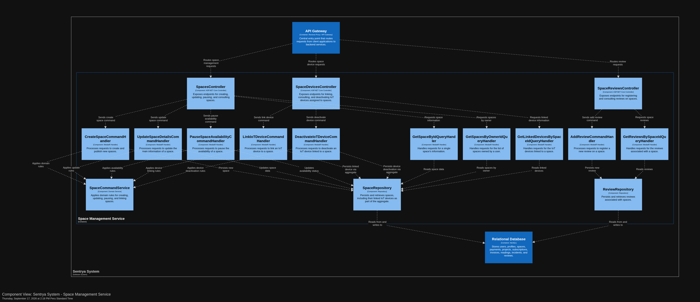

### 4.2.4.6. Bounded Context Software Architecture Code Level Diagrams

### 4.2.4.6.1. Bounded Context Domain Layer Class Diagrams

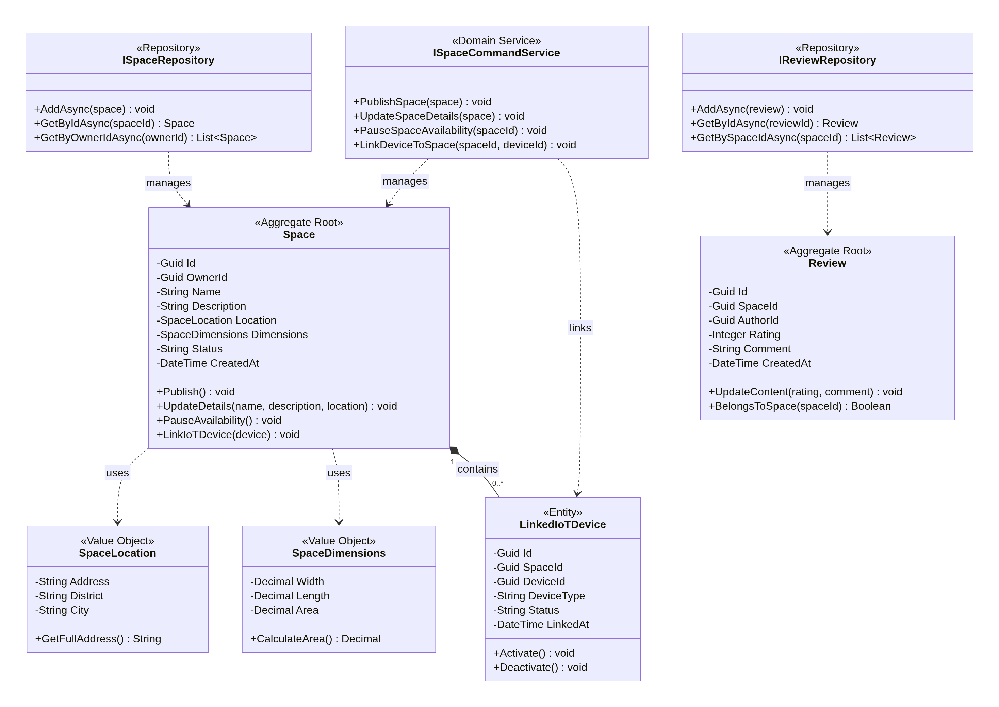

### 4.2.4.6.2. Bounded Context Database Design Diagrams

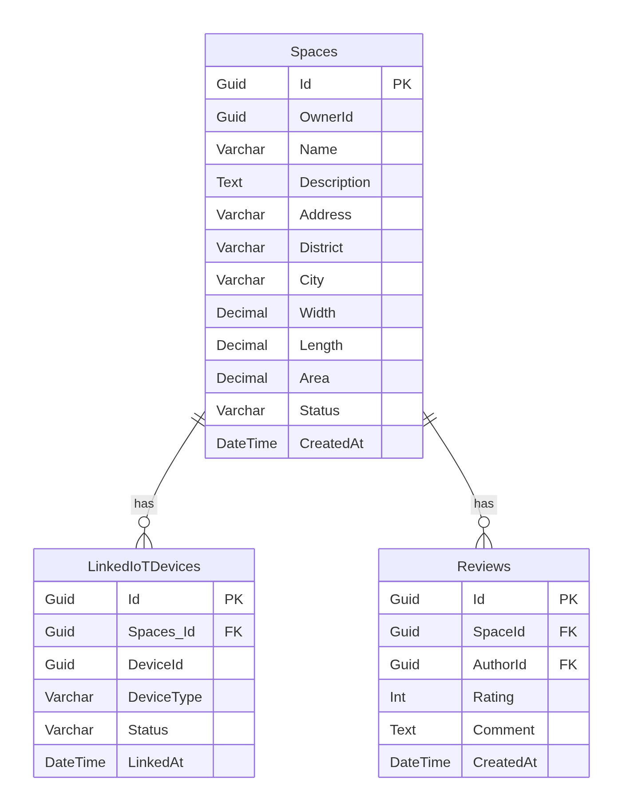

## 4.2.5. Bounded Context: IoT Monitoring and Notifications

### 4.2.5.1 Domain Layer

La capa de dominio de IoT Monitoring and Notifications encapsula la lógica principal para la supervisión de dispositivos IoT, recepción de lecturas, validación de datos y generación de alertas cuando se detectan valores fuera de rango.

### Aggregates

| **Atributo** | **Nombre**  | **Descripción**                                       |
| ------------ | --------- | ----------------------------------------------------- |
| Aggregate Root         | IoTDevice     | Representa el dispositivo IoT registrado en el sistema, asociado a un espacio específico y encargado de emitir lecturas para el monitoreo.       |

**Métodos:**
- IoTDevice.activate: Cambia el estado del dispositivo a activo para permitir la recepción de lecturas.
- IoTDevice.deactivate: Desactiva el dispositivo y evita que siga enviando información al sistema.
- IoTDevice.isActive: Verifica si el dispositivo se encuentra habilitado para operar.

### Entities

| **Atributo** | **Nombre**  | **Descripción**                                       |
| ------------ | --------- | ----------------------------------------------------- |
| ReadingId, DeviceId, MetricType, Value, Unit, ReceivedAt, Status       | Reading      | Entidad que representa una lectura enviada por un dispositivo IoT, incluyendo el tipo de métrica, valor registrado y estado de validación.      |
| AlertId, ReadingId, Severity, Status, CreatedAt          | Alert              | Entidad que representa una alerta generada cuando una lectura se encuentra fuera de los límites permitidos.                  |

### Value Objects

| **Atributo** | **Nombre**  | **Descripción**                                       |
| ------------ | --------- | ----------------------------------------------------- |
| MinValue, MaxValue, Unit  |  ThresholdRange   | Define el rango permitido para una métrica monitoreada.  |
| Value        | SeverityLevel      | Representa el nivel de gravedad de una alerta: baja, media, alta o crítica.      |
| Value        | ReadingStatus      | Indica el estado de una lectura: recibida, validada o fuera de rango.      |
| Value        | AlertStatus      | Indica el estado de una alerta: creada, enviada, reconocida o cerrada.      |

### Commands & Queries

| **Atributo** | **Nombre**  | **Tipo**                                       |
| ------------ | --------- | ----------------------------------------------------- |
| DeviceId, MetricType, Value, Unit       | IngestReadingCommand     | Command      |
| AlertId       | AcknowledgeAlertCommand      | Command      |
| AlertId       | CloseAlertCommand      | Command      |
| SpaceId       | GetAlertsBySpaceQuery      | Query      |
| SpaceId       | GetReadingsBySpaceQuery      | Query      |

### Domain Services

| **Nombre** | **Funcion**  | **Metodos**                                       |
| ------------ | --------- | ----------------------------------------------------- |
| IMonitoringDomainService        |Define las reglas para validar lecturas, detectar valores fuera de rango y generar alertas.      | ValidateReading, DetectOutOfRange, CreateAlert     |
| IAlertPolicyService        | Define criterios para clasificar la severidad de una alerta según el valor detectado.      | EvaluateSeverity, CanDispatchAlert      |

**Métodos:**

- IMonitoringDomainService.ValidateReading: Verifica que la lectura provenga de un dispositivo registrado y activo.

- IMonitoringDomainService.DetectOutOfRange: Evalúa si el valor recibido está fuera del rango permitido.

- IMonitoringDomainService.CreateAlert: Genera una alerta cuando se detecta una lectura anómala.

- IAlertPolicyService.EvaluateSeverity: Determina la severidad de la alerta según la métrica y el valor registrado.

- IAlertPolicyService.CanDispatchAlert: Valida si una alerta puede ser enviada al usuario responsable.

### Repositories

| **Nombre** | **Descripción**  | 
| ------------ | --------- |
| IIoTDeviceRepository        |Interfaz para la persistencia y recuperación de dispositivos IoT registrados.      |
| IReadingRepository        | Interfaz para almacenar y consultar lecturas recibidas desde los dispositivos.      |
| IAlertRepository        | Interfaz para gestionar el almacenamiento y consulta de alertas generadas.      |

En la Domain Layer de Sentrya, dentro del bounded context IoT Monitoring and Notifications, se define la lógica central para monitorear dispositivos, procesar lecturas y generar alertas ante condiciones fuera de rango. La clase IoTDevice actúa como el agregado raíz, mientras que Reading y Alert representan los eventos operativos principales del monitoreo. Finalmente, la validación de lecturas, detección de anomalías y persistencia de información se gestionan mediante servicios de dominio y repositorios especializados.

### 4.2.5.2. Interface Layer

En la Interface Layer de Sentrya, específicamente para el contexto de IoT Monitoring and Notifications, se definen los puntos de entrada que permiten la comunicación externa con las funcionalidades de monitoreo. Esta capa utiliza controladores REST, recursos DTOs y ensambladores para recibir lecturas IoT, consultar información de monitoreo y gestionar alertas, desacoplando el modelo de dominio de las representaciones externas.

### Resources

| **Nombre** | **Descripción**  |  
| ------------ | --------- | 
| IngestReadingResource        | DTO que encapsula los datos de entrada de una lectura IoT, incluyendo DeviceId, MetricType, Value y Unit.      | 
| ReadingResource        | DTO de salida que representa la información de una lectura registrada, como identificador, dispositivo, métrica, valor, unidad, fecha y estado.      | 
| AlertResource        | DTO de salida que representa una alerta generada por una lectura fuera de rango, incluyendo identificador, severidad, estado y mensaje.     | 
| AcknowledgeAlertResource        | DTO que transporta la información necesaria para reconocer una alerta pendiente.     | 
| CloseAlertResource        | DTO que permite cerrar una alerta luego de haber sido revisada o atendida.     | 

### Controllers

| **Nombre** | **Método HTTP**  | **Parámetro / Resource**  | **Descripción** |
| ------------ | --------- | --------- | --------- |
| IoTMonitoringController        | POST    |IngestReadingResource   | Expone el endpoint para recibir una nueva lectura enviada por un dispositivo IoT.   |
| IoTMonitoringController        | GET     |  SpaceId |  Recupera las lecturas registradas para un espacio monitoreado.  |
| AlertController        | GET      | SpaceId  |  Recupera las alertas asociadas a un espacio específico.  |
| AlertController        | PATCH     |  AcknowledgeAlertResource |  Permite marcar una alerta como reconocida por el usuario responsable.  |
| AlertController        | PATCH     |  CloseAlertResource |  Permite cerrar una alerta cuando ya fue atendida.  |

### Transformers / Assemblers

| **Nombre** | **Descripción**  |  
| ------------ | --------- | 
| IngestReadingCommandFromResourceAssembler        | Transforma los datos recibidos en IngestReadingResource en un comando IngestReadingCommand procesable por la capa de aplicación.   | 
| ReadingResourceFromEntityAssembler        | Convierte la entidad de dominio Reading en un objeto ReadingResource para su envío a través de la API.      | 
| AlertResourceFromEntityAssembler        | Convierte la entidad de dominio Alert en un objeto AlertResource para mostrar la información de la alerta en la aplicación.     | 
| AcknowledgeAlertCommandFromResourceAssembler        | Convierte el recurso AcknowledgeAlertResource en un comando para reconocer una alerta.    | 
| CloseAlertCommandFromResourceAssembler        | Convierte el recurso CloseAlertResource en un comando para cerrar una alerta.     | 

En la Interface Layer de Sentrya, específicamente para el contexto de IoT Monitoring and Notifications, los controladores reciben las solicitudes HTTP relacionadas con lecturas y alertas, las transforman mediante recursos y ensambladores, y las delegan a los servicios correspondientes. Esta capa no contiene reglas de negocio, sino que actúa como puente entre la aplicación móvil, los dispositivos IoT y la lógica interna del sistema de monitoreo.

### 4.2.5.3. Application Layer

En la Application Layer de Sentrya, específicamente para el contexto de IoT Monitoring and Notifications, los handlers se encargan de procesar los comandos y consultas relacionados con la recepción de lecturas IoT, la validación de datos y la gestión de alertas. Esta capa actúa como intermediaria entre la interfaz y el dominio, coordinando las operaciones necesarias para registrar lecturas, detectar valores fuera de rango, generar alertas y consultar información de monitoreo sin incluir directamente detalles de infraestructura.

### Commands & Queries Handlers

| **Nombre** | **Descripción**  |   Resumen de Lógica  |
| ------------ | --------- | --------- | 
| IngestReadingCommandHandler        | Procesa la recepción de nuevas lecturas enviadas por dispositivos IoT.      | Valida que el dispositivo exista y esté activo, registra la lectura recibida, evalúa si el valor está fuera del rango permitido y, si corresponde, genera una alerta asociada. | 
| AcknowledgeAlertCommandHandler        | Gestiona el reconocimiento de una alerta pendiente.     | Busca la alerta por su identificador, valida que pueda ser reconocida y actualiza su estado para indicar que el usuario ya tomó conocimiento del evento. | 
| CloseAlertCommandHandler        | Gestiona el cierre de una alerta atendida.  | Recupera la alerta registrada, valida su estado actual y la marca como cerrada cuando ya fue revisada o solucionada. | 
| GetReadingsBySpaceQueryHandler        | Recupera las lecturas asociadas a un espacio monitoreado.     | Consulta el repositorio de lecturas usando el identificador del espacio y devuelve la información organizada para su visualización. | 
| GetAlertsBySpaceQueryHandler        | Recupera las alertas generadas dentro de un espacio específico.   | Consulta las alertas asociadas al espacio, filtrando eventos pendientes, reconocidos o cerrados según sea necesario. | 

### Internal DTOs (Data Transfer Objects)

| **Nombre** | **Descripción**  |  
| ------------ | --------- | 
| ReadingDto        | Objeto que transporta la información principal de una lectura IoT, incluyendo dispositivo, tipo de métrica, valor, unidad, fecha de recepción y estado.    | 
| AlertDto        | DTO que representa una alerta generada por el sistema, incluyendo identificador, mensaje, severidad, estado y fecha de creación.    | 
| MonitoringSummaryDto        | Estructura resumida que agrupa información de monitoreo de un espacio, como cantidad de lecturas recientes, alertas activas y estado general del monitoreo.     | 

### 4.2.5.4. Infrastructure Layer

En la Infrastructure Layer de Sentrya, específicamente para el contexto de IoT Monitoring and Notifications, se implementan los detalles técnicos necesarios para persistir dispositivos, lecturas y alertas, así como para integrarse con servicios externos relacionados con la recepción de datos IoT y el envío de notificaciones. Esta capa permite que la lógica del dominio se ejecute sobre una infraestructura concreta, manteniendo separadas las reglas de negocio de los mecanismos técnicos de almacenamiento y comunicación.

### Persistence (Repositories Implementation)

| **Nombre** | **Descripción**  |   Tecnologías / Herramientas  |
| ------------ | --------- | --------- | 
| IoTDeviceRepository        | Implementación concreta de IIoTDeviceRepository encargada de registrar, actualizar y consultar dispositivos IoT asociados a los espacios monitoreados.     | Entity Framework Core, LINQ | 
| ReadingRepository        | Implementación de IReadingRepository encargada de almacenar las lecturas recibidas desde los dispositivos y consultarlas por espacio, dispositivo o fecha.    | Entity Framework Core, LINQ | 
| AlertRepository        | Implementación de IAlertRepository encargada de persistir alertas generadas, actualizar su estado y recuperar alertas pendientes o históricas.    | Entity Framework Core, LINQ | 
| IoTDeviceConfiguration        | Define el mapeo entre la entidad IoTDevice y la tabla correspondiente en la base de datos, incluyendo restricciones y relaciones.  | Fluent API | 
| ReadingConfiguration        | Configura el esquema de base de datos para las lecturas IoT, incluyendo tipos de datos, relación con dispositivos y fecha de recepción.   | Fluent API | 
| AlertConfiguration        | Configura el mapeo de las alertas, sus estados, severidad y relación con la lectura que originó la alerta.     | Fluent API | 

## Security Services Implementation

|Nombre|Desripcion |Resumen de Implementacion|
|------|-----------|-------------------------|
| IoTBrokerAdapter      | Adaptador encargado de recibir datos provenientes del broker IoT o dispositivos externos.     | Recibe lecturas externas, normaliza su formato y las transforma en datos procesables por la capa de aplicación. | 
| NotificationDispatcherService        |Servicio técnico encargado de enviar alertas o mensajes hacia los usuarios cuando ocurre un evento importante.   |Integra el sistema con un servicio externo de correo o notificaciones para comunicar alertas generadas por el monitoreo. | 
| ReadingNormalizerService        |Servicio de apoyo encargado de limpiar y estandarizar los valores recibidos desde sensores.    | Convierte unidades, valida estructura básica de datos y prepara la lectura antes de ser enviada al dominio. | 

### 4.2.5.5. Bounded Context Software Architecture Component Level Diagrams

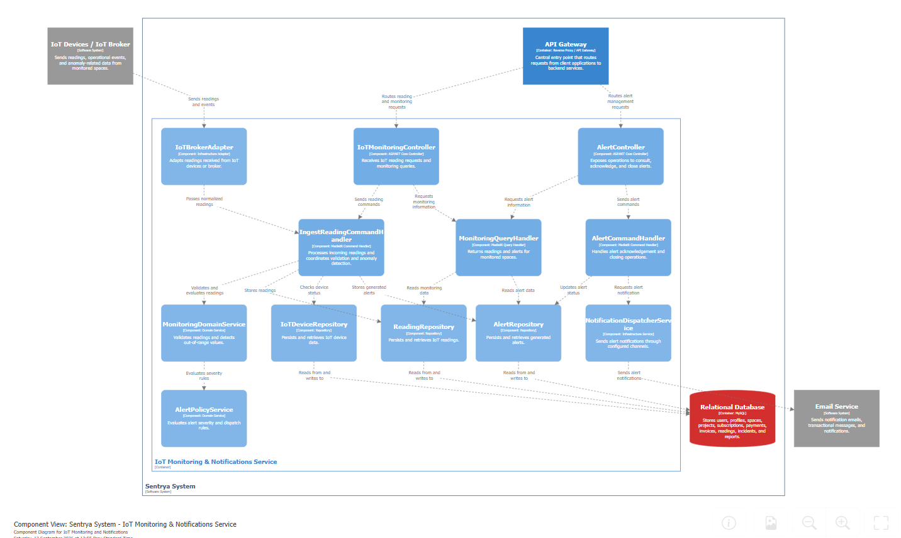

### 4.2.5.6. Bounded Context Software Architecture Code Level Diagrams

### 4.2.5.6.1. Bounded Context Domain Layer Class Diagrams

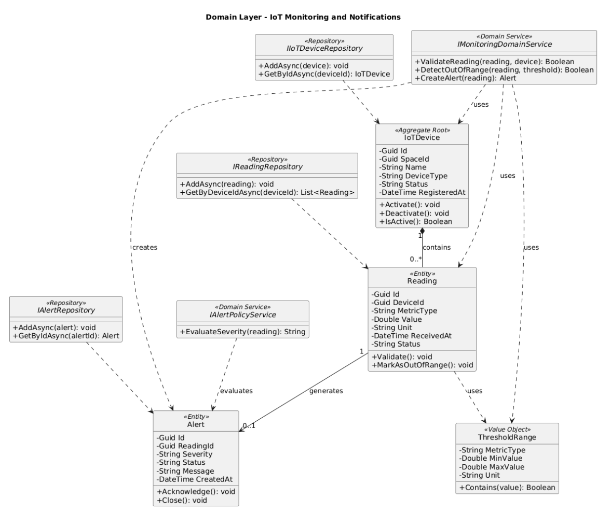

### 4.2.5.6.2. Bounded Context Database Design Diagrams

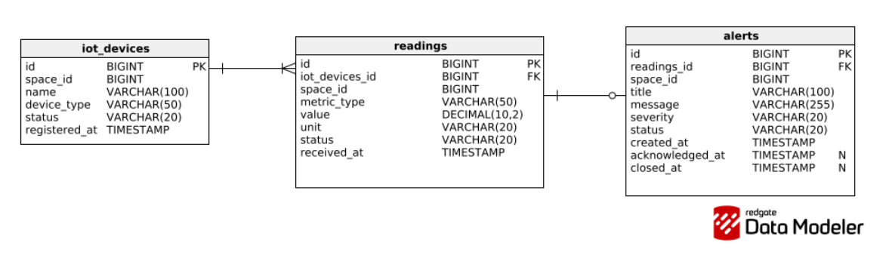
