

    

<h1 align="center">
    Universidad Peruana de Ciencias Aplicadas
</h1>

<h3 align="center">
    Carrera: Ingeniería de Software
       
    Curso: 1ASI0572 - Desarrollo de Soluciones IOT
       
    Sección: 8735
       
    Profesor: Marco Antonio Leon Baca
       
    Ciclo: 2026-02
       
    Informe de Trabajo Final
       
    Startup: SpaceUp
       
    Producto: Sentraya  
</h3>

| 
Alumno
       | 
Código
 |
|:-------------------------------------------:|:-------------------------------------:|
|  Martínez Valdivia, José Luis               |              u202213989               |
|  Taipe Sangama, Jorge Francisco             |                u202313458              | 
|  Serrano Uchuya, Gerald Patricio   | u202122876                           |
|    Martinez Gaona, Pablo Afranio         |   u202120011                          |
|  Ventosilla Trujillo, Anderson Ricardo | u202319025                            |
|  Torrejon Navarro, Braulio Rodrigo | u201711828                            |

 Setiembre 2026 

## Registro de Versiones del Informe

| Versión | Fecha      | Autor(es)      | Descripción de modificación       |
|-------|----------|--------------------------------------------------------|---------|
| 0.1     | 22/04/2026 |              |          |

# Tabla de Contenidos

- Capítulo I: Presentación   
  - [1.1 Startup Profile](#11-startup-profile)   
    - [1.1.1 Descripción de la Startup](#111-descripcion-de-la-startup)   
    - [1.1.2 Perfiles de integrantes del equipo](#112-perfiles-de-integrantes-del-equipo)   

  - [1.2 Solution Profile](#12-solution-profile)   
    - [1.2.1 Antecedentes y problemática](#121-antecedentes-y-problematica)   
    - [1.2.2 Lean UX Process](#122-lean-ux-process)   
      - [1.2.2.1 Lean UX Problem Statements](#1221-lean-ux-problem-statements)   
      - [1.2.2.2 Lean UX Assumptions](#1222-lean-ux-assumptions)   
      - [1.2.2.3 Lean UX Hypothesis Statements](#1223-lean-ux-hypothesis-statements)   
      - [1.2.2.4 Lean UX Canvas](#1224-lean-ux-canvas)   

  - [1.3 Segmentos Objetivo](#13-segmentos-objetivo)   

- Capítulo II: Requirements Development and Software Solution Design   
  - [2.1 Competidores](#21-competidores)   
    - [2.1.1 Análisis competitivo](#211-analisis-competitivo)   
    - [2.1.2 Estrategias y tácticas frente a competidores](#212-estrategias-y-tacticas-frente-a-competidores)   

  - [2.2 Entrevistas](#22-entrevistas)   
    - [2.2.1 Diseño de entrevistas](#221-diseno-de-entrevistas)   
    - [2.2.2 Registro de entrevistas](#222-registro-de-entrevistas)   
    - [2.2.3 Análisis de entrevistas](#223-analisis-de-entrevistas)   

  - [2.3 Needfinding](#23-needfinding)   
    - [2.3.1 User Personas](#231-user-personas)   
    - [2.3.2 User Task Matrix](#232-user-task-matrix)   
    - [2.3.3 User Journey Mapping](#233-user-journey-mapping)   
    - [2.3.4 Empathy Mapping](#234-empathy-mapping)   

  - [2.4 Big Picture EventStorming](#24-big-picture-eventstorming)   

  - [2.5 Ubiquitous Language](#25-ubiquitous-language)   

- Capítulo III: Requirements Specification   
  - [3.1 User Stories](#31-user-stories)   
  - [3.2 Impact Mapping](#32-impact-mapping)   
  - [3.3 Product Backlog](#33-product-backlog)   

- Capítulo IV: Solution Software Design   
  - [4.1 Strategic-Level Domain-Driven Design](#41-strategic-level-domain-driven-design)   
    - [4.1.1 Design-Level EventStorming](#411-design-level-eventstorming)   
      - [4.1.1.1 Candidate Context Discovery](#4111-candidate-context-discovery)   
      - [4.1.1.2 Domain Message Flows Modeling](#4112-domain-message-flows-modeling)   
      - [4.1.1.3 Bounded Context Canvases](#4113-bounded-context-canvases)   

    - [4.1.2 Context Mapping](#412-context-mapping)   

    - [4.1.3 Software Architecture](#413-software-architecture)   
      - [4.1.3.1 Software Architecture System Landscape Diagram](#4131-software-architecture-system-landscape-diagram)   
      - [4.1.3.2 Software Architecture Context Level Diagrams](#4132-software-architecture-context-level-diagrams)   
      - [4.1.3.3 Software Architecture Container Level Diagrams](#4133-software-architecture-container-level-diagrams)   
      - [4.1.3.4 Software Architecture Deployment Diagrams](#4134-software-architecture-deployment-diagrams)   

  - [4.2 Tactical-Level Domain-Driven Design](#42-tactical-level-domain-driven-design)   
    - [4.2.X Bounded Context: &lt;Bounded Context Name&gt;](#42x-bounded-context-bounded-context-name)   
      - [4.2.X.1 Domain Layer](#42x1-domain-layer)   
      - [4.2.X.2 Interface Layer](#42x2-interface-layer)   
      - [4.2.X.3 Application Layer](#42x3-application-layer)   
      - [4.2.X.4 Infrastructure Layer](#42x4-infrastructure-layer)   
      - [4.2.X.5 Bounded Context Software Architecture Component Level Diagrams](#42x5-bounded-context-software-architecture-component-level-diagrams)   
      - [4.2.X.6 Bounded Context Software Architecture Code Level Diagrams](#42x6-bounded-context-software-architecture-code-level-diagrams)   
        - [4.2.X.6.1 Bounded Context Domain Layer Class Diagrams](#42x61-bounded-context-domain-layer-class-diagrams)   
        - [4.2.X.6.2 Bounded Context Database Design Diagram](#42x62-bounded-context-database-design-diagram)   

**ABET – EAC - Student Outcome 7**

La capacidad de adquirir y aplicar nuevos
conocimientos según sea necesario,
utilizando estrategias de aprendizaje
apropiadas.

En el siguiente cuadro se describe las acciones realizadas y enunciados de conclusiones por parte del grupo,
que permiten sustentar el haber alcanzado el logro del ABET – EAC - Student Outcome 7.

| Criterio específico | Acciones realizadas | Conclusiones |
| :--- | :--- | :--- |
| **Actualiza conceptos y conocimientos necesarios para su desarrollo profesional y en especial para su proyecto en soluciones de software.** | **Pablo Martinez Gaona:** Realicé todo el capítulo 1    **Jose Luis Martínez Valdivia:** Contribuí en El desarrollo del capítulo 4 - Definición de Bounded Contexts y sus componentes    **Jorge Francisco Taipe Sangama:** Construí y refactoricé los Diagramas de contexto, de containers y diagramas ERD    **Anderson Ricardo Ventosilla Trujillo:** Desarrollé el capítulo 3, elaborando las User Stories, el Impact Mapping y el Product Backlog del proyecto, además de realizar las entrevistas al segmento 2 (implementadores de hogar inteligente).    **Gerald Serrano Uchuya:** Realicé la sección 4.1 relacionado al Event Storming, definición de Bounded Contexts, flujos y los diagramas de arquitectura de system landscape, context, container y despliegue.    **Braulio Torrejon:** Contribuí en el desarrollo del capítulo 2, realizando el análisis de las entrevistas a los segmentos objetivo, la identificación de necesidades de los usuarios y la elaboración de los User Personas, User Journey Mapping y Empathy Mapping. Además, incorporé los hallazgos obtenidos de las entrevistas para identificar oportunidades de mejora para la solución IoT.   | **Pablo Martinez Gaona:** **TB1** Esta entrega me permitió ampliar mis conocimientos sobre el planteamiento de soluciones IoT y comprender mejor cómo relacionar las necesidades de los usuarios con dispositivos, funcionalidades y procesos de software.    **XXXX:** **TB1:** El desarrollo del AV1 me permitió reforzar mis conocimientos sobre la estructura inicial de un proyecto de software. Sentí que este proceso me ayudó a entender mejor cómo plantear una base sólida, lo cual considero clave para mi crecimiento profesional.    **Jose Luis Martínez Valdivia:** El desarrollo del AV1 me permitió comentar y enriquecer mis conocimientos de DDD y la forma en la que se debaten ideas para implementar una solución de Servicio Web    **Jorge Francisco Taipe Sangama:** El desarrollo del AV1 me permitió conocer la perspectiva de los usuarios que usarán la aplicación.    **Gerald Serrano Uchuya:** El desarrollo del AV1 me permitió reconocer los módulos core del negocio al que nuestro proyecto se enfocará, adicionalmente que permitió definir el diagrama arquitectónico base que servirá como guía para la implementación de Sentrya.   **Anderson Ricardo Ventosilla Trujillo:** El desarrollo del AV1 me permitió profundizar en la construcción de artefactos clave como las user historias, el impact mapping y el product backlog. A través de este proceso, logré entender mejor cómo traducir necesidades del negocio en requerimientos claros y estructurados, facilitando una mejor organización del trabajo y priorización de funcionalidades dentro del proyecto.    **Braulio Torrejon:** El desarrollo del capítulo 2 me permitió reforzar mis conocimientos sobre análisis de usuarios y levantamiento de requisitos. A través de las entrevistas y herramientas de UX, comprendí mejor cómo identificar problemas reales de los usuarios y transformarlos en necesidades y oportunidades que pueden ser consideradas durante el desarrollo de una solución de software.   |
| **Reconoce la necesidad del aprendizaje permanente para el desempeño profesional y el desarrollo de proyectos en soluciones detecnologías de ingeniería de software** | **Pablo Martinez Gaona:** Contribuí realizando el capítulo 1,sedimentando las bases del proyecto    **Jose Luis Martínez Valdivia:** Contribuí en El desarrollo del capítulo 4 - Definición de Bounded Contexts y sus componentes    **Gerald Serrano Uchuya:** Fue necesario repasar los pasos para la identificación de bounded contexts y flujos, partiendo desde la lluvia de eventos hasta la definición de los módulos en los que se dividirá el proyecto. Adicionalmente, requerí repasar temas de diagramas c4 para ver cómo adaptar IoT a nuestro caso.    **Jorge Francisco Taipe Sangama:** Reconocí segmentos, funcionalidades y los convertí en bounded context para desarrollo    **Anderson Ricardo Ventosilla Trujillo:** Contribuí realizando parte del capítulo 3, con las user historias, el impact mapping y el product backlog.    **Braulio Torrejon:** Investigué y apliqué herramientas de análisis de usuarios y levantamiento de información, como entrevistas, User Personas, User Journey Mapping y Empathy Mapping, para comprender las necesidades de los dueños de hogar e implementadores de soluciones IoT.   | **Pablo Martinez Gaona** **TB1:** A lo largo del desarrollo del capítulo 1, comprendí que siempre hay aspectos que mejorar y aprender. Esta experiencia me hizo reflexionar sobre la importancia de mantenerme en constante actualización para poder aportar mejor en futuros proyectos.    **Jose Luis Martínez Valdivia:** Durante El desarrollo de capítulo 4, logré entender los procesos y requerimientos que se deben llevar a cabo para poder delimitar el alcance y arquitectura de desarrollo del proyecto a implementar    **Gerald Serrano Uchuya:** Repasar esos temas me permitió identificar correctamente los BC de Sentrya de acuerdo a las necesidades de nuestros usuarios y permitir diagramar adecuadamente las diferentes capas del modelo C4    **Jorge Francisco Taipe Sangama:** El desarrollo de este capítulo me permitió aprender como segmentar bounded context en el contexto de desarrollo móvil    **Anderson Ricardo Ventosilla Trujillo:** Durante el desarrollo del capítulo 3, comprendí mejor cómo definir y organizar el alcance del proyecto. El uso de herramientas como el impact mapping y el product backlog me ayudó a estructurar las ideas, priorizar funcionalidades y tener una visión más clara del desarrollo del software.   **Braulio Torrejon:** El desarrollo de este capítulo me permitió reconocer la importancia de continuar aprendiendo nuevas herramientas y metodologías para el desarrollo de software. En particular, comprendí que conocer las necesidades y dificultades de los usuarios es fundamental para plantear soluciones que respondan adecuadamente al contexto del proyecto.   |

---

# Capítulo I: Introducción

## 1.1. Startup Profile

### 1.1.1. Descripción de la Startup
SpaceUp es una startup tecnológica orientada al desarrollo de soluciones para hogares inteligentes mediante la integración de dispositivos IoT, plataformas digitales y servicios especializados de implementación. La propuesta surge ante la creciente incorporación de tecnologías conectadas dentro de las viviendas y la necesidad de facilitar su selección, instalación, monitoreo y administración desde un entorno centralizado.

La startup busca conectar a dueños de hogar con implementadores especializados en soluciones Smart Home, permitiendo que las viviendas puedan incorporar progresivamente dispositivos inteligentes de acuerdo con sus necesidades de seguridad, prevención, automatización y monitoreo. De esta manera, el usuario no se limita a adquirir dispositivos aislados, sino que puede construir un ecosistema tecnológico adaptable a las características de su vivienda.

Dentro de este ecosistema, SpaceUp desarrolla **Setrya**, una plataforma web y móvil orientada a la implementación y supervisión de hogares inteligentes. La solución permite administrar los dispositivos IoT instalados en una vivienda, visualizar la información generada por sensores, recibir alertas frente a eventos relevantes, controlar dispositivos compatibles y mantener comunicación con implementadores especializados.

Setrya plantea inicialmente tres soluciones IoT principales orientadas a la protección del hogar:

- **Escudo de seguridad con detección acústica y visual:** emplea sensores y mecanismos de detección para identificar eventos anómalos asociados a posibles situaciones de intrusión y generar alertas para el propietario.
- **Control térmico inteligente:** monitorea continuamente la temperatura del entorno y utiliza diferentes niveles o umbrales de alerta para identificar incrementos anómalos que puedan representar un riesgo para la vivienda.
- **Protector eléctrico inteligente:** supervisa determinadas condiciones del suministro eléctrico y permite interrumpir el flujo de corriente ante anomalías previamente definidas, contribuyendo a la protección de los dispositivos y electrodomésticos conectados.

Estas tres soluciones representan el núcleo inicial de Setrya. Sin embargo, el ecosistema está planteado bajo un enfoque modular, permitiendo incorporar posteriormente otros dispositivos y servicios de automatización según las necesidades del dueño de hogar, como sensores de movimiento, iluminación inteligente, cámaras, sensores ambientales, dispositivos de control energético y otras soluciones compatibles.

#### Objetivo

Brindar a los dueños de hogar e implementadores de soluciones Smart Home una plataforma centralizada que facilite la implementación, monitoreo, control y expansión de dispositivos IoT dentro de viviendas, proporcionando información relevante sobre el estado del hogar y permitiendo responder oportunamente ante eventos detectados por los dispositivos conectados.

#### Misión

Facilitar la transformación progresiva de viviendas convencionales en hogares inteligentes mediante soluciones IoT accesibles, modulares y centralizadas, conectando a propietarios con especialistas y proporcionando herramientas para monitorear, controlar y administrar la tecnología instalada en sus hogares.

#### Visión

Convertir a SpaceUp en una startup referente en soluciones para hogares inteligentes en Latinoamérica, destacando por integrar servicios de implementación, dispositivos IoT y herramientas digitales de monitoreo y control dentro de un ecosistema adaptable a las necesidades de cada vivienda.

### 1.1.2. Perfiles de integrantes del equipo
| Foto | Información                                                                                                                                                                                                              |
|------|--------------------------------------------------------------------------------------------------------------------------------------------------------------------------------------------------------------------------|
|   | **Nombre Completo:** Jose Luis Martinez Valdivia    **Código:** U202213989  **Carrera:** Ingeniería de Software    **Perfil:** Soy estudiante de 8vo ciclo de la carrera de Ingeniería de Software. Tengo interés en aprender nuevas herramientas y tecnologías para aplicarlas en proyectos académicos y personales. Actualmente trabajo como desarrollador fullstack. Dentro del proyecto, aportaré mis conocimientos en aseguramiento de la calidad y testing.     **Habilidades Técnicas:** DOTNET, SPRINGBOOT, CI/CD, KOTLIN, FLUTTER             **Habilidades Sociales:** Liderazgo, amabilidad y puntualidad             |
|  | **Nombre Completo:** Jorge Francisco Taipe Sangama   **Código:** U202313458   **Carrera:** Ingeniería de Software    **Perfil:**   Soy estudiante de Ingeniería de Software en la Universidad Peruana de Ciencias Aplicadas. Cuento con conocimientos en desarrollo Front-end y Backend. Dentro de Nurse Pulse, aportaré como líder del equipo las habilidades adquiridas durante ciclos anteriores, incluyendo trabajo colaborativo, organización y puntualidad.    **Habilidades Técnicas:**    Java, Kotlin, .Net Framework   **Habilidades Sociales:**   Liderazgo, Amigable, Empatico y Cordial        |
| | **Nombre Completo:** Pablo Afranio Martinez Gaona   **Código:** U202120011   **Carrera:** Ingeniería de Software    **Perfil:** Tengo 24 años y estudio la carrera de Ingeniería de Software. Me considero alguien adaptable a la situación, así como alguien que trabaja muy bien en equipo. Me especializo en modelos de aprendizaje. Busco aprender más acerca de la ciencia de datos asi como de la inteligencia artificial. Me gusta los videojuegos y escuchar música.    **Habilidades Técnicas:**   c++, c#, python   **Habilidades Sociales:**   Liderazgo, amabilidad, puntualidad y mediador  |
| |  **Nombre Completo:** Braulio Torrejon   **Código:** U201711828   **Carrera:** Ingeniería de Software    **Perfil:** Soy estudiante de 8vo ciclo de la carrera de Ingeniería de Software. Tengo interés en aprender nuevas herramientas y tecnologías para aplicarlas en proyectos académicos y personales. Actualmente trabajo como QA, donde cuento con experiencia en pruebas y control de calidad de software. Me considero una persona responsable, comprometida con el equipo y capaz de trabajar bajo presión. Dentro del proyecto, aportaré mis conocimientos en aseguramiento de la calidad y testing.    **Habilidades Técnicas:**   C++, Python, C#, Genexus, Jira, Postman, Selenium, Git    **Habilidades Sociales:**   Responsabilidad, trabajo en equipo, compañerismo, adaptabilidad, comunicación y trabajo bajo presión |
|  | **Nombre Completo:** Gerald Patricio Serrano Uchuya    **Código:** u202122876    **Carrera:** Ingeniería de Software    **Perfil:** Estoy en 9no ciclo de Ingeniería de software. Me enfoco en tecnologías web fullstack como Angular, .NET y Python. Soy alguien muy entusiasta al momento de aprender nuevas tecnologías y me gusta cumplir lo mejor que pueda mis responsibilidades en un grupo de trabajo.       **Habilidades Técnicas:** C#, TypeScript, JavaScript, Python y SQL          **Habilidades Sociales:**    comunicación con usuarios, resolución de problemas, trabajo en equipo y transferencia de conocimientos.                 |
|   | **Nombre Completo:** Anderson Ricardo Ventosilla Trujillo   **Código:** U202319025   **Carrera:** Ingeniería de Software    **Perfil:**   Soy estudiante de 7mo ciclo de la carrera de Ingeniería de Software en la UPC. Cuento con experiencia en desarrollo web y mobile (Angular, Vue.js, Flutter) y en arquitectura y despliegue en la nube (Azure, Google Cloud). Dentro de Setrya, aportaré mis conocimientos en desarrollo frontend, arquitectura de software e integración de soluciones cloud.    **Habilidades Técnicas:**   Angular, Vue.js, Java, Flutter, Azure, Google Cloud Platform, Docker, Git/GitFlow    **Habilidades Sociales:**   Trabajo en equipo, adaptabilidad, comunicación efectiva y aprendizaje autónomo |

### 1.2. Solution Profile
Setrya es una solución digital orientada a la implementación, administración y monitoreo de hogares inteligentes. La plataforma conecta a dos segmentos principales: dueños de hogar interesados en incorporar tecnología IoT en sus viviendas e implementadores especializados encargados de diseñar, instalar, configurar y mantener dichas soluciones.

La propuesta combina una aplicación móvil y una plataforma web con un ecosistema de dispositivos IoT capaz de recopilar información del entorno y ejecutar acciones frente a determinadas condiciones. Los datos producidos por los dispositivos pueden ser procesados y posteriormente presentados al usuario mediante indicadores, históricos, alertas y otras herramientas de visualización.

Para el dueño de hogar, Setrya busca centralizar la experiencia de un Smart Home en un mismo entorno, permitiéndole conocer el estado de sus dispositivos, consultar mediciones, recibir notificaciones y controlar aquellos componentes que admitan acciones remotas. Asimismo, podrá explorar diferentes soluciones disponibles y solicitar los servicios de implementadores especializados para ampliar o mantener su ecosistema.

Para el implementador de hogar inteligente, Setrya busca proporcionar herramientas que faciliten la administración de las instalaciones realizadas para diferentes clientes, el registro de dispositivos asociados a cada vivienda, la supervisión de su funcionamiento y la atención de incidencias o necesidades de mantenimiento.

El núcleo inicial de la solución se concentra en tres áreas de protección: detección acústica y visual ante posibles eventos de seguridad, monitoreo térmico mediante niveles de alerta y protección eléctrica frente a condiciones anómalas. A partir de esta base, el sistema permitirá ampliar progresivamente las capacidades de cada vivienda incorporando nuevos dispositivos IoT según los requerimientos del propietario.

### 1.2.1 Antecedentes y problemática
La incorporación de tecnologías digitales en los hogares peruanos encuentra un contexto favorable debido al crecimiento de la conectividad. De acuerdo con el Instituto Nacional de Estadística e Informática (INEI), durante el primer trimestre de 2026 el 62,7 % de los hogares del país contó con conexión a Internet. En Lima Metropolitana, esta proporción alcanzó el 82,7 %. Asimismo, el 96,0 % de los hogares peruanos contó con acceso al servicio de telefonía móvil y el 90,7 % de la población usuaria de Internet accedió a este servicio mediante un teléfono celular.

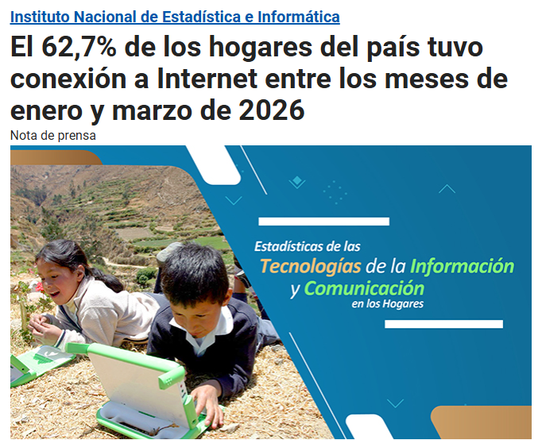

**Figura 1.** Indicadores de acceso a Internet y telefonía móvil en el Perú durante el primer trimestre de 2026. Fuente: INEI (2026).

Este nivel de conectividad permite que soluciones orientadas al hogar inteligente puedan complementarse con aplicaciones web y móviles para consultar información y administrar dispositivos remotamente. Sin embargo, contar con conectividad no implica necesariamente que la implementación de tecnología IoT dentro de una vivienda resulte sencilla para el propietario. La selección de dispositivos, su instalación, configuración, compatibilidad y posterior mantenimiento pueden requerir conocimientos técnicos o la participación de especialistas.

Asimismo, la protección del hogar involucra diferentes tipos de riesgos que tradicionalmente se atienden mediante sistemas independientes. La seguridad frente a accesos no autorizados puede depender de cámaras, alarmas u otros sensores; los incrementos anómalos de temperatura requieren mecanismos de detección; mientras que las instalaciones eléctricas necesitan elementos de protección frente a condiciones como sobrecargas y cortocircuitos.

En el ámbito eléctrico, Osinergmin recomienda que las viviendas dispongan de elementos adecuados de protección en sus instalaciones. Entre ellos se encuentran los interruptores termomagnéticos, capaces de interrumpir automáticamente un circuito frente a condiciones predeterminadas de sobrecarga o cortocircuito. Asimismo, la entidad recomienda que las instalaciones eléctricas sean revisadas y mantenidas por especialistas.

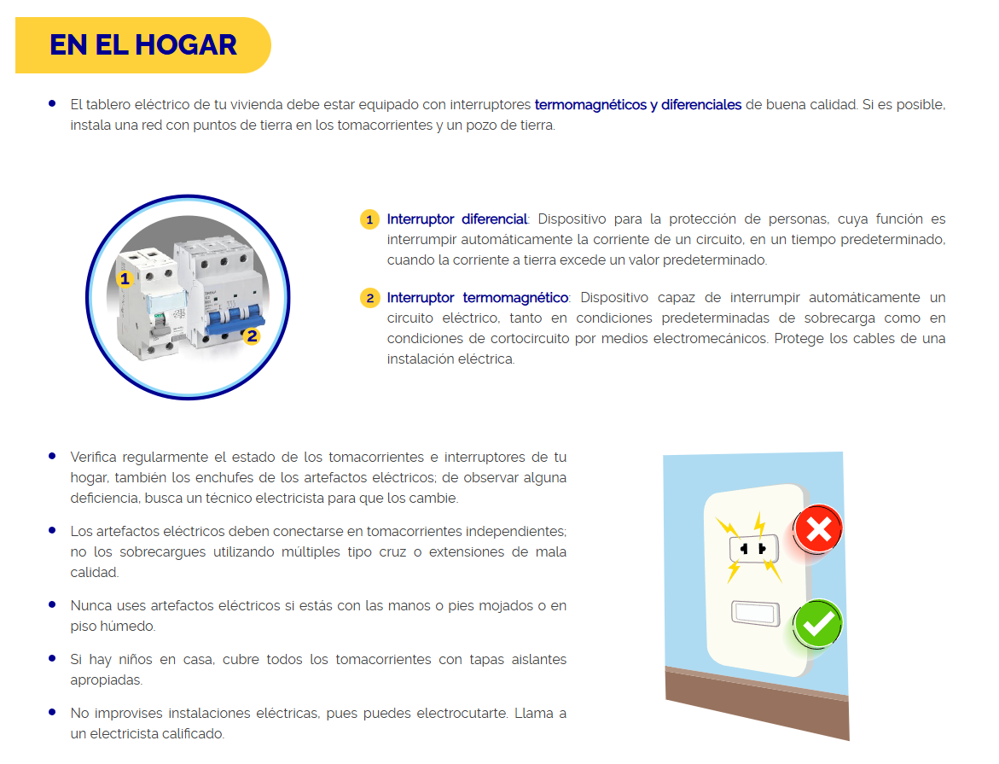

**Figura 2.** Recomendaciones para el uso seguro de la electricidad en viviendas. Fuente: Osinergmin.

La problemática se acentúa cuando cada necesidad del hogar es atendida mediante soluciones independientes que pueden disponer de sus propios métodos de instalación, monitoreo y control. Para un propietario sin experiencia técnica, administrar distintos dispositivos y determinar qué tecnologías resultan adecuadas para su vivienda puede incrementar la complejidad de adoptar un hogar inteligente. De forma paralela, los implementadores necesitan administrar los dispositivos instalados para diferentes clientes y contar con información que facilite su supervisión y posterior mantenimiento.

Frente a este contexto, se aplica la técnica de las **5W y 2H (Who, What, Where, When, Why, How & How Much)** para delimitar la problemática que busca abordar Setrya.

#### 1. ¿Qué? (What?)

Existe una necesidad de simplificar la implementación y administración de soluciones IoT dentro de viviendas. Los propietarios pueden encontrar diferentes dispositivos destinados a seguridad, automatización o monitoreo, pero requieren conocimientos técnicos y apoyo especializado para seleccionar, instalar y mantener un ecosistema que responda a las necesidades particulares de su hogar.

Además, la utilización de soluciones independientes puede generar una experiencia fragmentada, en la que la información generada por sensores y dispositivos debe consultarse utilizando diferentes medios.

#### 2. ¿Quién? (Who?)

Los principales involucrados son:

- **Dueños de hogar**, interesados en incorporar soluciones inteligentes para mejorar la seguridad, prevención, comodidad y control de su vivienda, pero que no necesariamente poseen conocimientos especializados sobre IoT.
- **Implementadores de hogar inteligente**, ya sean profesionales independientes o empresas especializadas, que diseñan, instalan, configuran y mantienen dispositivos IoT para clientes residenciales y necesitan administrar las instalaciones realizadas.

#### 3. ¿Dónde? (Where?)

La problemática se presenta principalmente en viviendas ubicadas en zonas urbanas que cuentan con conectividad a Internet y cuyos propietarios buscan incorporar progresivamente dispositivos inteligentes.

En una primera etapa, Setrya estará orientado al mercado residencial, dejando fuera del alcance inicial otros ambientes como oficinas, instalaciones industriales o grandes edificios corporativos.

#### 4. ¿Cuándo? (When?)

La necesidad aparece durante diferentes momentos del ciclo de vida de un hogar inteligente:

1. Cuando el propietario identifica una necesidad que desea resolver mediante tecnología.
2. Cuando necesita conocer qué dispositivo o solución resulta adecuada.
3. Durante la búsqueda y contratación de un implementador.
4. Durante la instalación y configuración de los dispositivos.
5. Cuando los dispositivos empiezan a generar mediciones y eventos.
6. Cuando el propietario necesita monitorear o controlar su vivienda remotamente.
7. Cuando se detecta una anomalía que requiere una respuesta.
8. Cuando un dispositivo requiere mantenimiento, sustitución o ampliación.

#### 5. ¿Por qué? (Why?)

La incorporación de IoT en una vivienda involucra diferentes conocimientos y decisiones relacionados con sensores, actuadores, conectividad, compatibilidad, configuración y mantenimiento. Un usuario no especializado puede tener dificultades para evaluar estas variables por su cuenta.

Por otra parte, atender seguridad, condiciones térmicas, protección eléctrica y automatización mediante soluciones aisladas dificulta mantener una visión centralizada del estado tecnológico de la vivienda.

Por ello, existe una oportunidad para integrar dispositivos, información y servicios especializados dentro de un mismo ecosistema que permita al propietario comprender el estado de su hogar y al implementador supervisar las soluciones que ha instalado.

#### 6. ¿Cómo? (How?)

La problemática será abordada mediante Setrya, una plataforma web y móvil integrada con dispositivos IoT y servicios de procesamiento de información.

El sistema permitirá:

- registrar viviendas y sus ambientes;
- asociar dispositivos IoT a una vivienda;
- visualizar mediciones obtenidas mediante sensores;
- detectar determinados eventos a partir de las lecturas recopiladas;
- generar diferentes niveles de alerta;
- controlar dispositivos compatibles;
- consultar históricos de eventos y mediciones;
- administrar las soluciones instaladas por cada implementador;
- facilitar el contacto entre propietarios e implementadores;
- incorporar nuevos módulos IoT según las necesidades del propietario.

Inicialmente, el ecosistema estará representado por un módulo de detección acústica y visual, un módulo de monitoreo térmico y un módulo de protección eléctrica.

#### 7. ¿Cuánto? (How Much?)

La disponibilidad de infraestructura digital evidencia que existe una base tecnológica considerable para servicios conectados destinados al hogar. Durante el primer trimestre de 2026, el 62,7 % de los hogares peruanos contó con conexión a Internet y, específicamente en Lima Metropolitana, la cifra alcanzó el 82,7 %. Además, el 96,0 % de los hogares contó con telefonía móvil.

Desde la perspectiva del acceso a la solución, el teléfono celular resulta especialmente relevante: el 90,7 % de la población usuaria de Internet de 6 años a más accedió a Internet mediante este dispositivo durante el mismo periodo. Estos indicadores respaldan la viabilidad de complementar el ecosistema IoT de Setrya con una aplicación móvil y una plataforma web que permitan consultar información y administrar remotamente las funcionalidades disponibles.

### 1.2.2 Lean UX Process
Para orientar el desarrollo de Setrya bajo un enfoque centrado en las necesidades de sus usuarios, se aplicará el proceso Lean UX. Este permitirá establecer inicialmente el problema que busca resolver la solución, identificar las principales suposiciones relacionadas con el negocio, los usuarios y las funcionalidades propuestas, y posteriormente formular hipótesis que puedan ser validadas durante el desarrollo del proyecto.

### 1.2.2.1. Lean UX Problem Statements
Actualmente, la incorporación de tecnología IoT en viviendas se encuentra enfocada principalmente en la adquisición e instalación de dispositivos inteligentes individuales destinados a resolver necesidades específicas como seguridad, automatización, monitoreo ambiental o control energético. Los principales involucrados dentro de este contexto son los dueños de hogar interesados en modernizar sus viviendas y los implementadores especializados encargados de instalar y configurar este tipo de soluciones.

Sin embargo, las alternativas existentes pueden generar una experiencia fragmentada cuando los dispositivos, servicios de implementación y mecanismos de monitoreo funcionan de manera independiente. Para un propietario sin conocimientos técnicos especializados, seleccionar soluciones adecuadas, comprender la información obtenida por los sensores, administrar diferentes dispositivos y encontrar profesionales que puedan realizar su implementación o mantenimiento puede representar una barrera para la adopción de un hogar inteligente. De forma paralela, los implementadores necesitan administrar diferentes instalaciones, dispositivos y clientes sin depender exclusivamente de registros y herramientas externas.

Setrya busca cubrir esta brecha mediante una plataforma web y móvil que conecte a dueños de hogar con implementadores especializados y permita centralizar la incorporación, monitoreo y administración de soluciones IoT dentro de una vivienda. La propuesta se enfocará inicialmente en tres áreas de protección: detección acústica y visual ante eventos de seguridad, monitoreo térmico mediante niveles de alerta y protección eléctrica frente a condiciones anómalas, manteniendo un enfoque modular que permita incorporar nuevas soluciones IoT posteriormente.

El enfoque inicial estará dirigido a propietarios de viviendas interesados en incorporar tecnología inteligente y a profesionales o empresas dedicadas a la implementación de hogares inteligentes.

Consideraremos que la propuesta está obteniendo resultados favorables cuando los usuarios puedan comprender y utilizar las funciones principales de monitoreo y gestión de dispositivos, los propietarios manifiesten interés en centralizar diferentes soluciones IoT mediante Setrya y los implementadores identifiquen valor en administrar las instalaciones realizadas para sus clientes desde una misma plataforma.

### 1.2.2.2. Lean UX Assumptions

A partir del problema identificado para Setrya, se establecieron las siguientes suposiciones iniciales. Estas representan creencias que deberán ser contrastadas posteriormente mediante entrevistas, pruebas con usuarios y validaciones del producto.

#### Business Assumptions

- Creemos que existe un grupo de dueños de hogar interesado en incorporar soluciones IoT para mejorar la protección, monitoreo y automatización de sus viviendas.

- Creemos que los propietarios valorarán contar con una plataforma que centralice diferentes soluciones inteligentes en lugar de depender de múltiples herramientas independientes.

- Creemos que existe valor comercial en conectar a propietarios interesados en implementar tecnología Smart Home con profesionales o empresas especializadas en este tipo de instalaciones.

- Creemos que los implementadores de hogares inteligentes tendrán interés en utilizar herramientas digitales que les permitan administrar las instalaciones y dispositivos asociados a diferentes clientes.

- Creemos que una propuesta modular permitirá que los clientes comiencen utilizando determinadas soluciones IoT y posteriormente amplíen su ecosistema de acuerdo con nuevas necesidades.

- Creemos que Setrya puede diferenciarse al integrar en una misma propuesta el servicio de implementación, la supervisión de dispositivos y el monitoreo de información generada por sensores.

- Creemos que la protección del hogar puede constituir una propuesta inicial atractiva para introducir posteriormente otras categorías de automatización inteligente.

- Creemos que existe disposición a pagar por servicios relacionados con la implementación, mantenimiento y ampliación de soluciones IoT cuando estos aportan utilidad percibida al propietario.

#### Business Outcome Assumptions

- Creemos que el negocio estará obteniendo resultados favorables si una proporción relevante de propietarios interesados en soluciones Smart Home solicita información o contacto con un implementador mediante Setrya.

- Creemos que el negocio estará obteniendo resultados favorables si los propietarios que incorporan una primera solución IoT posteriormente muestran interés en agregar nuevos módulos o dispositivos a su vivienda.

- Creemos que el negocio estará obteniendo resultados favorables si los implementadores administran activamente más de una instalación o cliente desde la plataforma.

- Creemos que el negocio estará obteniendo resultados favorables si los usuarios consultan periódicamente las mediciones, alertas y estados de los dispositivos asociados a su hogar.

- Creemos que el negocio estará obteniendo resultados favorables si los propietarios consideran que Setrya reduce la dificultad percibida al momento de incorporar y administrar tecnología IoT.

- Creemos que el negocio estará obteniendo resultados favorables si parte de los usuarios continúa utilizando la plataforma después de la instalación inicial para monitoreo, control o mantenimiento.

#### User Assumptions

- Creemos que uno de los principales usuarios de Setrya será el dueño de hogar que desea incorporar tecnología inteligente sin necesitar conocimientos especializados sobre dispositivos IoT.

- Creemos que otro usuario principal será el implementador de hogar inteligente, ya sea un profesional independiente o una empresa dedicada a instalar, configurar y mantener soluciones IoT residenciales.

- Creemos que los dueños de hogar tendrán diferentes niveles de conocimiento tecnológico, por lo que necesitarán información clara y comprensible sobre el estado de sus dispositivos.

- Creemos que los propietarios priorizarán diferentes necesidades dentro de su vivienda, como seguridad, prevención, automatización o control energético.

- Creemos que los implementadores trabajarán simultáneamente con diferentes clientes, viviendas y dispositivos, por lo que necesitarán distinguir claramente cada instalación.

- Creemos que los usuarios accederán a Setrya tanto desde dispositivos móviles como desde navegadores web dependiendo del contexto en el que necesiten consultar información.

- Creemos que los dueños de hogar esperarán poder ampliar progresivamente las capacidades inteligentes de su vivienda sin tener que reemplazar completamente las soluciones previamente instaladas.

#### User Outcome and Benefit Assumptions

- Creemos que los dueños de hogar desean conocer desde un mismo entorno el estado general de las soluciones IoT instaladas en su vivienda.

- Creemos que los propietarios desean recibir información oportuna cuando los dispositivos detecten condiciones consideradas relevantes o anómalas.

- Creemos que los propietarios desean comprender fácilmente las mediciones obtenidas por los sensores sin necesidad de interpretar información técnica compleja.

- Creemos que los dueños de hogar desean tener mayor facilidad para encontrar implementadores especializados cuando necesiten instalar, ampliar o realizar mantenimiento a sus soluciones inteligentes.

- Creemos que los propietarios desean consultar un historial que les permita conocer eventos y mediciones anteriores relacionados con su vivienda.

- Creemos que los implementadores desean supervisar de forma centralizada los dispositivos que han instalado para diferentes clientes.

- Creemos que los implementadores desean identificar con rapidez qué vivienda o dispositivo requiere revisión o mantenimiento.

- Creemos que los implementadores desean mantener información organizada sobre las soluciones y dispositivos instalados para cada propietario.

- Creemos que ambos segmentos obtendrán valor de una plataforma que reduzca la fragmentación existente entre instalación, monitoreo y administración de soluciones IoT.

#### Feature Assumptions

- Creemos que un **dashboard centralizado del hogar** permitirá al propietario conocer rápidamente el estado general de sus dispositivos y soluciones IoT.

- Creemos que un **sistema de monitoreo térmico con diferentes niveles de alerta** permitirá identificar variaciones relevantes de temperatura y comunicar al propietario cuando se alcancen condiciones previamente establecidas.

- Creemos que un **sistema de detección acústica y visual** permitirá identificar determinados eventos relacionados con la seguridad de la vivienda y generar alertas para el propietario.

- Creemos que un **sistema de protección eléctrica integrado con Setrya** permitirá identificar determinadas condiciones eléctricas anómalas, registrar el evento y ejecutar las acciones permitidas por el dispositivo de protección.

- Creemos que un **centro de alertas y notificaciones** permitirá a los propietarios identificar con mayor rapidez los eventos relevantes detectados por los dispositivos instalados.

- Creemos que la **visualización de mediciones e históricos** permitirá a los usuarios comprender mejor el comportamiento de los dispositivos y las condiciones registradas en su vivienda.

- Creemos que un **catálogo de soluciones IoT** permitirá al propietario conocer diferentes alternativas para ampliar progresivamente las capacidades inteligentes de su hogar.

- Creemos que una funcionalidad para **buscar o solicitar servicios de implementadores especializados** facilitará el proceso de incorporación, mantenimiento y expansión de soluciones IoT.

- Creemos que un módulo de **gestión de viviendas, clientes e instalaciones para implementadores** permitirá a estos profesionales administrar de manera más organizada los servicios realizados.

- Creemos que un módulo de **gestión de dispositivos IoT** permitirá registrar cada dispositivo instalado, asociarlo a una vivienda o ambiente y consultar su estado.

- Creemos que permitir el **control remoto de los dispositivos compatibles** facilitará al propietario administrar determinadas funciones de su hogar desde la plataforma.

- Creemos que una arquitectura modular que permita **incorporar nuevas categorías de dispositivos IoT** facilitará la expansión progresiva del ecosistema Setrya de acuerdo con las necesidades de cada vivienda.

### 1.2.2.3. Lean UX Hypothesis Statements

A partir de los Feature Assumptions identificados, se formularon los siguientes Hypothesis Statements. Cada hipótesis relaciona un resultado esperado para el negocio con un beneficio para alguno de los segmentos objetivo y una funcionalidad específica de Setrya.

Los criterios de validación incluidos corresponden a métricas preliminares que serán contrastadas posteriormente mediante entrevistas, pruebas de usabilidad y validaciones del producto.

#### Hypothesis Statement 01 — Dashboard centralizado del hogar

Creemos que lograremos incrementar el uso recurrente de Setrya  
si los **dueños de hogar**  
logran conocer rápidamente el estado general de las soluciones IoT instaladas en su vivienda  
mediante un **dashboard centralizado del hogar**.

**Criterio de validación propuesto:** Consideraremos favorable la hipótesis si al menos el 80 % de los participantes puede identificar, sin asistencia, el estado general de sus dispositivos y reconocer si existe alguna alerta activa durante una prueba de usabilidad.

---

#### Hypothesis Statement 02 — Monitoreo térmico

Creemos que lograremos aumentar el valor percibido de Setrya como herramienta de monitoreo preventivo  
si los **dueños de hogar**  
logran identificar variaciones relevantes de temperatura y comprender el nivel de alerta asociado  
mediante un **sistema de monitoreo térmico con diferentes niveles de alerta**.

**Criterio de validación propuesto:** Consideraremos favorable la hipótesis si al menos el 80 % de los participantes puede interpretar correctamente los niveles de alerta térmica presentados durante una simulación y reconocer cuándo una situación requiere atención.

---

#### Hypothesis Statement 03 — Detección acústica y visual

Creemos que lograremos incrementar la percepción de utilidad de Setrya en materia de seguridad residencial  
si los **dueños de hogar**  
logran conocer oportunamente la ocurrencia de eventos anómalos relacionados con la seguridad de su vivienda  
mediante un **sistema de detección acústica y visual**.

**Criterio de validación propuesto:** Consideraremos favorable la hipótesis si al menos el 80 % de los participantes identifica correctamente una alerta de seguridad simulada y comprende qué evento provocó su generación.

---

#### Hypothesis Statement 04 — Protección eléctrica

Creemos que lograremos aumentar el valor percibido del ecosistema Setrya como herramienta de protección del hogar  
si los **dueños de hogar**  
logran conocer cuándo se presenta una condición eléctrica anómala y qué acción realizó el sistema frente a ella  
mediante un **sistema de protección eléctrica integrado con Setrya**.

**Criterio de validación propuesto:** Consideraremos favorable la hipótesis si al menos el 80 % de los participantes comprende, durante una simulación, la condición eléctrica detectada, el dispositivo afectado y la acción ejecutada por el módulo de protección.

---

#### Hypothesis Statement 05 — Centro de alertas y notificaciones

Creemos que lograremos aumentar la frecuencia con la que los usuarios atienden eventos relevantes de sus viviendas  
si los **dueños de hogar**  
logran identificar rápidamente qué situación requiere su atención  
mediante un **centro centralizado de alertas y notificaciones**.

**Criterio de validación propuesto:** Consideraremos favorable la hipótesis si al menos el 80 % de los participantes identifica correctamente el tipo de alerta, su prioridad y el dispositivo o ambiente relacionado durante una prueba de usabilidad.

---

#### Hypothesis Statement 06 — Mediciones e históricos

Creemos que lograremos incrementar el uso de Setrya después de la instalación inicial de los dispositivos  
si los **dueños de hogar e implementadores**  
logran consultar y comprender el comportamiento previo de los dispositivos y las condiciones registradas en la vivienda  
mediante la **visualización de mediciones, eventos e información histórica**.

**Criterio de validación propuesto:** Consideraremos favorable la hipótesis si al menos el 75 % de los participantes puede consultar un periodo determinado, localizar un evento anterior e interpretar la tendencia básica presentada en los datos.

---

#### Hypothesis Statement 07 — Catálogo de soluciones IoT

Creemos que lograremos incrementar el interés de los propietarios por ampliar progresivamente su ecosistema inteligente  
si los **dueños de hogar**  
logran descubrir soluciones IoT relacionadas con nuevas necesidades de su vivienda  
mediante un **catálogo de dispositivos y soluciones Smart Home**.

**Criterio de validación propuesto:** Consideraremos favorable la hipótesis si al menos el 70 % de los participantes puede identificar, sin asistencia, una solución del catálogo relacionada con una necesidad específica presentada durante la prueba.

---

#### Hypothesis Statement 08 — Solicitud de implementadores

Creemos que lograremos incrementar la generación de oportunidades de servicio dentro de SpaceUp  
si los **dueños de hogar**  
logran encontrar y solicitar apoyo profesional para instalar, ampliar o mantener soluciones inteligentes  
mediante una **funcionalidad de búsqueda y solicitud de servicios de implementadores especializados**.

**Criterio de validación propuesto:** Consideraremos favorable la hipótesis si al menos el 70 % de los participantes puede localizar un implementador adecuado y completar una solicitud de servicio sin asistencia.

---

#### Hypothesis Statement 09 — Gestión de clientes e instalaciones

Creemos que lograremos incrementar la adopción de Setrya por parte de profesionales del sector Smart Home  
si los **implementadores de hogar inteligente**  
logran administrar de manera organizada diferentes clientes, viviendas e instalaciones  
mediante un **módulo centralizado de gestión de clientes e instalaciones**.

**Criterio de validación propuesto:** Consideraremos favorable la hipótesis si al menos el 80 % de los implementadores entrevistados o evaluados puede localizar una instalación específica, revisar sus dispositivos asociados e identificar cuál requiere atención sin utilizar herramientas externas.

---

#### Hypothesis Statement 10 — Gestión de dispositivos IoT

Creemos que lograremos mejorar la organización y trazabilidad de las instalaciones realizadas mediante Setrya  
si los **implementadores de hogar inteligente**  
logran registrar y consultar claramente qué dispositivos pertenecen a cada vivienda y ambiente  
mediante un **módulo de gestión de dispositivos IoT**.

**Criterio de validación propuesto:** Consideraremos favorable la hipótesis si al menos el 85 % de los participantes puede registrar un dispositivo, asociarlo correctamente a una vivienda y ambiente, y posteriormente localizarlo sin asistencia.

---

#### Hypothesis Statement 11 — Control remoto

Creemos que lograremos incrementar la utilidad cotidiana de Setrya para los propietarios  
si los **dueños de hogar**  
logran ejecutar acciones sobre determinados dispositivos sin encontrarse físicamente junto a ellos  
mediante una **funcionalidad de control remoto para dispositivos compatibles**.

**Criterio de validación propuesto:** Consideraremos favorable la hipótesis si al menos el 85 % de los participantes puede ejecutar correctamente una acción de control y verificar posteriormente el nuevo estado del dispositivo.

---

#### Hypothesis Statement 12 — Expansión modular

Creemos que lograremos incrementar la continuidad y expansión del uso de Setrya  
si los **dueños de hogar e implementadores**  
logran incorporar nuevas soluciones inteligentes de acuerdo con necesidades posteriores sin reemplazar el ecosistema previamente configurado  
mediante una **arquitectura modular para incorporar nuevas categorías de dispositivos IoT**.

**Criterio de validación propuesto:** Consideraremos favorable la hipótesis si al menos el 70 % de los propietarios evaluados manifiesta interés en incorporar una segunda solución IoT después de conocer el funcionamiento del módulo inicial y los implementadores consideran comprensible el proceso de ampliación del ecosistema.

### 1.2.2.4. Lean UX Canvas
#### 1.2.2.4. Lean UX Canvas

A partir del Problem Statement, los Assumptions y los Hypothesis Statements previamente definidos, se elaboró el Lean UX Canvas de Setrya. Este artefacto sintetiza la problemática identificada, los resultados esperados para el negocio y los usuarios, las principales soluciones planteadas y los aspectos que deberán ser validados durante el desarrollo del producto.

<table>
    <thead>
    <r>
    <th colspan="2">Lean UX Canvas - Setrya</th>
    </r>
  </thead>
  <tbody>
    <tr>
      <td>
        <b>1. Business Problem</b>  
        Los dueños de hogar interesados en incorporar soluciones IoT pueden enfrentarse a una experiencia fragmentada al seleccionar, instalar, monitorear y administrar dispositivos inteligentes destinados a diferentes necesidades del hogar.  
        Asimismo, los implementadores especializados necesitan organizar múltiples clientes, viviendas, dispositivos e instalaciones, así como realizar seguimiento de las soluciones implementadas.  
        SpaceUp identifica una oportunidad para centralizar estos procesos mediante Setrya, conectando a propietarios e implementadores dentro de un ecosistema orientado inicialmente a la protección y monitoreo inteligente del hogar.
      </td>
      <td>
        <b>2. Business Outcomes</b>  
        <ul>
          <li>Incrementar la cantidad de propietarios que solicitan servicios de implementación mediante Setrya.</li>
          <li>Conseguir que propietarios que incorporan una primera solución IoT posteriormente amplíen su ecosistema con nuevos módulos.</li>
          <li>Conseguir que los implementadores administren múltiples clientes e instalaciones desde la plataforma.</li>
          <li>Incrementar el uso recurrente de Setrya después de finalizada la instalación inicial.</li>
          <li>Generar oportunidades de ingresos mediante servicios de implementación, mantenimiento y expansión de soluciones IoT.</li>
        </ul>
      </td>
    </tr>
    <tr>
      <td>
        <b>3. Users</b>  
        <b>Dueño de hogar:</b> 
        Propietario o responsable de una vivienda interesado en incorporar soluciones inteligentes para mejorar aspectos como seguridad, prevención, monitoreo, automatización o control, sin requerir conocimientos técnicos especializados en IoT.  
        <b>Implementador de hogar inteligente:</b> 
        Profesional independiente o empresa especializada en seleccionar, instalar, configurar, supervisar y mantener soluciones IoT dentro de viviendas.
      </td>
      <td>
        <b>4. User Outcomes &amp; Benefits</b>  
        <b>Dueño de hogar:</b>
        <ul>
          <li>Conocer el estado de sus soluciones IoT desde un entorno centralizado.</li>
          <li>Recibir información oportuna ante eventos relevantes.</li>
          <li>Comprender fácilmente las mediciones generadas por los dispositivos.</li>
          <li>Controlar remotamente dispositivos compatibles.</li>
          <li>Encontrar especialistas para nuevas instalaciones o mantenimiento.</li>
          <li>Ampliar progresivamente las capacidades inteligentes de su vivienda.</li>
          <li>Consultar eventos y mediciones anteriores.</li>
        </ul>
        <b>Implementador de hogar inteligente:</b>
        <ul>
          <li>Administrar diferentes clientes e instalaciones.</li>
          <li>Conocer qué dispositivos pertenecen a cada vivienda.</li>
          <li>Detectar instalaciones o dispositivos que requieren atención.</li>
          <li>Consultar información generada por los dispositivos instalados.</li>
          <li>Mantener organizada la información técnica de cada instalación.</li>
          <li>Gestionar ampliaciones y mantenimiento de las soluciones implementadas.</li>
        </ul>
      </td>
    </tr>
    <tr>
      <td>
        <b>5. Solutions</b>  
        <ul>
          <li>Dashboard centralizado del hogar.</li>
          <li>Monitoreo térmico mediante diferentes niveles de alerta.</li>
          <li>Detección acústica y visual.</li>
          <li>Protección eléctrica inteligente.</li>
          <li>Centro de alertas y notificaciones.</li>
          <li>Visualización de mediciones e históricos.</li>
          <li>Catálogo de soluciones IoT.</li>
          <li>Solicitud de servicios de implementadores especializados.</li>
          <li>Gestión de clientes e instalaciones.</li>
          <li>Gestión de dispositivos IoT.</li>
          <li>Control remoto de dispositivos compatibles.</li>
          <li>Incorporación modular de nuevas soluciones IoT.</li>
        </ul>
      </td>
      <td>
        <b>6. Hypotheses</b>  
        <b>H1:</b> Creemos que aumentaremos el uso recurrente de Setrya si los dueños de hogar pueden conocer rápidamente el estado de sus dispositivos mediante un dashboard centralizado.  
        <b>H2:</b> Creemos que aumentaremos el valor percibido de Setrya si los dueños de hogar pueden identificar anomalías mediante los módulos de monitoreo térmico, detección acústica y visual, y protección eléctrica.  
        <b>H3:</b> Creemos que aumentaremos las oportunidades de servicio si los propietarios pueden encontrar implementadores especializados mediante Setrya.  
        <b>H4:</b> Creemos que aumentaremos la adopción profesional de Setrya si los implementadores pueden administrar clientes, viviendas y dispositivos desde una misma plataforma.
      </td>
    </tr>
    <tr>
      <td>
        <b>7. What's the most important thing we need to learn first?</b>  
        Necesitamos conocer si los dueños de hogar consideran suficientemente valioso centralizar la protección, monitoreo y administración de soluciones IoT dentro de una sola plataforma y si muestran interés en recurrir a implementadores especializados para incorporar estas tecnologías en sus viviendas.  
        Asimismo, necesitamos conocer si los implementadores perciben valor en administrar clientes, instalaciones y dispositivos desde una herramienta centralizada.
      </td>
      <td>
        <b>8. What's the least amount of work we need to do to learn the next most important thing?</b>  
        Realizar entrevistas con representantes de ambos segmentos y presentar un prototipo inicial de Setrya que permita demostrar los principales flujos de la plataforma junto con simulaciones funcionales de los módulos IoT de monitoreo térmico, detección acústica y visual, y protección eléctrica.  
        Se evaluará principalmente la comprensión de las alertas, el valor percibido del monitoreo centralizado, el interés por incorporar nuevas soluciones IoT y la utilidad de conectar propietarios con implementadores especializados.
      </td>
    </tr>
  </tbody>
</table>

## 1.3. Segmentos objetivo
Setrya está orientado inicialmente a dos segmentos relacionados con la adopción e implementación de soluciones IoT dentro de viviendas: los dueños de hogar y los implementadores de hogar inteligente.

### Segmento Objetivo 1: Dueño de hogar

Este segmento está conformado por propietarios o responsables de una vivienda interesados en incorporar soluciones IoT para mejorar la seguridad, monitoreo, automatización y control de su hogar. No requieren conocimientos técnicos especializados, por lo que valoran soluciones fáciles de comprender, centralizadas y con acceso desde dispositivos móviles o web.

#### Características demográficas

- Personas adultas con capacidad de decisión sobre una vivienda.
- Residentes principalmente de zonas urbanas.
- Usuarios con acceso a Internet, smartphone y/o computadora.
- Personas con distintos niveles de conocimiento tecnológico e interés en soluciones Smart Home.

#### Información estadística de sustento

Según el INEI, durante el primer trimestre de 2026 el **62,7 % de los hogares peruanos contó con conexión a Internet**, mientras que en Lima Metropolitana la cifra alcanzó el **82,7 %**. Asimismo, el **96,0 % de los hogares contó con telefonía móvil** y el **90,7 % de los usuarios de Internet accedió mediante teléfono celular**.

Estos indicadores muestran un contexto favorable para una solución IoT complementada por aplicaciones móviles y web.

### Segmento Objetivo 2: Implementador de hogar inteligente

Este segmento está conformado por profesionales independientes o empresas que brindan servicios de instalación, configuración, mantenimiento e integración de soluciones IoT dentro de viviendas. Su principal necesidad es organizar clientes, instalaciones y dispositivos, además de supervisar el funcionamiento de las soluciones implementadas.

#### Características demográficas y profesionales

- Técnicos, profesionales independientes o pequeñas empresas.
- Con conocimientos relacionados con electricidad, electrónica, redes, automatización, seguridad o IoT.
- Usuarios que gestionan uno o varios clientes e instalaciones.
- Familiarizados con herramientas digitales para coordinación y supervisión de servicios.

---

# Capítulo II: Requirements Elicitation & Analysis

## 2.1. Competidores

### 2.1.1. Análisis competitivo

<table border="1" cellpadding="8" cellspacing="0" style="border-collapse:collapse; width:100%; font-family:Arial, sans-serif;">
    <tr>
        <th colspan="7" style="background-color:#d9ead3;">Competitive Analysis Landscape</th>
    </tr>
    <tr>
        <td colspan="2" rowspan="2" style="background-color:#f4cccc;"><strong>¿Por qué llevar a cabo este análisis?</strong></td>
        <td colspan="5">Identificar las principales alternativas existentes en el mercado de soluciones para hogares inteligentes y comparar sus propuestas de valor, funcionalidades, costos, canales y fortalezas. Esto permitirá identificar oportunidades de diferenciación para Sentrya, especialmente en la gestión, monitoreo y mantenimiento de instalaciones IoT.</td>
    </tr>
    <tr>
        <td colspan="5"></td>
    </tr>
    <tr>
        <td colspan="3"></td>
        <td style="text-align:center;"><strong>Sentrya</strong></td>
        <td style="text-align:center;"><strong>Samsung SmartThings</strong></td>
        <td style="text-align:center;"><strong>Home Assistant</strong></td>
        <td style="text-align:center;"><strong>Google Home</strong></td>
    </tr>
    <tr>
        <td rowspan="2">Perfil</td>
        <td colspan="2">Overview</td>
        <td>Plataforma web y móvil orientada a la gestión, monitoreo y supervisión de soluciones IoT en el hogar. Busca centralizar dispositivos, alertas, mediciones, históricos y la comunicación entre dueños de hogar e implementadores.</td>
        <td>Plataforma de hogar inteligente que permite conectar, controlar y automatizar dispositivos desde una aplicación. Integra dispositivos Samsung y de diferentes fabricantes.</td>
        <td>Plataforma abierta de automatización del hogar que permite integrar dispositivos y servicios de diferentes marcas, además de crear dashboards y automatizaciones.</td>
        <td>Plataforma de Google para configurar, administrar y controlar dispositivos inteligentes desde una aplicación, además de crear automatizaciones para el hogar.</td>
    </tr>
    <tr>
        <td colspan="2">Ventaja competitiva ¿Qué valor ofrece a los clientes?</td>
        <td>Integra en una misma plataforma el monitoreo, las alertas, los históricos, la gestión de dispositivos y el contacto con implementadores. Su propuesta considera tanto las necesidades del dueño de hogar como las del implementador.</td>
        <td>Ofrece un ecosistema consolidado para controlar y automatizar dispositivos de diferentes categorías desde una misma plataforma, con integración con el ecosistema Samsung.</td>
        <td>Destaca por su alta interoperabilidad, personalización y capacidad de integración con diferentes tecnologías, marcas y protocolos de IoT.</td>
        <td>Ofrece facilidad de uso e integración con el ecosistema de Google, permitiendo controlar y automatizar diferentes dispositivos inteligentes.</td>
    </tr>
    <tr>
        <td rowspan="2">Perfil de Marketing</td>
        <td colspan="2">Mercado objetivo</td>
        <td>Dueños de hogares interesados en implementar soluciones IoT y obtener monitoreo, seguridad y mantenimiento. También implementadores que necesitan administrar clientes, instalaciones y dispositivos.</td>
        <td>Usuarios de hogares inteligentes, especialmente consumidores del ecosistema Samsung y personas interesadas en automatización, comodidad, seguridad y eficiencia.</td>
        <td>Usuarios de hogares inteligentes que buscan integrar y personalizar sus dispositivos, desde usuarios principiantes hasta usuarios con conocimientos técnicos.</td>
        <td>Usuarios que utilizan productos y servicios de Google o que buscan una solución sencilla para administrar dispositivos inteligentes en el hogar.</td>
    </tr>
    <tr>
        <td colspan="2">Estrategias de marketing</td>
        <td>Propuesta centrada en seguridad, prevención, monitoreo, centralización y acompañamiento mediante implementadores especializados.</td>
        <td>Promoción integrada con el ecosistema Samsung, mostrando casos de uso relacionados con automatización, seguridad, comodidad y ahorro de energía.</td>
        <td>Utiliza una comunidad open source, documentación técnica, contenido especializado y una comunidad de usuarios para impulsar su adopción.</td>
        <td>Promoción mediante el ecosistema Google, dispositivos Nest y comunicación enfocada en facilidad de uso, automatización y control del hogar.</td>
    </tr>
    <tr>
        <td rowspan="3">Perfil de Producto</td>
        <td colspan="2">Productos & Servicios</td>
        <td>Dashboard centralizado, monitoreo térmico, detección acústica y visual, protección eléctrica inteligente, alertas, históricos, catálogo de soluciones IoT, búsqueda de implementadores, gestión de clientes e instalaciones, gestión de dispositivos, control remoto y expansión modular.</td>
        <td>Control y automatización de dispositivos, rutinas, seguridad, monitoreo energético y administración de dispositivos compatibles.</td>
        <td>Integraciones IoT, dashboards, automatizaciones, históricos, gestión energética, presencia, asistentes de voz y organización de dispositivos.</td>
        <td>Gestión y control de dispositivos, automatizaciones, cámaras, termostatos, altavoces, dispositivos Nest y otros productos compatibles.</td>
    </tr>
    <tr>
        <td colspan="2">Precios & Costos</td>
        <td>Por definir según el modelo de negocio de SpaceUp. Puede contemplar servicios de implementación, mantenimiento y expansión de soluciones IoT.</td>
        <td>La plataforma de gestión no representa el principal costo para el usuario; los costos dependen principalmente de los dispositivos y servicios utilizados.</td>
        <td>La plataforma puede utilizarse sin una suscripción obligatoria, aunque requiere hardware compatible para su funcionamiento. También existen opciones de hardware oficial y de terceros.</td>
        <td>La aplicación de gestión no representa el principal costo; los costos dependen principalmente de los dispositivos y servicios adicionales utilizados.</td>
    </tr>
    <tr>
        <td colspan="2">Canales de distribución (Web y/o Móvil)</td>
        <td>Plataforma web y aplicación móvil propuesta para la gestión y monitoreo del ecosistema Sentrya.</td>
        <td>Aplicación móvil y ecosistema de dispositivos Samsung.</td>
        <td>Interfaz web, aplicación móvil y diferentes interfaces para acceder y controlar el hogar inteligente.</td>
        <td>Aplicación móvil y otros dispositivos compatibles con el ecosistema Google.</td>
    </tr>
    <tr>
        <td rowspan="4">Análisis SWOT</td>
        <td colspan="2">Fortalezas</td>
        <td>Enfoque dual en dueño de hogar e implementador. Centralización del monitoreo, alertas, dispositivos, históricos y mantenimiento. Posibilidad de conectar la instalación con su seguimiento posterior.</td>
        <td>Ecosistema consolidado, amplia variedad de dispositivos compatibles e integración con diferentes categorías de productos.</td>
        <td>Alta interoperabilidad, personalización, integración con múltiples tecnologías y posibilidad de utilizar control local.</td>
        <td>Facilidad de uso, reconocimiento de la marca Google e integración con su ecosistema de productos y servicios.</td>
    </tr>
    <tr>
        <td colspan="2">Debilidades</td>
        <td>Producto nuevo, menor reconocimiento de marca y ecosistema de dispositivos más limitado frente a plataformas consolidadas.</td>
        <td>Puede generar dependencia del ecosistema Samsung y de los dispositivos compatibles con la plataforma.</td>
        <td>Su configuración y administración pueden resultar complejas para usuarios sin conocimientos técnicos.</td>
        <td>Su propuesta está principalmente orientada al usuario final y no a la gestión profesional de instalaciones y mantenimiento.</td>
    </tr>
    <tr>
        <td colspan="2">Oportunidades</td>
        <td>Diferenciarse mediante la gestión profesional de instalaciones, implementadores, mantenimiento preventivo, alertas automáticas y expansión modular.</td>
        <td>Expansión de dispositivos compatibles, adopción de nuevos estándares como Matter y crecimiento de soluciones de automatización y eficiencia energética.</td>
        <td>Crecimiento del mercado IoT, adopción de estándares abiertos y aumento del interés por la privacidad y el control local.</td>
        <td>Crecimiento del mercado de hogares inteligentes, automatizaciones y expansión de dispositivos compatibles.</td>
    </tr>
    <tr>
        <td colspan="2">Amenazas</td>
        <td>Competencia de grandes empresas tecnológicas, rápida evolución de estándares IoT y dependencia de la compatibilidad entre fabricantes.</td>
        <td>Competencia de plataformas abiertas y de otros grandes ecosistemas de hogar inteligente.</td>
        <td>Competencia de plataformas comerciales que ofrecen una experiencia más sencilla para usuarios no técnicos.</td>
        <td>Competencia de Samsung, Amazon, Home Assistant y otras plataformas de hogar inteligente.</td>
    </tr>
</table>

### 2.1.2. Estrategias y tácticas frente a competidores

| **Análisis FODA cruzado** | **Oportunidades (O)** | **Amenazas (A)** |
|---|---|---|
| **Fortalezas (F)** 1. Enfoque en dueños de hogar e implementadores. 2. Monitoreo y gestión centralizada. 3. Servicios de implementación y mantenimiento. | **Estrategias (FO) — Estrategias Ofensivas** 1. Aprovechar el crecimiento del IoT para ampliar las soluciones compatibles. 2. Diferenciarse mediante la integración dueño–implementador. 3. Ofrecer mantenimiento y expansión de soluciones IoT. | **Estrategias (FA) — Estrategias Defensivas** 1. Diferenciarse de grandes plataformas mediante servicios profesionales. 2. Enfocar la propuesta en prevención, monitoreo y mantenimiento. 3. Mantener una arquitectura modular frente a cambios tecnológicos. |
| **Debilidades (D)** 1. Producto nuevo y poco reconocimiento. 2. Ecosistema inicialmente limitado. 3. Dependencia de dispositivos de terceros. | **Estrategias (DO) — Reorientación** 1. Crear alianzas con proveedores e implementadores. 2. Ampliar progresivamente el catálogo de dispositivos. 3. Validar nuevas funcionalidades según las necesidades de los usuarios. | **Estrategias (DA) — Supervivencia** 1. Priorizar funcionalidades de mayor valor para evitar competir por cantidad. 2. Incorporar progresivamente nuevos estándares e integraciones IoT. 3. Adaptar el producto según los cambios tecnológicos y competitivos. |

## 2.2. Entrevistas

### 2.2.1. Diseño de entrevistas

Las entrevistas tuvieron como objetivo identificar las necesidades, experiencias y dificultades de los usuarios de Sentrya. Se realizaron mediante preguntas abiertas y semiestructuradas para los siguientes segmentos:

**Segmento 1: Dueño de hogar**

1. ¿Actualmente cuentas con algún dispositivo inteligente o dispositivo IoT en tu hogar? ¿Cuáles?
2. ¿Qué necesidad o problema buscabas solucionar cuando decidiste adquirirlo?
3. ¿Cómo fue tu experiencia buscando y eligiendo el dispositivo que necesitabas?
4. ¿Cómo realizaste la instalación y configuración? ¿Lo hiciste por tu cuenta o contrataste a un especialista?
5. ¿Qué dificultades has tenido al instalar, configurar o utilizar dispositivos inteligentes en tu hogar?
6. ¿Cómo controlas y monitoreas actualmente tus dispositivos? ¿Utilizas una o varias aplicaciones?
7. ¿Alguna vez has necesitado saber qué estaba ocurriendo en tu hogar mientras estabas fuera? ¿Cómo lo solucionaste?
8. ¿Qué información de tu hogar consideras importante poder consultar o recibir como alerta de manera remota?
9. Si necesitaras instalar, ampliar o dar mantenimiento a una solución inteligente, ¿cómo encontrarías actualmente a un especialista o empresa?
10. ¿Qué es lo que más te dificultaría implementar y administrar varias soluciones inteligentes en tu hogar?

**Segmento 2: Implementador de hogar inteligente**

1. ¿Qué tipo de dispositivos o soluciones de hogar inteligente implementas actualmente?
2. ¿Cómo es normalmente el proceso desde que un cliente solicita una instalación hasta que finalizas el servicio?
3. ¿Cómo identificas qué dispositivos o soluciones necesita cada cliente?
4. ¿Qué dificultades encuentras con mayor frecuencia durante la instalación o configuración?
5. Después de realizar una instalación, ¿cómo haces el seguimiento del funcionamiento de los dispositivos?
6. ¿Qué problemas o consultas suelen tener tus clientes después de una instalación?
7. ¿Cómo administras actualmente la información de tus clientes, viviendas y dispositivos instalados?
8. Si un dispositivo instalado presenta una anomalía, ¿cómo te enteras y cómo realizas el diagnóstico o seguimiento?
9. ¿Qué dificultades encuentras al administrar dispositivos de diferentes marcas, aplicaciones o sistemas?
10. ¿Qué herramienta o funcionalidad consideras que te ayudaría más a mejorar la gestión, monitoreo y mantenimiento de tus instalaciones?

### 2.2.2. Registro de entrevistas

#### Link de Entrevistas unidas: [Registro de entrevistas](https://upcedupe-my.sharepoint.com/:v:/g/personal/u202313458_upc_edu_pe/IQCbt_6Mzl12SJq6qsfCFuxqAR2Ywpzb010_STXjIGtgn6c?nav=eyJyZWZlcnJhbEluZm8iOnsicmVmZXJyYWxBcHAiOiJTdHJlYW1XZWJBcHAiLCJyZWZlcnJhbFZpZXciOiJTaGFyZURpYWxvZy1MaW5rIiwicmVmZXJyYWxBcHBQbGF0Zm9ybSI6IldlYiIsInJlZmVycmFsTW9kZSI6InZpZXcifX0%3D&e=m336re)
#### Segmento objetivo 1 
<table>
<colgroup>
</colgroup>
<thead>
  <tr>
    <th colspan="2">Entrevista #1 </th>
  </tr>
</thead>
<tbody>
  <tr>
    <td>Nombre</td>
    <td>Patricia</td>
  </tr>
  <tr>
    <td>Apellidos</td>
    <td>Navarro</td>
  </tr>
  <tr>
    <td>Edad</td>
    <td>52</td>
  </tr>
  <tr>
    <td>Rol</td>
    <td>Dueña de hogar</td>
  </tr>
  <tr>
    <td>Evidencia</td>
    <td>
      

         
      

    </td>
  </tr>
  <tr>
    <td>Link</td>
    <td>
      <a href="https://upcedupe-my.sharepoint.com/:v:/g/personal/u201711828_upc_edu_pe/IQBhIkbgFjd5RY4HyFRh7DfTAeusEvDwh8Nf4zchNU-ZnpM?e=zIFhMt&nav=eyJyZWZlcnJhbEluZm8iOnsicmVmZXJyYWxBcHAiOiJTdHJlYW1XZWJBcHAiLCJyZWZlcnJhbFZpZXciOiJTaGFyZURpYWxvZy1MaW5rIiwicmVmZXJyYWxBcHBQbGF0Zm9ybSI6IldlYiIsInJlZmVycmFsTW9kZSI6InZpZXcifX0%3D">
         Entrevista 1
      </a>
    </td>
  </tr>
  <tr>
    <td>Timing donde inicia la entrevista </td>
    <td>00:00</td>
  </tr>
  <tr>
    <td>Duración de la entrevista </td>
    <td>03:54</td>
  </tr>
  <tr>
    <td>Resumen</td>
    <td>Patricia cuenta que utiliza diferentes dispositivos IoT en su hogar, como focos inteligentes, cámaras y Alexa. Utiliza su celular para controlar los dispositivos y menciona que la instalación no presentó mayores dificultades. Sin embargo, identifica como principal problema tener que utilizar varias aplicaciones para gestionar los dispositivos. También utiliza cámaras para monitorear su hogar y recibe alertas cuando se detecta actividad. Además, manifiesta interés en conocer el consumo mensual de electricidad y detectar posibles usos no autorizados. Para encontrar especialistas, recurriría principalmente a redes sociales o páginas web. Finalmente, señala que le gustaría tener todos sus dispositivos y funcionalidades centralizados en una sola aplicación.</td>
  </tr>
  </tr>
</tbody>
</table>

<table>
<colgroup>
</colgroup>
<thead>
  <tr>
    <th colspan="2">Entrevista #2 </th>
  </tr>
</thead>
<tbody>
  <tr>
    <td>Nombre</td>
    <td>Carlos</td>
  </tr>
  <tr>
    <td>Apellidos</td>
    <td>Segundo</td>
  </tr>
  <tr>
    <td>Edad</td>
    <td>23</td>
  </tr>
  <tr>
    <td>Rol</td>
    <td>Dueño del hogar</td>
  </tr>
  <tr>
    <td>Evidencia</td>
    <td>
      

        
      

    </td>
  </tr>
  <tr>
    <td>Link</td>
    <td>
      <a href="https://upcedupe-my.sharepoint.com/:v:/g/personal/u202122876_upc_edu_pe/IQAet-HXwwZkSI2zK29LiEUTAWZrvAxGnmiukaoT2guOy_I?e=su9eve&nav=eyJyZWZlcnJhbEluZm8iOnsicmVmZXJyYWxBcHAiOiJTdHJlYW1XZWJBcHAiLCJyZWZlcnJhbFZpZXciOiJTaGFyZURpYWxvZy1MaW5rIiwicmVmZXJyYWxBcHBQbGF0Zm9ybSI6IldlYiIsInJlZmVycmFsTW9kZSI6InZpZXcifX0%3D" target="_blank">
        Entrevista 2
      </a>
    </td>
  </tr>
  <tr>
    <td>Timing donde inicia la entrevista </td>
    <td>00:00</td>
  </tr>
  <tr>
    <td>Duración de la entrevista </td>
    <td>08:47</td>
  </tr>
  <tr>
    <td>Resumen</td>
    <td>Carlos Segundo, dueño de un hogar en Lince, utiliza focos inteligentes que instaló por su cuenta para controlar la intensidad y el color de la iluminación desde su celular, principalmente por comodidad. Además, está evaluando adquirir una cámara de seguridad para supervisar su vivienda cuando se encuentre fuera. Durante la entrevista, señaló dificultades para elegir dispositivos debido a la variedad de marcas, las dudas sobre su compatibilidad y las posibles limitaciones de conectividad Wi-Fi. También considera tedioso administrar varias aplicaciones, cuentas y contraseñas, y expresa preocupación por el acceso a sus dispositivos ante la pérdida o el robo del celular. Aunque puede realizar instalaciones sencillas, buscaría apoyo especializado para configuraciones complejas o problemas de mantenimiento. Su principal expectativa es contar con una aplicación móvil que centralice el control y monitoreo de los dispositivos de su hogar de manera sencilla y segura.
</td>
  </tr>
</tbody>
</table>

#### Segmento objetivo 2

<table>
<colgroup>
</colgroup>
<thead>
  <tr>
    <th colspan="2">Entrevista 1 </th>
  </tr>
</thead>
<tbody>
  <tr>
    <td>Nombre</td>
    <td>Oscar </td>
  </tr>
  <tr>
    <td>Apellidos</td>
    <td>Armas</td>
  </tr>
  <tr>
    <td>Edad</td>
    <td>22</td>
  </tr>
  <tr>
    <td>Rol</td>
    <td>Tecnico de IOT</td>
  </tr>
  <tr>
    <td>Evidencia</td>
    <td>
      

        
      

    </td>
  </tr>
  <tr>
    <td>Link</td>
    <td>
      <a href="https://upcedupe-my.sharepoint.com/:v:/g/personal/u202313458_upc_edu_pe/IQC5RCCkX9qPRbhiCPPdNr_kAf-ZZKIRP9Gl0WBl9lu74gs?nav=eyJyZWZlcnJhbEluZm8iOnsicmVmZXJyYWxBcHAiOiJTdHJlYW1XZWJBcHAiLCJyZWZlcnJhbFZpZXciOiJTaGFyZURpYWxvZy1MaW5rIiwicmVmZXJyYWxBcHBQbGF0Zm9ybSI6IldlYiIsInJlZmVycmFsTW9kZSI6InZpZXcifX0%3D&e=YrbGQi" target="https://upcedupe-my.sharepoint.com/:v:/g/personal/u202313458_upc_edu_pe/IQC5RCCkX9qPRbhiCPPdNr_kAf-ZZKIRP9Gl0WBl9lu74gs?nav=eyJyZWZlcnJhbEluZm8iOnsicmVmZXJyYWxBcHAiOiJTdHJlYW1XZWJBcHAiLCJyZWZlcnJhbFZpZXciOiJTaGFyZURpYWxvZy1MaW5rIiwicmVmZXJyYWxBcHBQbGF0Zm9ybSI6IldlYiIsInJlZmVycmFsTW9kZSI6InZpZXcifX0%3D&e=YrbGQi">
        Entrevista 1
      </a>
    </td>
  </tr>
  <tr>
    <td>Timing donde inicia la entrevista </td>
    <td>00:01</td>
  </tr>
  <tr>
    <td>Duración de la entrevista </td>
    <td>7 minutos</td>
  </tr>
  <tr>
    <td>Resumen</td>
    <td>Oscar, técnico IoT de 22 años, instala dispositivos inteligentes, pero pierde mucho tiempo gestionando información manualmente en Excel y usando múltiples apps para distintas marcas. Como su soporte es netamente reactivo, su solución ideal es una plataforma centralizada que unifique clientes, inventarios y envíe alertas automáticas de fallas para poder actuar proactivamente.</td>
  </tr>
</tbody>
</table>

<table>
<colgroup>
</colgroup>
<thead>
  <tr>
    <th colspan="2">Entrevista 2 </th>
  </tr>
</thead>
<tbody>
  <tr>
    <td>Nombre</td>
    <td>Mathias</td>
  </tr>
  <tr>
    <td>Apellidos</td>
    <td>Villavicencio Viacava</td>
  </tr>
  <tr>
    <td>Edad</td>
    <td>25</td>
  </tr>
  <tr>
    <td>Rol</td>
    <td>Técnico independiente de hogares inteligentes</td>
  </tr>
  <tr>
    <td>Evidencia</td>
    <td>
      

        
      

    </td>
  </tr>
  <tr>
    <td>Link</td>
    <td>
      <a href="https://upcedupe-my.sharepoint.com/:v:/g/personal/u202319025_upc_edu_pe/IQC3f9CI_NK-SKlISPVuJR-kAZk2KMT4iv5fewT_TTJFCX0?nav=eyJyZWZlcnJhbEluZm8iOnsicmVmZXJyYWxBcHAiOiJTdHJlYW1XZWJBcHAiLCJyZWZlcnJhbFZpZXciOiJTaGFyZURpYWxvZy1MaW5rIiwicmVmZXJyYWxBcHBQbGF0Zm9ybSI6IldlYiIsInJlZmVycmFsTW9kZSI6InZpZXcifX0%3D&e=mQVEmh" target="_blank">
        Entrevista 2
      </a>
    </td>
  </tr>
  <tr>
    <td>Timing donde inicia la entrevista </td>
    <td>00:01</td>
  </tr>
  <tr>
    <td>Duración de la entrevista </td>
    <td>5 min</td>
  </tr>
  <tr>
    <td>Resumen</td>
    <td>Mathias, técnico independiente en hogares inteligentes, instala cámaras, alarmas y automatización básica, pero gestiona todo manualmente en Excel y depende de que el cliente le avise cuando algo falla. Considera que una plataforma centralizada que agrupe clientes, instalaciones y alertas automáticas de fallas mejoraría notablemente su forma de trabajar.</td>
  </tr>
</tbody>
</table>

<table>
<colgroup>
</colgroup>
<thead>
  <tr>
    <th colspan="2">Entrevista 3 </th>
  </tr>
</thead>
<tbody>
  <tr>
    <td>Nombre</td>
    <td>Carlos</td>
  </tr>
  <tr>
    <td>Apellidos</td>
    <td>Alvarez</td>
  </tr>
  <tr>
    <td>Edad</td>
    <td>25</td>
  </tr>
  <tr>
    <td>Rol</td>
    <td>Implementador IOT</td>
  </tr>
  <tr>
    <td>Evidencia</td>
    <td>
      

        
      

    </td>
  </tr>
  <tr>
    <td>Link</td>
    <td>
      <a href="https://upcedupe-my.sharepoint.com/:v:/g/personal/u202313458_upc_edu_pe/IQDorReCYjS8R4Mh55WJzlzCAQfa_TwcuAbt-bhV1aHSExY?nav=eyJyZWZlcnJhbEluZm8iOnsicmVmZXJyYWxBcHAiOiJTdHJlYW1XZWJBcHAiLCJyZWZlcnJhbFZpZXciOiJTaGFyZURpYWxvZy1MaW5rIiwicmVmZXJyYWxBcHBQbGF0Zm9ybSI6IldlYiIsInJlZmVycmFsTW9kZSI6InZpZXcifX0%3D&e=wl0fbZ" target="_blank">
        Entrevista 3
    </a>
    </td>
  </tr>
  <tr>
    <td>Timing donde inicia la entrevista </td>
    <td>00:02</td>
  </tr>
  <tr>
    <td>Duración de la entrevista </td>
    <td>05:04</td>
  </tr>
  <tr>
    <td>Resumen</td>
    <td>Carlos, integrador IoT de 25 años, se enfoca en instalaciones de mayor presupuesto y gestiona su información en Notion. Sus principales fricciones son lidiar con equipos incompatibles que compran los clientes, las caídas de servidores en la nube y depender de que el cliente reporte fallas o baterías agotadas. Su solución ideal es un dashboard de monitoreo remoto exclusivo para instaladores, que le alerte sobre equipos desconectados o sin batería antes de que el cliente se dé cuenta, permitiéndole brindar y monetizar un servicio de mantenimiento proactivo.</td>
  </tr>
</tbody>
</table>

<table>
<colgroup>
</colgroup>
<thead>
  <tr>
    <th colspan="2">Entrevista 3 </th>
  </tr>
</thead>
<tbody>
  <tr>
    <td>Nombre</td>
    <td>Thiago</td>
  </tr>
  <tr>
    <td>Apellidos</td>
    <td>Paucar Aranda</td>
  </tr>
  <tr>
    <td>Edad</td>
    <td>22</td>
  </tr>
  <tr>
    <td>Rol</td>
    <td>Técnico independiente de hogares inteligentes</td>
  </tr>
  <tr>
    <td>Evidencia</td>
    <td>
      

        
      

    </td>
  </tr>
  <tr>
    <td>Link</td>
    <td>
      <a href="TU_LINK_DE_VIDEO_AQUI" target="_blank">
        Entrevista 3
      </a>
    </td>
  </tr>
  <tr>
    <td>Timing donde inicia la entrevista </td>
    <td>00:01</td>
  </tr>
  <tr>
    <td>Duración de la entrevista </td>
    <td>5:34</td>
  </tr>
  <tr>
    <td>Resumen</td>
    <td>Thiago, técnico independiente especializado en automatización de iluminación y climatización, sigue un proceso más estructurado (formulario de diagnóstico, checklist de cierre), pero administra todo entre Trello, Excel y Drive. Destaca como principal problema la falta de una app única que centralice dispositivos de distintas marcas.</td>
  </tr>
</tbody>
</table>

### 2.2.3. Análisis de entrevistas

A partir de las entrevistas realizadas se identificaron características y necesidades recurrentes relacionadas con la gestión, monitoreo y mantenimiento de soluciones IoT.

| Características identificadas | Entrevistados que lo mencionan | Porcentaje |
|---|---|---:|
| Necesidad de centralizar dispositivos e información | Patricia, Oscar y Mathias | 75% |
| Necesidad de monitoreo y alertas | Patricia, Oscar, Mathias y Carlos | 100% |
| Gestión manual de información | Oscar, Mathias y Carlos | 75% |
| Dependencia del cliente para reportar fallas | Oscar, Mathias y Carlos | 75% |
| Uso o gestión de múltiples aplicaciones y herramientas | Patricia, Oscar y Carlos | 75% |
| Necesidad de mantenimiento preventivo | Oscar, Mathias y Carlos | 75% |
| Problemas de compatibilidad entre dispositivos y marcas | Oscar y Carlos | 50% |
| Necesidad de monitoreo remoto para detectar fallas | Oscar, Mathias y Carlos | 75% |
| Captación o búsqueda mediante redes sociales o recomendaciones | Patricia y Mathias | 50% |

## 2.3. Needfinding

### 2.3.1. User Personas

### 2.3.2. User Task Matrix

| **Actividad / Tarea** | **Dueño de hogar** | **Implementador** |
|---|:---:|:---:|
| Identificar una necesidad del hogar | ✓ | ✓ |
| Buscar una solución IoT | ✓ | ✓ |
| Seleccionar dispositivos | ✓ | ✓ |
| Instalar dispositivos | ✓ | ✓ |
| Configurar dispositivos | ✓ | ✓ |
| Monitorear dispositivos | ✓ | ✓ |
| Consultar mediciones | ✓ | ✓ |
| Recibir y gestionar alertas | ✓ | ✓ |
| Revisar históricos y eventos | ✓ | ✓ |
| Diagnosticar anomalías |  | ✓ |
| Gestionar clientes |  | ✓ |
| Gestionar instalaciones |  | ✓ |
| Gestionar dispositivos instalados |  | ✓ |
| Solicitar mantenimiento | ✓ | ✓ |
| Realizar mantenimiento |  | ✓ |
| Ampliar soluciones IoT | ✓ | ✓ |

<table>
    <tr>
        <th rowspan="2">Actividad</th>
        <th colspan="2">Dueño de hogar</th>
        <th colspan="2">Implementador</th>
    </tr>
    <tr>
        <td>Frecuencia</td>
        <td>Importancia</td>
        <td>Frecuencia</td>
        <td>Importancia</td>
    </tr>
    <tr>
        <td>Buscar soluciones IoT</td>
        <td>Media</td>
        <td>Alta</td>
        <td>Alta</td>
        <td>Alta</td>
    </tr>
    <tr>
        <td>Seleccionar dispositivos</td>
        <td>Media</td>
        <td>Alta</td>
        <td>Alta</td>
        <td>Alta</td>
    </tr>
    <tr>
        <td>Instalar y configurar dispositivos</td>
        <td>Media</td>
        <td>Alta</td>
        <td>Alta</td>
        <td>Alta</td>
    </tr>
    <tr>
        <td>Controlar dispositivos</td>
        <td>Alta</td>
        <td>Alta</td>
        <td>Media</td>
        <td>Media</td>
    </tr>
    <tr>
        <td>Monitorear dispositivos</td>
        <td>Alta</td>
        <td>Alta</td>
        <td>Alta</td>
        <td>Alta</td>
    </tr>
    <tr>
        <td>Consultar información</td>
        <td>Alta</td>
        <td>Alta</td>
        <td>Alta</td>
        <td>Alta</td>
    </tr>
    <tr>
        <td>Gestionar clientes</td>
        <td>Baja</td>
        <td>Baja</td>
        <td>Alta</td>
        <td>Alta</td>
    </tr>
    <tr>
        <td>Gestionar instalaciones</td>
        <td>Baja</td>
        <td>Baja</td>
        <td>Alta</td>
        <td>Alta</td>
    </tr>
    <tr>
        <td>Gestionar dispositivos instalados</td>
        <td>Media</td>
        <td>Alta</td>
        <td>Alta</td>
        <td>Alta</td>
    </tr>
    <tr>
        <td>Recibir y atender alertas</td>
        <td>Alta</td>
        <td>Alta</td>
        <td>Alta</td>
        <td>Alta</td>
    </tr>
    <tr>
        <td>Realizar mantenimiento</td>
        <td>Baja</td>
        <td>Alta</td>
        <td>Alta</td>
        <td>Alta</td>
    </tr>
    <tr>
        <td>Ampliar soluciones IoT</td>
        <td>Media</td>
        <td>Alta</td>
        <td>Media</td>
        <td>Alta</td>
    </tr>
</table>

### 2.3.3. User Journey Mapping

### 2.3.4. Empathy Mapping

### Dueña de hogar

### Implementador de soluciones IoT

## 2.4. Big Picture EventStorming

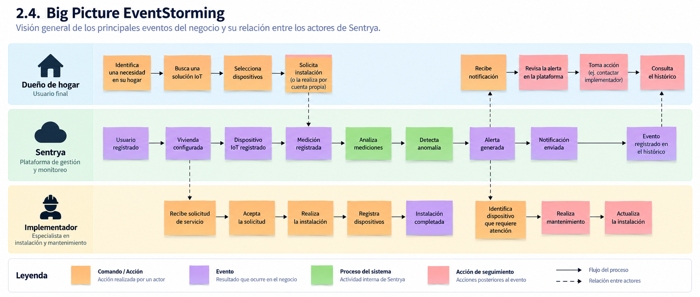

### 2.5. Ubiquitous Language

| Término | Descripción |
|---------|-------------|
| **Sentrya** | Plataforma para la gestión y monitoreo de soluciones IoT en el hogar. |
| **Dueño de hogar** | Usuario responsable de una vivienda que utiliza y administra soluciones IoT. |
| **Implementador** | Profesional encargado de instalar, configurar y mantener soluciones IoT. |
| **Vivienda** | Hogar donde se encuentran instaladas las soluciones y dispositivos IoT. |
| **Ambiente** | Espacio específico de una vivienda donde se encuentran uno o más dispositivos IoT. |
| **Dispositivo IoT** | Dispositivo conectado que permite obtener información, detectar eventos o ejecutar acciones en la vivienda. |
| **Solución IoT** | Conjunto de dispositivos y funcionalidades destinados a resolver una necesidad específica del hogar. |
| **Instalación** | Implementación de una solución o conjunto de dispositivos IoT en una vivienda. |
| **Medición** | Dato obtenido por un dispositivo IoT, como temperatura, consumo o estado. |
| **Alerta** | Notificación generada cuando el sistema detecta una condición que requiere atención. |
| **Evento** | Hecho registrado por el sistema como resultado de una acción o cambio detectado. |
| **Histórico** | Registro de mediciones y eventos almacenados para su consulta posterior. |
| **Mantenimiento** | Actividades realizadas para revisar, corregir o conservar el funcionamiento de una instalación. |
| **Expansión modular** | Incorporación de nuevas soluciones o dispositivos IoT sin reemplazar los existentes. |

---

# Capítulo III: Requirements Specification

## 3.1. User Stories

En esta sección se detallan las Épicas y las User Stories que guiarán el desarrollo de Setrya. Las épicas agrupan las historias de usuario según las soluciones IoT y funcionalidades definidas en el Capítulo I (dashboard centralizado, monitoreo térmico, detección acústica y visual, protección eléctrica, centro de alertas, mediciones e históricos, catálogo de soluciones IoT, solicitud de implementadores, gestión de clientes e instalaciones, gestión de dispositivos IoT, control remoto y expansión modular).

### 3.1.1. Épicas

| Epic ID | Título | Descripción |
|---------|--------|--------------|
| EP01 | Registro y Autenticación | Como usuario de Setrya (dueño de hogar o implementador), quiero crear una cuenta, iniciar/cerrar sesión y recuperar mi contraseña, para acceder de forma segura a la plataforma según mi rol. |
| EP02 | Dashboard Centralizado del Hogar | Como dueño de hogar, quiero visualizar en un solo entorno el estado general de mis dispositivos y soluciones IoT, para conocer rápidamente la situación de mi vivienda. |
| EP03 | Monitoreo Térmico | Como dueño de hogar, quiero monitorear la temperatura de mi vivienda con distintos niveles de alerta, para prevenir riesgos asociados a incrementos anómalos. |
| EP04 | Detección Acústica y Visual | Como dueño de hogar, quiero recibir alertas ante eventos anómalos de seguridad detectados por sensores acústicos y visuales, para responder oportunamente ante posibles intrusiones. |
| EP05 | Protección Eléctrica Inteligente | Como dueño de hogar, quiero que el sistema detecte condiciones eléctricas anómalas y actúe automáticamente, para proteger mis dispositivos y mi vivienda. |
| EP06 | Centro de Alertas y Notificaciones | Como dueño de hogar, quiero recibir y consultar todas las alertas generadas por mis dispositivos en un solo lugar, para atender rápidamente lo que requiere mi atención. |
| EP07 | Mediciones e Históricos | Como usuario de Setrya, quiero consultar el historial de mediciones y eventos de mi vivienda, para comprender el comportamiento de mis dispositivos a lo largo del tiempo. |
| EP08 | Catálogo de Soluciones IoT | Como dueño de hogar, quiero explorar un catálogo de soluciones IoT disponibles, para ampliar progresivamente el ecosistema inteligente de mi vivienda. |
| EP09 | Solicitud de Implementadores | Como dueño de hogar, quiero buscar y solicitar el servicio de un implementador especializado, para instalar, ampliar o mantener mis soluciones IoT. |
| EP10 | Gestión de Clientes e Instalaciones | Como implementador, quiero administrar mis clientes, viviendas e instalaciones desde un mismo entorno, para organizar mi trabajo de forma centralizada. |
| EP11 | Gestión de Dispositivos IoT | Como implementador, quiero registrar y consultar los dispositivos asociados a cada vivienda y ambiente, para mantener trazabilidad de cada instalación. |
| EP12 | Control Remoto y Expansión Modular | Como dueño de hogar, quiero controlar remotamente los dispositivos compatibles e incorporar nuevas categorías de dispositivos, para administrar y ampliar mi hogar inteligente sin reemplazar lo ya instalado. |

### 3.1.2. Historias de Usuario

| Epic / Story ID | Título | Descripción | Criterios de Aceptación | Epic ID |
|------------------|--------|--------------|---------------------------|---------|
| Registro y Autenticación / US01 | Registro de usuario | Como usuario de Setrya, quiero crear una cuenta seleccionando mi rol (dueño de hogar o implementador), para acceder a las funcionalidades correspondientes. | Dado que el usuario accede a la pantalla de registro   Cuando completa el formulario con sus datos y selecciona un rol   Entonces el sistema crea la cuenta y lo redirige a su dashboard según el rol elegido. | EP01 |
| Registro y Autenticación / US02 | Inicio de sesión | Como usuario de Setrya, quiero iniciar sesión con mis credenciales, para acceder a mi cuenta personalizada. | Escenario 1:   Dado que el usuario ingresa credenciales válidas   Cuando presiona "Iniciar sesión"   Entonces accede a su dashboard.    Escenario 2:   Dado que el usuario ingresa credenciales inválidas   Cuando presiona "Iniciar sesión"   Entonces el sistema muestra un mensaje de error y no permite el acceso. | EP01 |
| Registro y Autenticación / US03 | Recuperar contraseña | Como usuario de Setrya, quiero recuperar mi contraseña, para volver a acceder a mi cuenta en caso la olvide. | Dado que el usuario no recuerda su contraseña   Cuando presiona "Recuperar contraseña" e ingresa su correo   Entonces el sistema envía un enlace para restablecerla. | EP01 |
| Dashboard Centralizado / US04 | Visualización del estado general del hogar | Como dueño de hogar, quiero ver un resumen del estado de todos mis dispositivos IoT al ingresar a la aplicación, para identificar rápidamente si existe alguna alerta activa. | Dado que el dueño de hogar tiene dispositivos registrados   Cuando ingresa a su dashboard   Entonces el sistema muestra el estado general de cada módulo (térmico, seguridad, eléctrico) y las alertas activas. | EP02 |
| Dashboard Centralizado / US05 | Organización por ambientes | Como dueño de hogar, quiero visualizar mis dispositivos agrupados por ambiente de la vivienda, para ubicar rápidamente el dispositivo que necesito revisar. | Dado que el dueño de hogar tiene ambientes configurados   Cuando accede a la sección "Mis ambientes"   Entonces el sistema lista los dispositivos asociados a cada ambiente. | EP02 |
| Monitoreo Térmico / US06 | Configuración de niveles de alerta térmica | Como dueño de hogar, quiero configurar los umbrales de temperatura que activan una alerta, para adaptar el monitoreo a las condiciones de mi vivienda. | Dado que el dueño de hogar tiene un sensor térmico instalado   Cuando define los umbrales de alerta (normal, moderado, crítico)   Entonces el sistema guarda la configuración y la aplica a las lecturas futuras. | EP03 |
| Monitoreo Térmico / US07 | Recepción de alerta térmica | Como dueño de hogar, quiero recibir una notificación cuando la temperatura supere el umbral configurado, para tomar acción antes de que represente un riesgo. | Dado que un sensor térmico registra una lectura fuera de los umbrales definidos   Cuando se supera el umbral configurado   Entonces el sistema genera una alerta y notifica al dueño de hogar indicando el nivel alcanzado. | EP03 |
| Detección Acústica y Visual / US08 | Recepción de alerta de seguridad | Como dueño de hogar, quiero recibir una alerta cuando un sensor acústico o visual detecte un evento anómalo, para conocer oportunamente una posible situación de riesgo. | Dado que los sensores de seguridad están activos   Cuando se detecta un evento anómalo   Entonces el sistema genera una alerta con la evidencia disponible y notifica al dueño de hogar. | EP04 |
| Detección Acústica y Visual / US09 | Revisión de evidencia de un evento | Como dueño de hogar, quiero revisar la evidencia asociada a una alerta de seguridad, para comprender qué originó la notificación. | Dado que existe una alerta de seguridad generada   Cuando el dueño de hogar accede al detalle de la alerta   Entonces el sistema muestra la evidencia (imagen o registro) asociada al evento. | EP04 |
| Protección Eléctrica / US10 | Detección de condición eléctrica anómala | Como dueño de hogar, quiero que el sistema identifique condiciones eléctricas anómalas (sobrecarga o cortocircuito), para proteger los dispositivos conectados a mi vivienda. | Dado que el protector eléctrico inteligente está instalado   Cuando se detecta una condición anómala predefinida   Entonces el sistema registra el evento y ejecuta la acción de protección configurada. | EP05 |
| Protección Eléctrica / US11 | Consulta de acción ejecutada | Como dueño de hogar, quiero consultar qué acción ejecutó el sistema ante una condición eléctrica anómala, para conocer el estado actual del suministro. | Dado que se generó un evento de protección eléctrica   Cuando el dueño de hogar accede al detalle del evento   Entonces el sistema muestra la condición detectada, el dispositivo afectado y la acción ejecutada. | EP05 |
| Centro de Alertas / US12 | Listado centralizado de alertas | Como dueño de hogar, quiero ver todas mis alertas (térmicas, de seguridad y eléctricas) en un mismo centro de notificaciones, para atender rápidamente lo más relevante. | Dado que existen alertas generadas por distintos módulos   Cuando el dueño de hogar accede al "Centro de alertas"   Entonces el sistema lista las alertas ordenadas por prioridad y fecha. | EP06 |
| Centro de Alertas / US13 | Configuración de preferencias de notificación | Como dueño de hogar, quiero elegir el canal por el que recibo mis notificaciones (push, correo), para enterarme de los eventos de la forma que prefiera. | Dado que el dueño de hogar accede a "Preferencias de notificaciones"   Cuando selecciona los canales deseados   Entonces el sistema aplica la configuración a las futuras alertas. | EP06 |
| Mediciones e Históricos / US14 | Consulta de histórico de mediciones | Como dueño de hogar, quiero consultar el histórico de mediciones de un dispositivo en un periodo determinado, para comprender su comportamiento a lo largo del tiempo. | Dado que un dispositivo tiene mediciones registradas   Cuando el usuario selecciona un rango de fechas   Entonces el sistema muestra las mediciones y una tendencia básica del periodo. | EP07 |
| Mediciones e Históricos / US15 | Consulta de histórico de eventos | Como implementador, quiero consultar el historial de eventos de las instalaciones que administro, para dar seguimiento a su comportamiento. | Dado que una instalación tiene eventos registrados   Cuando el implementador accede al historial de la instalación   Entonces el sistema lista los eventos ordenados por fecha. | EP07 |
| Catálogo de Soluciones IoT / US16 | Exploración del catálogo | Como dueño de hogar, quiero explorar un catálogo de soluciones IoT disponibles, para identificar nuevas soluciones acordes a las necesidades de mi vivienda. | Dado que el dueño de hogar accede al "Catálogo de soluciones"   Cuando filtra por categoría (seguridad, monitoreo, automatización)   Entonces el sistema muestra las soluciones disponibles para esa categoría. | EP08 |
| Catálogo de Soluciones IoT / US17 | Detalle de una solución del catálogo | Como dueño de hogar, quiero ver el detalle de una solución del catálogo, para conocer sus características antes de solicitarla. | Dado que el dueño de hogar selecciona una solución del catálogo   Cuando accede a su detalle   Entonces el sistema muestra la descripción, requisitos y beneficios de la solución. | EP08 |
| Solicitud de Implementadores / US18 | Búsqueda de implementadores | Como dueño de hogar, quiero buscar implementadores especializados disponibles en mi zona, para solicitar la instalación o el mantenimiento de una solución. | Dado que el dueño de hogar accede a "Buscar implementador"   Cuando filtra por ubicación y especialidad   Entonces el sistema muestra una lista de implementadores disponibles. | EP09 |
| Solicitud de Implementadores / US19 | Solicitud de servicio a un implementador | Como dueño de hogar, quiero enviar una solicitud de servicio a un implementador, para coordinar la instalación de una solución IoT. | Dado que el dueño de hogar seleccionó un implementador   Cuando completa y envía el formulario de solicitud   Entonces el sistema notifica al implementador y registra la solicitud como pendiente. | EP09 |
| Gestión de Clientes e Instalaciones / US20 | Registro de una nueva instalación | Como implementador, quiero registrar una nueva instalación asociada a un cliente, para llevar control de los servicios que realizo. | Dado que el implementador acepta una solicitud de servicio   Cuando registra los datos de la instalación   Entonces el sistema la asocia al cliente correspondiente y la agrega a su listado de instalaciones. | EP10 |
| Gestión de Clientes e Instalaciones / US21 | Consulta de instalaciones por cliente | Como implementador, quiero consultar las instalaciones que he realizado agrupadas por cliente, para ubicar rápidamente la información que necesito. | Dado que el implementador tiene instalaciones registradas   Cuando accede a "Mis clientes"   Entonces el sistema lista los clientes junto con sus instalaciones asociadas. | EP10 |
| Gestión de Dispositivos IoT / US22 | Registro de dispositivo IoT | Como implementador, quiero registrar un dispositivo IoT y asociarlo a una vivienda y ambiente, para mantener organizada la información de cada instalación. | Dado que el implementador está configurando una instalación   Cuando registra un dispositivo indicando vivienda y ambiente   Entonces el sistema guarda el dispositivo y lo asocia correctamente. | EP11 |
| Gestión de Dispositivos IoT / US23 | Identificación de dispositivos que requieren atención | Como implementador, quiero identificar qué dispositivos presentan alertas o fallas, para priorizar mi trabajo de mantenimiento. | Dado que existen dispositivos con alertas activas   Cuando el implementador accede a su panel de dispositivos   Entonces el sistema resalta los dispositivos que requieren revisión. | EP11 |
| Control Remoto / US24 | Control remoto de un dispositivo compatible | Como dueño de hogar, quiero ejecutar acciones remotas sobre un dispositivo compatible, para administrar mi vivienda sin necesidad de estar físicamente junto al dispositivo. | Dado que el dueño de hogar tiene un dispositivo compatible con control remoto   Cuando ejecuta una acción desde la aplicación   Entonces el sistema aplica la acción y actualiza el estado del dispositivo. | EP12 |
| Control Remoto / US25 | Incorporación de una nueva categoría de dispositivo | Como dueño de hogar, quiero incorporar una nueva categoría de dispositivo a mi ecosistema, para ampliar mi hogar inteligente sin reemplazar lo ya instalado. | Dado que el dueño de hogar selecciona una nueva solución del catálogo   Cuando confirma su incorporación   Entonces el sistema la agrega a su ecosistema manteniendo activas las soluciones previas. | EP12 |

## 3.2. Impact Mapping

El Impact Mapping se elaboró a partir de los objetivos de negocio (Business Outcomes) definidos en el Lean UX Canvas del Capítulo I, distinguiendo los dos segmentos objetivo de Setrya: dueños de hogar e implementadores de hogar inteligente.

### 3.2.1. Impact Mapping — Segmento: Dueño de hogar

- **Goal (¿Por qué?):** Incrementar el uso recurrente de Setrya y la ampliación progresiva del ecosistema IoT de la vivienda.
  - **Actor (¿Quién?): Dueño de hogar**
    - **Impact (¿Cómo debe cambiar su comportamiento?):** Consultar el estado de su hogar con frecuencia y confiar en las alertas generadas.
      - **Deliverable (¿Qué podemos construir?):** Dashboard Centralizado del Hogar (EP02)
      - **Deliverable:** Centro de Alertas y Notificaciones (EP06)
      - **Deliverable:** Mediciones e Históricos (EP07)
    - **Impact:** Reconocer oportunamente eventos de riesgo (térmicos, de seguridad y eléctricos) y responder ante ellos.
      - **Deliverable:** Monitoreo Térmico (EP03)
      - **Deliverable:** Detección Acústica y Visual (EP04)
      - **Deliverable:** Protección Eléctrica Inteligente (EP05)
    - **Impact:** Ampliar su ecosistema inteligente incorporando nuevas soluciones sin reemplazar lo instalado.
      - **Deliverable:** Catálogo de Soluciones IoT (EP08)
      - **Deliverable:** Control Remoto y Expansión Modular (EP12)
    - **Impact:** Solicitar apoyo especializado cuando lo necesite, sin depender de medios externos.
      - **Deliverable:** Solicitud de Implementadores (EP09)

### 3.2.2. Impact Mapping — Segmento: Implementador de hogar inteligente

- **Goal (¿Por qué?):** Incrementar la adopción profesional de Setrya y mejorar la organización y trazabilidad de las instalaciones realizadas.
  - **Actor (¿Quién?): Implementador de hogar inteligente**
    - **Impact (¿Cómo debe cambiar su comportamiento?):** Administrar clientes e instalaciones desde una misma herramienta en lugar de registros externos.
      - **Deliverable:** Gestión de Clientes e Instalaciones (EP10)
    - **Impact:** Registrar y ubicar con rapidez los dispositivos que ha instalado para cada vivienda.
      - **Deliverable:** Gestión de Dispositivos IoT (EP11)
    - **Impact:** Priorizar su trabajo identificando primero las instalaciones o dispositivos que requieren atención.
      - **Deliverable:** Centro de Alertas y Notificaciones (EP06)
      - **Deliverable:** Mediciones e Históricos (EP07)
    - **Impact:** Aceptar y dar seguimiento a nuevas solicitudes de servicio generadas por los dueños de hogar.
      - **Deliverable:** Solicitud de Implementadores (EP09)

## 3.3. Product Backlog

| # Orden | User Story ID | Título | Story Points (1/2/3/5/8) |
|---------|----------------|--------|----------------------------|
| 1 | US01 | Registro de usuario | 3 |
| 2 | US02 | Inicio de sesión | 2 |
| 3 | US03 | Recuperar contraseña | 2 |
| 4 | US04 | Visualización del estado general del hogar | 5 |
| 5 | US05 | Organización por ambientes | 3 |
| 6 | US06 | Configuración de niveles de alerta térmica | 3 |
| 7 | US07 | Recepción de alerta térmica | 5 |
| 8 | US08 | Recepción de alerta de seguridad | 5 |
| 9 | US09 | Revisión de evidencia de un evento | 3 |
| 10 | US10 | Detección de condición eléctrica anómala | 5 |
| 11 | US11 | Consulta de acción ejecutada | 2 |
| 12 | US12 | Listado centralizado de alertas | 3 |
| 13 | US13 | Configuración de preferencias de notificación | 2 |
| 14 | US14 | Consulta de histórico de mediciones | 3 |
| 15 | US15 | Consulta de histórico de eventos | 3 |
| 16 | US16 | Exploración del catálogo | 2 |
| 17 | US17 | Detalle de una solución del catálogo | 1 |
| 18 | US18 | Búsqueda de implementadores | 3 |
| 19 | US19 | Solicitud de servicio a un implementador | 3 |
| 20 | US20 | Registro de una nueva instalación | 3 |
| 21 | US21 | Consulta de instalaciones por cliente | 2 |
| 22 | US22 | Registro de dispositivo IoT | 3 |
| 23 | US23 | Identificación de dispositivos que requieren atención | 5 |
| 24 | US24 | Control remoto de un dispositivo compatible | 5 |
| 25 | US25 | Incorporación de una nueva categoría de dispositivo | 3 |

---

### 4.1. Strategic-Level Domain-Driven Design

Esta sección describe cómo el diseño orientado al dominio (DDD) guio la arquitectura estratégica de nuestra solución. Nos enfocamos en segmentar el sistema en contextos delimitados (Bounded Contexts) para mejorar la organización del desarrollo. Mediante el uso de Event Storming y Bounded Context Canvases, definimos con precisión el alcance y las interacciones de cada componente. Como resultado, logramos una estructura de software totalmente alineada con las necesidades reales del negocio.

#### 4.1.1. Design-Level EventStorming
El proceso de modelado comenzó con una fase de descubrimiento deliberado mediante una dinámica de lluvia de ideas. Durante esta actividad, se utilizaron notas adhesivas de color naranja para representar los Domain Events (eventos de dominio). Estos elementos son fundamentales, ya que capturan hechos significativos que ocurren dentro del sistema y reflejan cambios de estado críticos para el negocio. Esta identificación visual permitió al equipo mapear la cronología de los procesos e identificar los puntos de interacción más relevantes de la aplicación.

##### 4.1.1.1. Candidate Context Discovery
Esta sección describe la dinámica de los procesos de negocio mediante el flujo de eventos. Al identificar los pivotal events, logramos detectar los puntos de cambio donde una responsabilidad termina y otra comienza, lo que resulta fundamental para la creación de los Bounded Contexts. Esta delimitación estratégica permite estructurar el dominio de forma coherente, facilitando el desarrollo modular y permitiendo que el software escale de manera ordenada según las necesidades de la organización.

### Identity & Access Management BC

### Payment Management BC
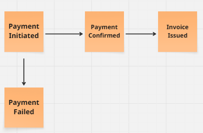

### IoT Monitoring and Notifications BC
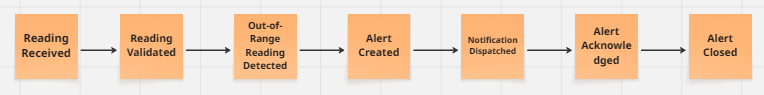

### Space Management BC
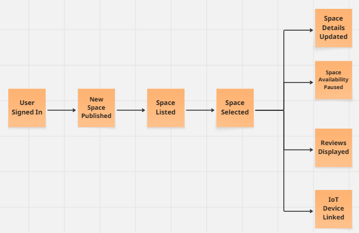

### Report Management BC
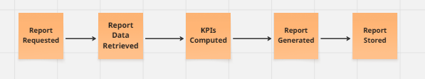
 

A partir de esto, fuimos agrupando aquellos que tenían vínculos más cercanos y separamos los que apenas interactuaban, marcando así límites de consistencia más claros.

### 4.1.1.2. Domain Message Flows Modeling

Posteriormente, se procedió a definir la interconexión estratégica de los bounded contexts delimitados en las fases previas. Este proceso se centró en la identificación y mapeo de eventos de dominio clave, los cuales actúan como el tejido conectivo de la arquitectura distribuida. Al establecer estos puntos de enlace, se garantizó una comunicación asíncrona y desacoplada, permitiendo que el flujo de información entre contextos sea fluido, coherente y respete las reglas de negocio de cada área.

## IAM (Identity and Access Management) - El Punto de Entrada --> Space Management (Gestión de Equipos) - La Configuración

## Space Management (Gestión de Equipos) - La Configuración --> Payment Management - La Activación del Servicio

## Payment Management - La Activación del Servicio --> IoT Monitoring and Notifications - El Core Operativo

## IoT Monitoring and Notifications - El Core Operativo --> Reports and Advanced Features - La Inteligencia de Negocio

 ### 4.1.1.3. Bounded Context Canvases

La separación en bounded contexts permite reducir la complejidad, facilitar la escalabilidad y mantener la coherencia del modelo, garantizando que cada parte del sistema responda a objetivos específicos sin generar dependencias innecesarias.

En Sentrya, los bounded contexts identificados fueron los siguientes:

Registro y Autenticación de Usuario (IAM): Encargado de la validación de identidades de propietarios y técnicos, garantizando el acceso seguro a la infraestructura de remodelación e IoT privada.

Gestión de Espacios (Space Management): Núcleo operativo que organiza la infraestructura física y digital de los espacios, permitiendo definir layouts, gestionar el inventario y vincular dispositivos inteligentes.

Monitoreo y Notificaciones IoT: Responsable de procesar la telemetría de los sensores en tiempo real, identificar anomalías técnicas mediante la detección de incidentes y distribuir alertas automáticas ante eventos relevantes .

Gestión de Pagos (Payment Management): Especializado en el ciclo de vida financiero de las transacciones de remodelación, incluyendo el procesamiento de cobros, reembolsos y la emisión de facturas legales.

Informes y Funciones Avanzadas (Reports): Orientado al procesamiento de datos operativos y financieros para generar métricas de eficiencia, informes de sostenibilidad y tableros de control ejecutivo.

Cada uno de estos bounded contexts se detalla a continuación a través de su canvas, explicando su descripción, clasificación estratégica, roles, comunicaciones entrantes y salientes, lenguaje ubicuo y decisiones de negocio clave.

### Identity & Access Management BC

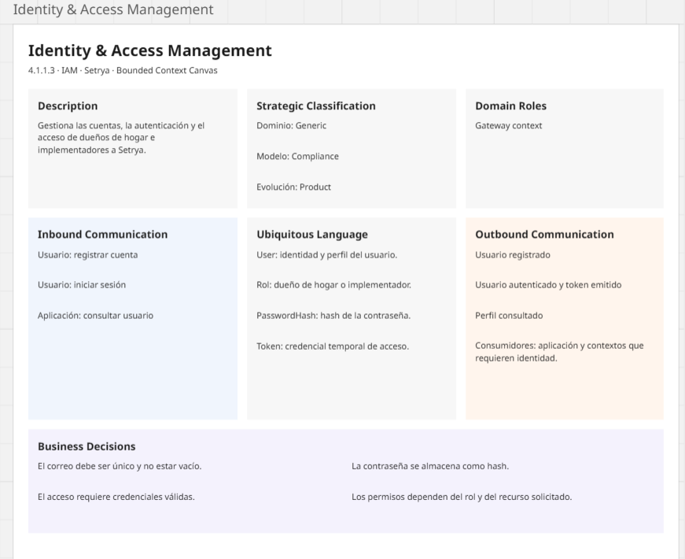

### Space Management BC

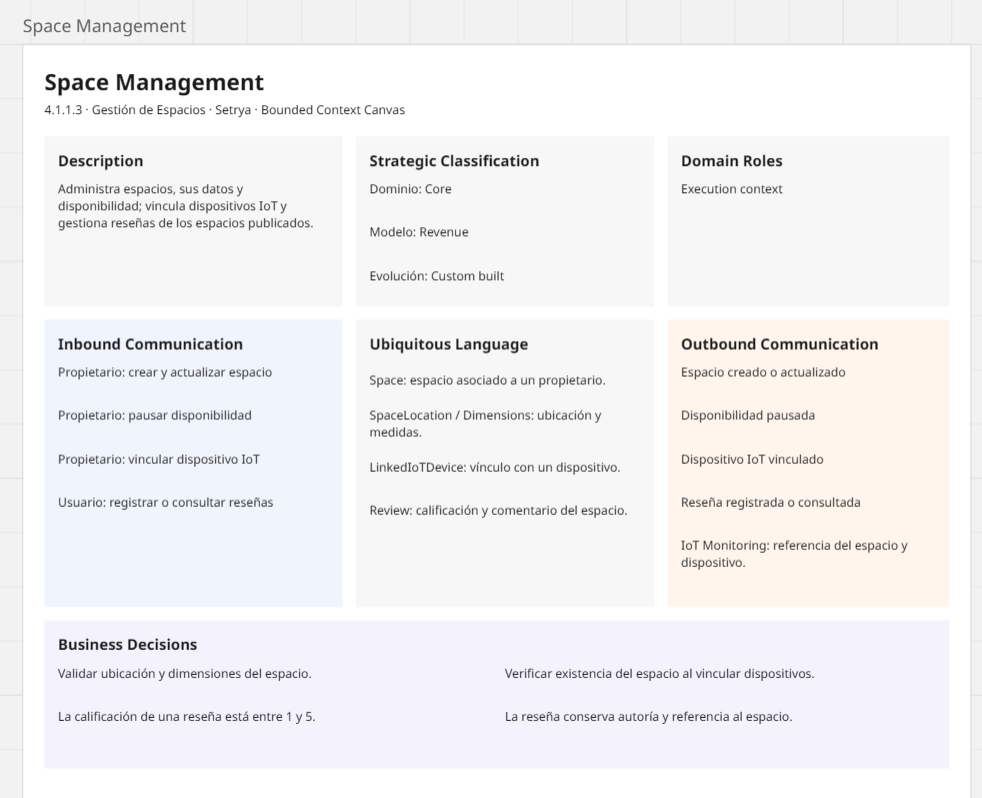

### Iot Monitoring and Notification BC

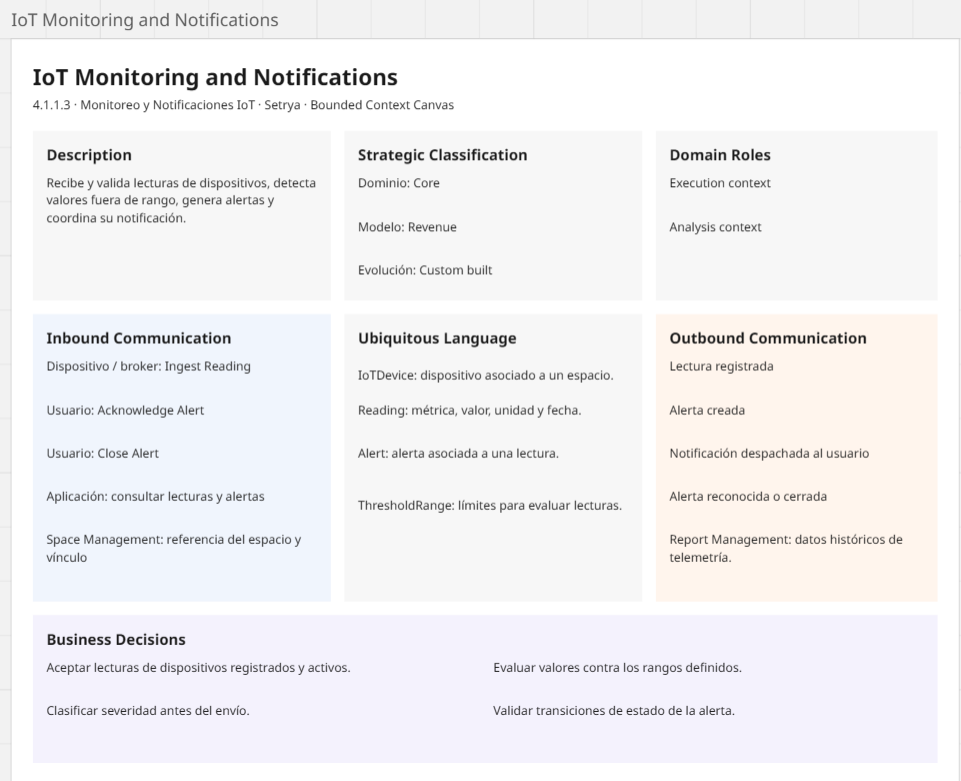

### Payment Management BC

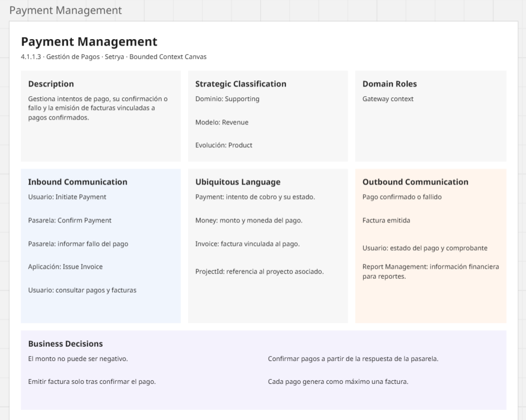

### Reports & Advanced Features BC

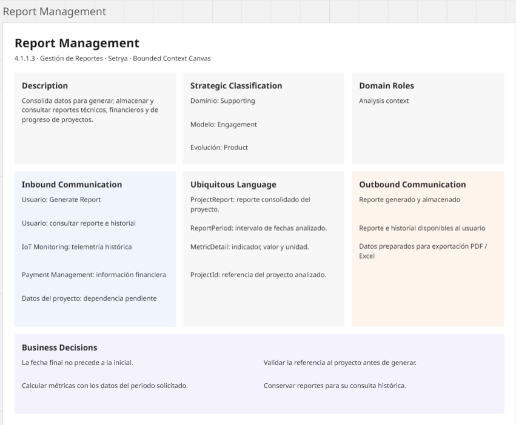

### 4.1.2 Context Mapping
El Context Mapping de Sentrya permite representar la organización general del dominio del sistema y la manera en que sus distintas partes se relacionan entre sí. Esta vista ayuda a delimitar responsabilidades, reducir el acoplamiento y entender con mayor claridad cómo se distribuyen los procesos principales de la solución.
Se identificaron los siguientes bounded context en el sistema:

**Identity & Access Management**

Se encarga del registro, autenticación y control de acceso de los usuarios. Su función principal es permitir que el usuario cree su cuenta, inicie sesión y acceda al sistema de forma segura según su rol. A partir de este contexto se habilita el ingreso a las demás funcionalidades de la plataforma. 

**Space Management**

Se encarga de la gestión de espacios dentro de la plataforma. Aquí se registran, publican, actualizan y administran los espacios que formarán parte del flujo principal del negocio. También concentra la lógica base sobre la cual se conectan los procesos de remodelación, monitoreo y contratación de servicios. 

**Payment Management**

Administra los pagos, cobros, suscripciones y comprobantes relacionados con los servicios contratados en Sentrya. Su función es controlar la parte financiera del sistema y dar trazabilidad a las operaciones económicas asociadas a remodelaciones o servicios del espacio. 

**IoT Monitoring & Notifications**

Se encarga del monitoreo de lecturas, detección de incidentes y envío de notificaciones. Su objetivo es registrar eventos relacionados con el espacio o con el proceso de remodelación, identificar anomalías y comunicar alertas a los usuarios cuando sea necesario. 

**Reports & Advanced Features**

Se encarga de la generación de reportes, métricas e información analítica. Su función es tomar datos producidos por otros contextos y transformarlos en información útil para seguimiento, supervisión y apoyo a la toma de decisiones.

|Destino |Origen |Tipo de relación |Comentario |
|-------|----------|-------------|------------|
|Space Management |Identity & Access Management |Shared Kernel |La gestión de espacios requiere que el usuario esté autenticado y tenga un rol válido dentro del sistema. Por ello, ambos contextos comparten una base mínima de identidad sin mezclar sus responsabilidades. |
|Payment Management |Space Management |Customer/Supplier |Payment Management necesita información generada en Space Management, como espacios, servicios contratados o remodelaciones asociadas, para procesar los cobros y pagos del sistema. |
|IoT Monitoring & Notifications |Space Management |Customer/Supplier |El monitoreo y las notificaciones dependen de un espacio previamente registrado en la plataforma. Por eso, Space Management provee la base del espacio y IoT Monitoring & Notifications usa esa información para gestionar lecturas, alertas e incidentes. |
|Reports & Advanced Features |Payment Management |Conformist |Reports & Advanced Features consume la información financiera generada por Payment Management para construir reportes e indicadores sin modificar el modelo original. |
|Reports & Advanced Features |IoT Monitoring & Notifications |Conformist |Reports & Advanced Features también consume la información producida por IoT Monitoring & Notifications, como alertas, incidentes o eventos, para generar análisis y vistas de seguimiento. |

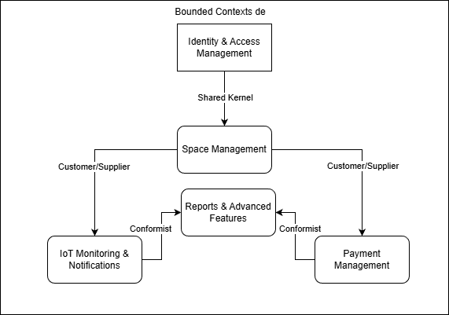

### Identity & Access Management BC

### Payment Management BC

### Iot Monitoring and Notification

### Space Management BC

### Reports & Advanced Features BC

### 4.1.3 Software Architecture
La arquitectura de software de Sentrya ha sido planteada para soportar los procesos principales del negocio de forma organizada y desacoplada. La solución parte de una aplicación móvil desde la cual los usuarios interactúan con la plataforma para gestionar espacios, contratar servicios de remodelación, monitorear el avance del proyecto, recibir alertas y consultar reportes. Para responder a estas necesidades, el sistema se apoya en un backend centralizado que concentra la lógica del negocio y coordina la interacción con los distintos módulos funcionales, como autenticación, gestión de espacios, pagos, monitoreo IoT, notificaciones y reportes. Además, la arquitectura contempla la integración con servicios externos necesarios para el procesamiento de pagos, la generación de comprobantes electrónicos, el envío de correos y la recepción de lecturas o eventos provenientes del entorno monitoreado. Esta organización permite que la solución mantenga una estructura clara, facilite la evolución de sus funcionalidades y soporte de manera consistente el flujo principal de Sentrya.

#### 4.1.3.1. Software Architecture System Landscape Diagram
El diagrama System Landscape de Sentrya presenta una visión general del ecosistema de la solución, identificando sus usuarios principales y los sistemas con los que interactúa. Los dueños de hogar utilizan la plataforma para administrar sus espacios y consultar información de dispositivos, alertas, pagos y reportes, mientras que los implementadores de hogares inteligentes participan en la vinculación de dispositivos y la supervisión de las instalaciones autorizadas. Sentrya centraliza estas funcionalidades mediante sus interfaces web y móvil y se integra con el entorno IoT para recibir mediciones, con una pasarela de pagos para procesar transacciones y con un servicio de correo para enviar notificaciones y comprobantes. Asimismo, se representa un servicio de facturación electrónica como integración propuesta, pendiente de concretar en el diseño táctico. Esta vista delimita los participantes y las relaciones generales del ecosistema, sin detallar los contenedores ni los componentes internos de la plataforma.

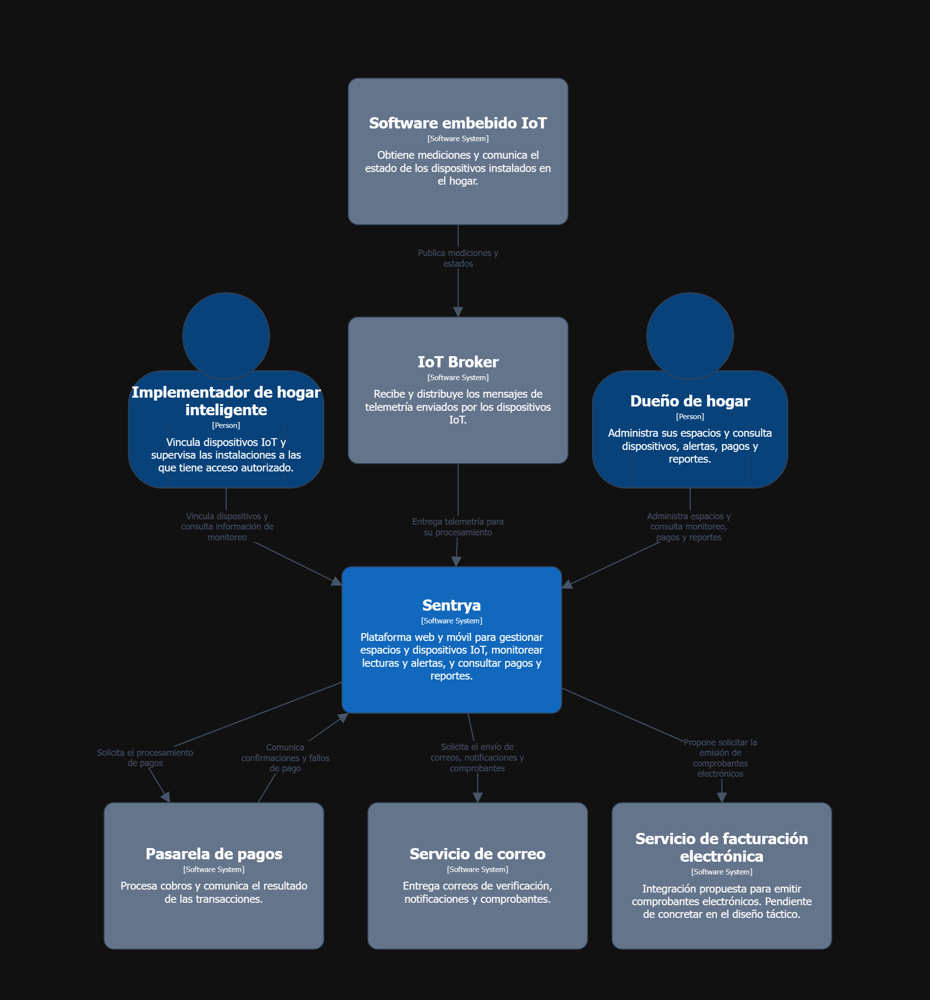

#### 4.1.3.2. Software Architecture Context Level Diagram
El diagrama de contexto de Sentrya representa la plataforma como un único sistema y muestra sus relaciones con los usuarios y sistemas externos que participan directamente en su funcionamiento. Los dueños de hogar utilizan la solución para administrar sus espacios y consultar dispositivos, lecturas, alertas, pagos y reportes. Por su parte, los implementadores de hogares inteligentes vinculan dispositivos y consultan información de monitoreo de las instalaciones autorizadas. Sentrya recibe telemetría mediante un broker IoT, solicita el procesamiento de transacciones a una pasarela de pagos y utiliza un servicio de correo para enviar notificaciones y comprobantes. También contempla una integración propuesta con un servicio de facturación electrónica, pendiente de concretar en el diseño táctico. Esta vista permite identificar los límites de la plataforma y sus dependencias externas, sin detallar su organización interna.

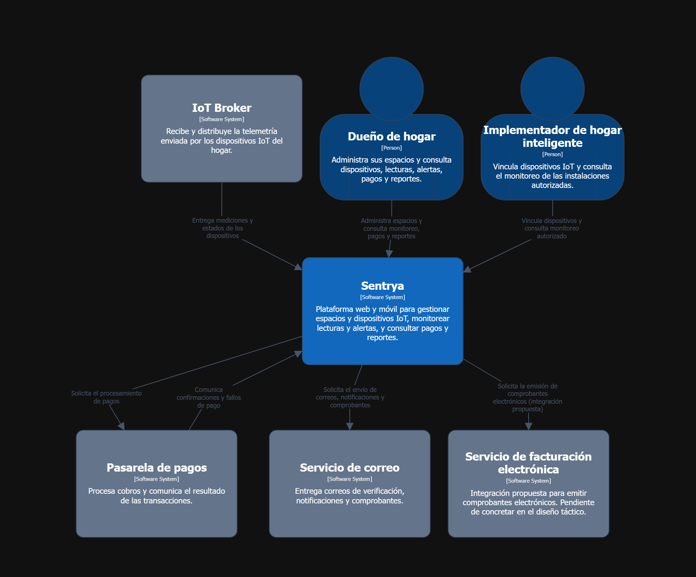

#### 4.1.3.3. Software Architecture Container Level Diagrams
El diagrama de contenedores de Sentrya presenta la organización interna de la plataforma y las responsabilidades de sus principales unidades de software. Los dueños de hogar y los implementadores acceden a las funcionalidades mediante una aplicación móvil y una aplicación web, mientras que la landing page proporciona información general sobre la solución. Ambas aplicaciones se comunican con un API Gateway, que dirige las solicitudes hacia los servicios de identidad y acceso, gestión de espacios, gestión de pagos, gestión de reportes y monitoreo y notificaciones IoT. En esta propuesta, dichos servicios se representan como aplicaciones independientes que utilizan una base de datos relacional común para persistir su información. El servicio de monitoreo recibe las lecturas del entorno IoT y procesa las alertas, mientras que los servicios correspondientes se integran con proveedores externos de pagos y correo. La facturación electrónica externa se mantiene como una integración propuesta, pendiente de concretar en el diseño táctico. Asimismo, la obtención de datos de proyectos para pagos y reportes constituye una dependencia pendiente de delimitar en el apartado 4.2.
 

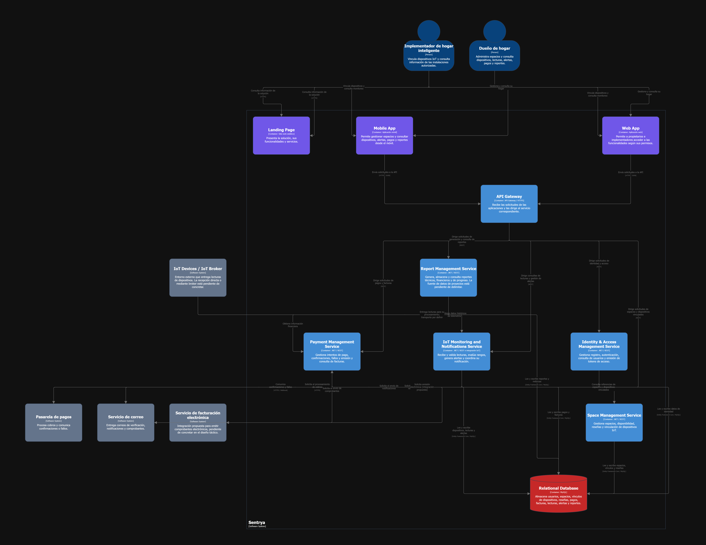

#### 4.1.3.4. Software Architecture Deployment Diagrams.
El diagrama presenta una vista resumida del despliegue propuesto de Sentrya. La aplicación móvil se ejecuta en los dispositivos de los usuarios, mientras que la aplicación web y la Landing Page se alojan en infraestructura web. En la plataforma cloud se encuentra el entorno backend, que aloja el API Gateway y los servicios de identidad y acceso, espacios, pagos, reportes, y monitoreo IoT y notificaciones. Estos servicios utilizan una base de datos relacional MySQL para la persistencia de información.

Para facilitar su lectura, el diagrama agrupa el despliegue del backend en un único nodo y omite las integraciones externas, descritas en los diagramas de contexto y contenedores. Esta agrupación representa su entorno de alojamiento y no modifica la separación funcional de los servicios.

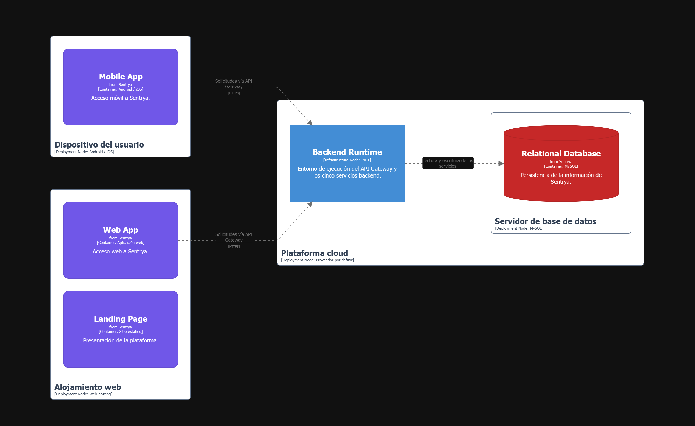

# 4.2. Tactical-Level Domain-Driven Design

## 4.2.1. Bounded Context IAM

### 4.2.1.1. Domain Layer

La capa de dominio de IAM encapsula la lógica de negocio central para la gestión de identidades y seguridad, asegurando que las reglas de autenticación y autorización sean independientes de las tecnologías externas.

### Aggregates

| **Atributo** | **Nombre**  | **Descripción**                                       |
| ------------ | --------- | ----------------------------------------------------- |
| Aggregate Root         | User      | Representa al usuario autenticado en el sistema, conteniendo su identidad y el hash de su contraseña para validación segura.       |

**Métodos:**
- User (Constructor): Además de inicializar las propiedades del usuario, este método realiza una validación de negocio crítica al asegurar que el correo electrónico no esté vacío antes de crear la instancia.
### Value Objects

| **Atributo** | **Nombre**  | **Descripción**                                       |
| ------------ | --------- | ----------------------------------------------------- |
| Value        | Username      | Identificador único de texto utilizado por el usuario para acceder al sistema.      |
| Value        | PasswordHash      | Representación segura de la contraseña tras pasar por un algoritmo de encriptación.      |

### Commands & Queries

| **Atributo** | **Nombre**  | **Tipo**                                       |
| ------------ | --------- | ----------------------------------------------------- |
| Username, Password        | RegisterUserCommand      | Command      |
| Username, Password        | LoginQuery      | Query      |
| UserId        | GetUserByIdQuery      | Query      |

### Domain Services

| **Nombre** | **Funcion**  | **Metodos**                                       |
| ------------ | --------- | ----------------------------------------------------- |
| IPasswordHashingService        | Define el contrato para el cifrado y verificación de contraseñas de seguridad.      | HashPassword, VerifyPassword      |
| ITokenGenerationService        | Define el contrato para la generación de tokens de acceso (JWT) para sesiones autenticadas.      | GenerateToken      |

**Métodos:**

- IPasswordHashingService.HashPassword: Recibe la contraseña en texto plano ingresada por el usuario y la transforma en una cadena cifrada (hash) mediante un algoritmo criptográfico para su almacenamiento seguro.
- IPasswordHashingService.VerifyPassword: Compara una contraseña ingresada en texto claro contra un hash previamente almacenado para verificar si coinciden, permitiendo así el acceso al sistema.
- ITokenGenerationService.GenerateToken: Utiliza la información del objeto User autenticado para generar un token de seguridad (usualmente JWT), el cual servirá como credencial temporal para autorizar las peticiones del cliente en la plataforma.
### Repositories

| **Nombre** | **Descripción**                                     |
| ------------ | --------- |
| IUserRepository        | Interfaz para la persistencia y recuperación de datos de los agregados User.     |

En la Domain Layer de Sentrya, específicamente dentro del Bounded Context de IAM, hemos definido la gestión de identidades bajo un modelo de Domain-Driven Design (DDD). Estas entidades y objetos de valor representan las reglas de negocio fundamentales del sistema de autenticación y autorización para la plataforma de remodelación IoT. La clase User actúa como el Agregado raíz que centraliza la información del perfil y su asociación con roles específicos (como customer o perfiles técnicos), garantizando que el acceso y las credenciales se validen estrictamente a través de servicios de dominio como IPasswordHashingService e ITokenGenerationService. Finalmente, la recuperación y persistencia de estas identidades se gestiona mediante repositorios especializados como IUserRepository.
 
---

### 4.2.1.2. Interface Layer

En la Interface Layer de Sentrya, específicamente para el contexto de IAM, se han definido los puntos de entrada para la comunicación externa. Esta capa utiliza controladores REST, recursos (DTOs) y ensambladores para desacoplar el modelo de dominio de las representaciones externas, facilitando el registro y la autenticación de los usuarios de forma segura.

### Resources

| **Nombre** | **Descripción**  |  
| ------------ | --------- | 
| RegisterUserResource        | DTO que encapsula los datos de entrada (Email, Password, FullName, Phone) para el registro de un nuevo usuario.      | 
| LoginResource        | DTO que contiene las credenciales necesarias (Email, Password) para validar el acceso al sistema.      | 
| UserResource        | DTO de salida que representa la información pública del usuario (ID, Nombre, Email, Rol) tras una consulta exitosa.     | 
| AuthenticatedUserResource        | Recurso que devuelve el token JWT generado y la información básica del usuario tras un inicio de sesión correcto.      | 

### Controllers

| **Nombre** | **Método HTTP**  | **Parámetro / Resource**  | **Descripción** |
| ------------ | --------- | --------- | --------- |
| UsersController        | POST    |RegisterUserResource   | Expone el endpoint para crear una nueva cuenta de usuario en la plataforma.   |
| UsersController        | POST     |  LoginResource |  Gestiona la autenticación, verificando las credenciales y devolviendo el token de acceso.  |
| UsersController        | GET     |  UserId |  Recupera la información detallada de un usuario específico mediante su identificador.  |

### Transformers / Assemblers

| **Nombre** | **Descripción**  |  
| ------------ | --------- | 
| UserResourceFromEntityAssembler        | Se encarga de convertir la entidad de dominio User en un objeto UserResource para su envío a través de la API.     | 
| RegisterUserCommandFromResourceAssembler        | Transforma los datos recibidos en el RegisterUserResource en un comando RegisterUserCommand procesable por la capa de aplicación.      | 

En la Interface Layer de Sentrya, específicamente para el contexto de IAM, los controladores son los encargados de recibir las solicitudes HTTP, dirigirlas a los servicios apropiados y devolver una respuesta adecuada. Estos controladores no contienen reglas de negocio, sino que delegan el procesamiento a la capa de dominio o a los servicios de aplicación, actuando como una interfaz entre los usuarios y la lógica del negocio. Los controladores presentados permiten gestionar el registro de nuevos usuarios y la autenticación segura mediante credenciales dentro de la plataforma de remodelación IoT.
 
---

### 4.2.1.3. Application Layer

En la Application Layer de Sentrya, específicamente para el contexto de IAM, los handlers son los encargados de procesar los comandos y consultas, orquestando la lógica necesaria para cumplir con los casos de uso del sistema. Estos handlers actúan como mediadores entre la interfaz y el dominio, asegurando que las operaciones de registro y autenticación se realicen siguiendo las reglas de negocio establecidas. Los componentes presentados permiten orquestar la seguridad y los perfiles de usuario dentro de la plataforma de remodelación IoT.

|Nombre|Descripcion|Resumen de Logica|
|------|---------|------|
| RegisterUserCommandHandler        | Procesa la creación de nuevas cuentas de usuario.      | Valida que el email no esté en uso, cifra la contraseña usando el servicio de hashing, instancia el agregado User y persiste los cambios a través del repositorio y la unidad de trabajo. | 
| LoginQueryHandler        | Gestiona el proceso de inicio de sesión y autenticación.     | Busca al usuario por email, verifica la validez de la contraseña comparándola con el hash almacenado y genera un token JWT para sesiones seguras. | 
| GetUserByIdQueryHandler        | Recupera la información de un usuario específico.     | Consulta al repositorio de usuarios mediante un identificador único y devuelve un DTO con la información pública y técnica del perfil. | 

### Internal DTOs (Data Transfer Objects)

| **Nombre** | **Descripción**  |  
|------------|------------------|
| UserDto        | Objeto que transporta la información pública y operativa del usuario, incluyendo su rol y foto de perfil.     | 
| AuthenticationDto        | DTO especializado que encapsula la información básica del usuario junto con el token JWT tras una autenticación exitosa.      | 
 
---

### 4.2.1.4. Infrastructure Layer

En la Infrastructure Layer de Sentrya, específicamente para el contexto de IAM, se implementan los detalles técnicos y las integraciones con marcos de trabajo externos. Esta capa se encarga de la persistencia de datos mediante Entity Framework Core (EFC), configurando las entidades del dominio para su mapeo con la base de datos, y de la implementación de los servicios de seguridad como el cifrado de contraseñas y la generación de tokens JWT. Estos componentes aseguran que la lógica de negocio se ejecute sobre una infraestructura robusta y escalable dentro de la plataforma de remodelación IoT.

### Persistence (Repositories Implementation)

| **Nombre** | **Descripción**  |   Tecnologías / Herramientas  |
| ------------ | --------- | --------- | 
| UserRepository        | Implementación concreta de IUserRepository que utiliza EFC para realizar operaciones CRUD sobre la tabla de usuarios.      | Entity Framework Core, LINQ. | 
| UserConfiguration        | Define el mapeo detallado entre la entidad User y la tabla de base de datos, incluyendo restricciones y tipos de datos.     | Fluent API (EFC). | 

### Security Services Implementation

| **Nombre** | **Descripción**  |   Resumen de Implementación  |
| ------------ | --------- | --------- | 
| PasswordHashingService        | Implementación técnica encargada de proteger las contraseñas de los usuarios.      | Utiliza algoritmos de cifrado estándar para generar hashes seguros y validar contraseñas durante el acceso. | 
| TokenGenerationService        |Servicio responsable de la gestión de identidades en tránsito mediante tokens de seguridad.     | Implementa la generación de tokens JWT (JSON Web Tokens), codificando la información del usuario y su rol para la autorización de peticiones. | 

### 4.2.1.5. Bounded Context Software Architecture Component Level Diagrams

### 4.2.1.6. Bounded Context Software Architecture Code Level Diagrams

### 4.2.1.6.1. Bounded Context Domain Layer Class Diagrams

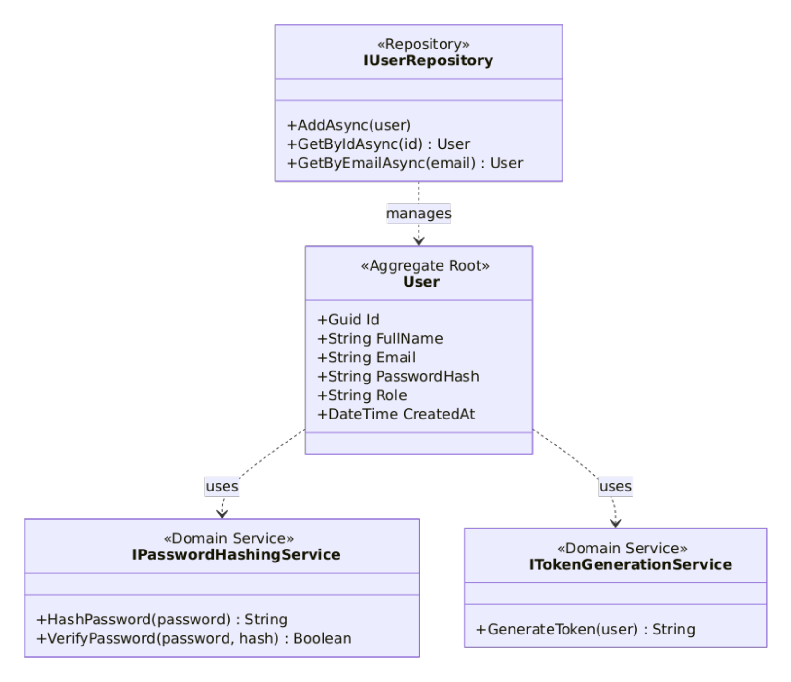

### 4.2.1.6.2. Bounded Context Database Design Diagrams
El diseño de la base de datos para el contexto de IAM se ha normalizado para garantizar la integridad de las identidades y la seguridad de la información financiera. Se compone de dos tablas principales relacionadas mediante una clave foránea.

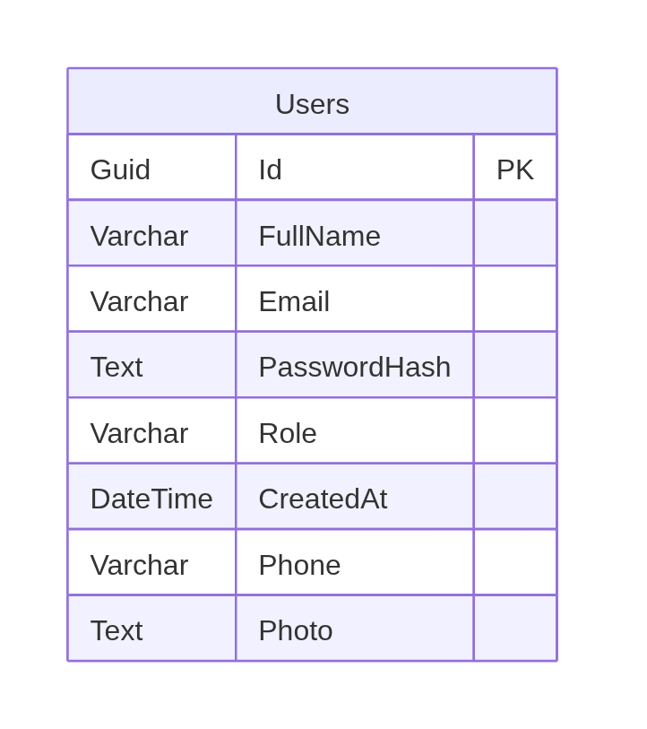

## 4.2.2. Bounded Context: Payment Management

### 4.2.2.1. Domain Layer

La Domain Layer es el núcleo que orquesta y gestiona las reglas de negocio relacionadas con las transacciones financieras y la facturación de servicios en la plataforma Sentrya. En este contexto, entidades como **Payment** e **Invoice**, junto con los objetos de valor y servicios de validación, permiten gestionar el ciclo de vida de los pagos por proyectos de remodelación e infraestructura IoT.

**Objetivo:**

La capa de dominio tiene como objetivo representar las entidades y servicios fundamentales del procesamiento de pagos, cubriendo desde la iniciación de la transacción hasta la emisión de comprobantes fiscales, asegurando la integridad de los montos y la trazabilidad de cada cobro.

## 1. Aggregate: Payment

**Descripción:**

El agregado Payment actúa como la raíz del modelo y encapsula todos los datos y comportamientos relacionados con una transacción económica dentro del sistema. Representa un intento de cobro y contiene la información necesaria para interactuar con pasarelas de pago externas.

### Atributos

| Atributo           | Tipo   | Descripción                                                                 |
|--------------------|--------|-----------------------------------------------------------------------------|
| id                 | Guid   | Identificador único del pago (autogenerado).                               |
| projectId          | Guid   | Identificador del proyecto de remodelación asociado al pago.               |
| amount             | Money  | Objeto de valor que contiene el monto y la moneda.                         |
| status             | String | Estado actual del pago (PENDING, COMPLETED, FAILED).                       |
| externalReference  | String | Código de referencia devuelto por la pasarela de pagos.                    |
| createdAt          | Date   | Fecha de creación del registro de pago.                                    |

### Métodos

- `confirm(String reference)`: Cambia el estado a COMPLETED y vincula la referencia externa.
- `fail(String reason)`: Marca la transacción como fallida y registra el motivo.
- `calculateTax()`: Calcula los impuestos aplicables según el monto total del proyecto.

---

## 2. Value Object: Money

**Descripción:**

El objeto de valor Money representa una cantidad monetaria validada. Es un objeto embebido que asegura que los cálculos financieros se realicen con la precisión correcta y bajo la misma denominación monetaria.

### Atributos

| Atributo | Tipo    | Descripción                     |
|----------|--------|---------------------------------|
| amount   | Decimal | Cantidad numérica del pago.     |
| currency | String  | Código de moneda (ej. USD, PEN).|

### Métodos

- `Money(Decimal amount, String currency)`: Constructor que valida que el monto no sea negativo.
- `add(Money other)`: Suma otro objeto Money validando que la moneda sea idéntica.
- `getFormatted()`: Retorna el monto con el símbolo de moneda correspondiente.

---

## 3. Aggregate: Invoice

**Descripción:**

Representa el documento legal de facturación emitido tras un pago exitoso. Define los permisos y responsabilidades asociados a la documentación fiscal del sistema.

### Atributos

| Atributo      | Tipo   | Descripción                                                   |
|---------------|--------|---------------------------------------------------------------|
| id            | Guid   | Identificador único de la factura.                            |
| paymentId     | Guid   | Referencia al pago confirmado que genera la factura.          |
| invoiceNumber | String | Serie y número correlativo legal del documento.               |
| issuedAt      | Date   | Fecha de emisión de la factura.                               |

### Métodos

- `generateNumber()`: Genera el correlativo legal basado en la serie configurada.
- `voidInvoice()`: Marca la factura como anulada en caso de devoluciones.

---

## 4. Domain Service: PaymentCommandService

**Descripción:**

El servicio PaymentCommandService encapsula las reglas de negocio complejas que involucran la validación de transacciones y la comunicación lógica con el dominio de proyectos.

### Métodos

- `processTransaction(Payment payment)`: Valida la viabilidad de la transacción antes de su persistencia.
- `validatePaymentMethod(Guid methodId)`: Verifica que el método de pago seleccionado esté activo y sea compatible.

---

## 5. Repository: IPaymentRepository

**Descripción:**

El IPaymentRepository es una abstracción para la persistencia de las transacciones en la base de datos, permitiendo realizar operaciones de consulta y guardado de manera efectiva.

### Métodos

- `save(Payment payment)`: Guarda un nuevo pago o actualiza uno existente.
- `findById(Guid id)`: Recupera un pago por su identificador único.
- `findByProjectId(Guid projectId)`: Recupera el historial de pagos asociados a un proyecto.

En la Domain Layer de Sentrya, hemos definido los flujos financieros bajo un modelo de Domain-Driven Design (DDD). Estas entidades y objetos de valor representan las reglas de negocio fundamentales para el procesamiento de cobros y facturación. La clase Payment se asocia con los proyectos de remodelación, y se valida la integridad de los montos a través de servicios como PaymentCommandService y repositorios como IPaymentRepository.

## 4.2.2.2. Interface Layer

La Interface Layer es la capa que expone los endpoints de la aplicación, permitiendo la interacción entre los clientes y el sistema de pagos de Sentrya. Los controladores son responsables de recibir las peticiones, validarlas y coordinar con los servicios correspondientes para ejecutar las transacciones financieras.

En esta capa, no se implementan reglas de negocio, sino que se coordina la comunicación entre las solicitudes de los usuarios y la lógica del dominio.

---

## Controlador: PaymentsController

**Descripción:**

El PaymentsController maneja los endpoints relacionados con la iniciación y el seguimiento de pagos por servicios de remodelación e instalaciones IoT.

### Endpoints

| Método | Ruta                                   | Descripción |
|--------|----------------------------------------|-------------|
| POST   | /api/v1/payments                       | Maneja la solicitud para iniciar un nuevo pago. Recibe un objeto CreatePaymentResource, lo convierte en un comando y llama al servicio de aplicación. Devuelve el recurso del pago creado o un error 400. |
| GET    | /api/v1/payments/{paymentId}           | Recupera la información detallada de un pago específico mediante su ID. Si existe, lo convierte en un recurso y lo devuelve; de lo contrario, retorna un error 404. |
| GET    | /api/v1/projects/{projectId}/payments  | Obtiene el historial de pagos asociados a un proyecto de remodelación específico. |

### Dependencias

- **IPaymentCommandService**: Servicio que maneja los comandos de creación y confirmación de transacciones.
- **IPaymentQueryService**: Servicio encargado de gestionar las consultas de historial de pagos.
- **CreatePaymentCommandFromResourceAssembler**: Utilidad para convertir el recurso de entrada en un comando procesable.
- **PaymentResourceFromEntityAssembler**: Utilidad para convertir la entidad de dominio Payment en un recurso de respuesta para el cliente.

---

## Controlador: InvoicesController

**Descripción:**

El InvoicesController maneja los endpoints relacionados con la obtención y visualización de documentos fiscales electrónicos.

### Endpoints

| Método | Ruta                                   | Descripción |
|--------|----------------------------------------|-------------|
| GET    | /api/v1/invoices/{invoiceId}           | Maneja la solicitud para obtener una factura específica. Llama al servicio de consultas y devuelve el recurso de la factura para su visualización o descarga. |
| GET    | /api/v1/users/{userId}/invoices        | Recupera todas las facturas emitidas para un usuario en particular, permitiendo el seguimiento de sus gastos en la plataforma. |

### Dependencias

- **IInvoiceQueryService**: Servicio encargado de manejar las búsquedas y recuperación de facturas.
- **InvoiceResourceFromEntityAssembler**: Utilidad para transformar las entidades de factura en recursos JSON para la API.

---

## Flujo de Trabajo

### Procesamiento de Pagos
Los usuarios pueden iniciar un pago a través de la API, lo que invoca a los servicios de comando para registrar la transacción y validar los montos con la pasarela externa.

### Gestión de Facturas
Una vez que un pago es confirmado, el sistema genera automáticamente una factura que puede ser consultada por los usuarios y administradores a través del endpoint de facturación.

### Historial por Proyecto
Los administradores pueden consultar todos los pagos realizados dentro del contexto de un proyecto de remodelación IoT para asegurar que el presupuesto se esté ejecutando correctamente.

---

En esta capa de Sentrya, los controladores son los encargados de recibir las solicitudes HTTP, dirigirlas a los servicios apropiados y devolver una respuesta adecuada.

Estos controladores no contienen reglas de negocio, sino que delegan el procesamiento a la capa de dominio o los servicios, actuando como una interfaz entre los clientes (propietarios y técnicos) y la lógica financiera del negocio.

Los controladores presentados permiten gestionar la transaccionalidad económica y la emisión de comprobantes dentro del sistema.

## 4.2.2.3. Application Layer

Esta capa actúa como un orquestador. Recibe comandos y consultas de la capa de interfaz y coordina la ejecución de la lógica del negocio financiero. Es el "intermediario" que traduce las peticiones de los usuarios en acciones del dominio, asegurando que las transacciones y la facturación de servicios IoT se apliquen correctamente.

---

## 1. Servicios de Comando y Consulta (Handlers)

Las implementaciones de los Handlers son responsables de las transacciones (escribir datos) y las consultas (leer datos), respectivamente. Estos servicios usan los repositorios para interactuar con el dominio.

### Handlers

| Nombre                          | Descripción                                                                 | Resumen de Lógica |
|---------------------------------|-----------------------------------------------------------------------------|-------------------|
| CreatePaymentCommandHandler     | Gestiona la creación de una nueva intención de pago en el sistema.         | Valida el ProjectId, instancia el objeto Money, crea el agregado Payment en estado pendiente y lo persiste mediante el repositorio. |
| ConfirmPaymentCommandHandler    | Procesa la confirmación de éxito desde la pasarela externa.                | Recupera el pago, invoca el método confirm() del dominio para cambiar el estado y dispara el evento para la generación de la factura. |
| GetPaymentByIdQueryHandler      | Recupera la información detallada de una transacción.                      | Consulta el IPaymentRepository utilizando el identificador único y devuelve el DTO correspondiente. |
| IssueInvoiceCommandHandler      | Orquesta la generación de documentos fiscales.                             | Verifica que el pago esté completado, genera el correlativo legal para la Invoice y guarda el registro fiscal en la base de datos. |

---

## 2. DTOs Internos (Data Transfer Objects)

Estos objetos se utilizan para transportar datos entre las capas de aplicación e interfaz, manteniendo el dominio limpio de preocupaciones de presentación.

### DTOs

| Nombre                   | Descripción |
|--------------------------|-------------|
| PaymentDto              | Contiene la información operativa del pago, incluyendo el estado, monto y referencia externa para uso interno. |
| InvoiceDto              | Encapsula los datos fiscales necesarios para generar la representación visual o PDF de la factura. |
| TransactionSummaryDto   | Provee una vista simplificada de los movimientos financieros asociados a un proyecto de remodelación. |

---

## 3. Servicios Externos (Outbound Services)

Se utilizan para manejar operaciones técnicas que no forman parte de la lógica de negocio principal, permitiendo que el dominio permanezca enfocado en las reglas financieras de Sentrya.

### Servicios

- **ExternalPaymentGatewayService**: Interfaz que define la comunicación técnica con la pasarela de pagos (ej. Stripe o Culqi) para procesar el cobro real.
- **EmailNotificationService**: Servicio encargado de enviar el comprobante de pago y la factura al correo electrónico del cliente una vez confirmada la operación.

---

En la Application Layer de Sentrya, se implementa el patrón MediatR para desacoplar la intención de la ejecución. Los handlers orquestan el flujo financiero, asegurando que cada pago sea validado y que la facturación electrónica se dispare solo cuando el dominio confirma la transacción. La lógica se valida a través de servicios de aplicación y se persiste mediante los repositorios definidos en la infraestructura.

## 4.2.2.4. Infrastructure Layer

En la Infrastructure Layer de Sentrya, específicamente para el contexto de Payment Management, se implementan los detalles técnicos y las integraciones con marcos de trabajo externos necesarios para la persistencia financiera.

Esta capa se encarga de:
- La gestión de datos mediante Entity Framework Core (EFC).
- La configuración del mapeo de transacciones y facturas con la base de datos MySQL.
- La implementación de servicios de comunicación con pasarelas de pago externas.

Estos componentes aseguran que la lógica financiera se ejecute sobre una infraestructura segura y auditable.

---

## 1. Persistence (Repositories Implementation)

| Nombre                | Descripción                                                                 | Tecnologías / Herramientas |
|-----------------------|-----------------------------------------------------------------------------|-----------------------------|
| PaymentRepository     | Implementación concreta de IPaymentRepository que utiliza EFC para gestionar el almacenamiento de transacciones. | Entity Framework Core, LINQ |
| InvoiceRepository     | Implementación de IInvoiceRepository encargada de persistir los comprobantes fiscales generados por el sistema. | Entity Framework Core |
| PaymentConfiguration  | Define el mapeo detallado entre la entidad Payment y la tabla payments, incluyendo restricciones de precisión para el monto. | Fluent API (EFC) |
| InvoiceConfiguration  | Configura el esquema de base de datos para la entidad Invoice, asegurando la unicidad del número de factura correlativo. | Fluent API (EFC) |

---

## 2. External / Technical Services Implementation

| Nombre                  | Descripción                                                                 | Resumen de Implementación |
|--------------------------|-----------------------------------------------------------------------------|---------------------------|
| StripeGatewayService     | Implementación técnica para la comunicación con la pasarela de pagos externa (Stripe/Culqi). | Utiliza el SDK de la pasarela para procesar el cargo y recibir webhooks de confirmación. |
| PdfInvoiceGenerator      | Servicio técnico responsable de transformar los datos de la factura en un archivo digital. | Implementa la generación de documentos PDF utilizando bibliotecas de renderizado para el cliente. |

## 4.2.2.5. Bounded Context Software Architecture Component Level Diagrams

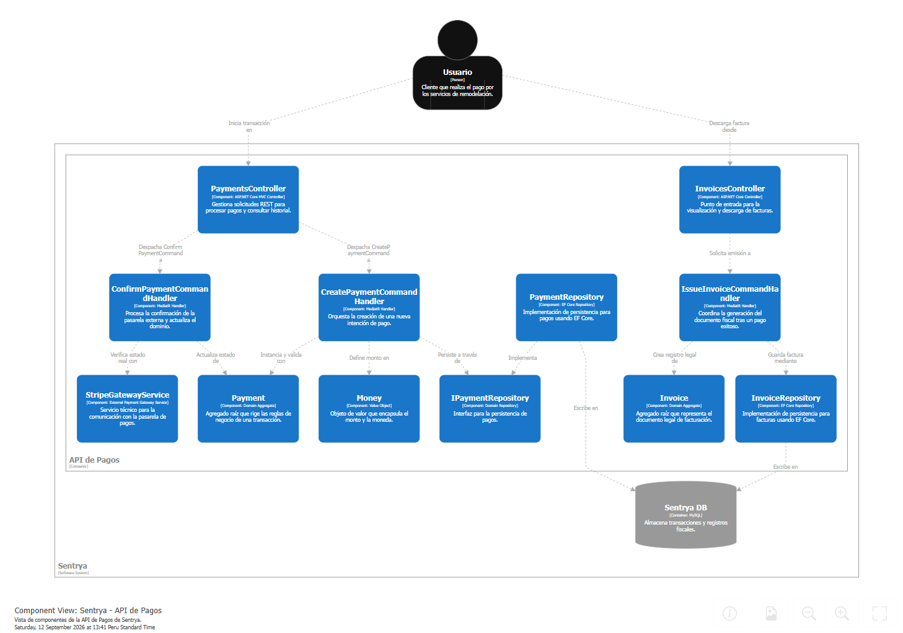

### 4.2.2.6. Bounded Context Software Architecture Code Level Diagrams

### 4.2.2.6.1.  Bounded Context Domain Layer Class Diagrams

El diagrama de clases de la capa de dominio describe la estructura lógica del modelo de negocio financiero. El diseño se centra en el agregado raíz Payment, que rige el flujo transaccional, y el agregado Invoice, que gestiona la documentación fiscal. Se utiliza el objeto de valor Money para garantizar la precisión monetaria.

## Descripción de Elementos del Diagrama

### Payment (Aggregate Root)

Clase principal que encapsula el estado de la transacción.

Características:
- Actúa como **raíz del agregado**.
- Gestiona el ciclo de vida del pago.
- Estados posibles:
    - Pending
    - Completed
    - Failed

Métodos principales:
- `confirm()`: Marca el pago como completado.
- `fail()`: Marca el pago como fallido.

---

### Invoice (Aggregate Root)

Representa el comprobante legal de cobro generado tras un pago exitoso.

Características:
- Se genera automáticamente luego de la confirmación del pago.
- Contiene el número correlativo de facturación.
- Mantiene la trazabilidad legal de la transacción.

---

### Money (Value Object)

Objeto inmutable que representa una cantidad monetaria.

Características:
- Contiene:
    - Monto decimal
    - Código de moneda (ISO 4217)
- Evita errores en cálculos entre distintas divisas.
- Se compara por valor, no por identidad.

---

### Interfaces de Repositorio

#### IPaymentRepository

Define el contrato para la persistencia de pagos.

Responsabilidades:
- Guardar transacciones.
- Recuperar pagos por ID.
- Consultar pagos por proyecto.

---

#### IInvoiceRepository

Define el contrato para la persistencia de facturas.

Responsabilidades:
- Almacenar comprobantes fiscales.
- Recuperar facturas por ID o por pago.
- Mantener la integridad de los registros financieros.

---

## Relación General del Modelo

- **Payment** puede generar una **Invoice** (relación 1:1).
- **Money** es un objeto de valor utilizado dentro de **Payment**.
- Los repositorios abstraen la persistencia de ambos agregados.

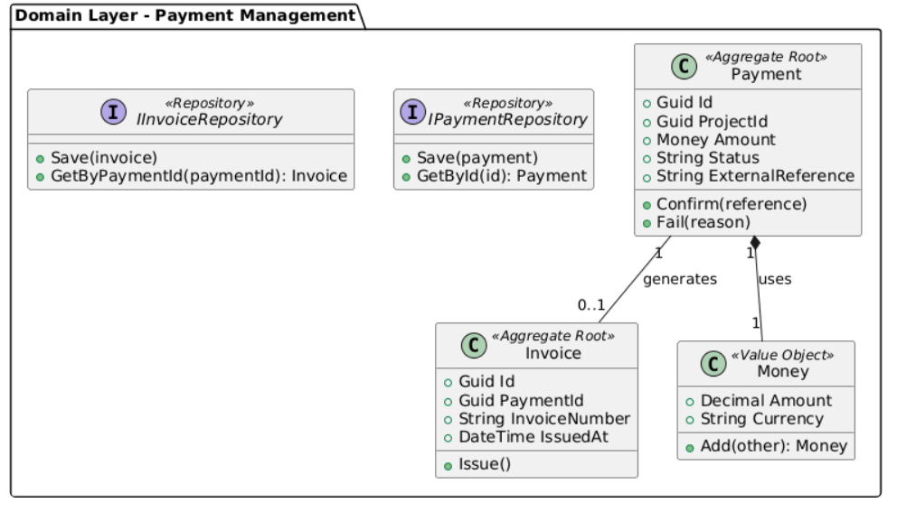

### 4.2.2.6.2. Bounded Context Database Design Diagrams

El diseño de la base de datos para el contexto de Payment Management se ha normalizado para gestionar de manera eficiente el flujo de cobros y la emisión de facturas. El esquema físico garantiza que cada transacción esté vinculada a un proyecto de remodelación y que la documentación fiscal sea inalterable una vez generada.

## Tabla: Payments

Esta tabla registra todos los intentos de pago y transacciones completadas dentro de la plataforma.

| Campo             | Tipo de Dato        | Restricción | Descripción |
|------------------|--------------------|-------------|-------------|
| Id               | Guid / Binary(16)  | PK          | Identificador único de la transacción. |
| ProjectId        | Guid / Binary(16)  | FK          | Referencia al proyecto de remodelación asociado. |
| Amount           | Decimal(18,2)      | Not Null    | Monto de la operación financiera. |
| Currency         | Varchar(10)        | Not Null    | Código de la moneda (ej. "USD", "PEN"). |
| Status           | Varchar(50)        | Not Null    | Estado del pago (Pending, Completed, Failed). |
| ExternalReference| Varchar(255)       | Nullable    | ID de seguimiento provisto por la pasarela de pagos. |
| CreatedAt        | DateTime           | Not Null    | Fecha y hora de creación del registro. |

---

## Tabla: Invoices

Almacena la información de los comprobantes fiscales electrónicos generados tras un pago exitoso.

| Campo         | Tipo de Dato        | Restricción   | Descripción |
|--------------|--------------------|---------------|-------------|
| Id           | Guid / Binary(16)  | PK            | Identificador único de la factura. |
| PaymentId    | Guid / Binary(16)  | FK, Unique    | Referencia al pago que originó la factura. |
| InvoiceNumber| Varchar(100)       | Unique        | Número correlativo legal del documento. |
| IssuedAt     | DateTime           | Not Null      | Fecha de emisión oficial del comprobante. |

---

## Relaciones de Integridad

### Relación Payments - Invoices (1:1)

- Un **Payment** puede generar **una única Invoice**.
- Se establece mediante la clave foránea **PaymentId** en la tabla **Invoices**.
- La restricción **Unique** garantiza que no existan múltiples facturas para un mismo pago.

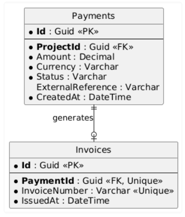

## 4.2.3. Bounded Context: Report Management

## 4.2.3.1. Domain Layer

La Domain Layer en el contexto de Report Management es la encargada de definir la lógica para la agregación de datos y la generación de conocimiento analítico.

A diferencia de otros contextos, este no suele modificar el estado de los proyectos, sino que extrae información para transformarla en métricas clave de desempeño (KPIs) sobre el avance de las remodelaciones y el funcionamiento de los dispositivos IoT.

## 1. Aggregate: ProjectReport

**Descripción:**

Es el agregado raíz que representa un reporte consolidado de un proyecto de remodelación. Contiene el resumen de costos, avances y cumplimiento de cronograma.

### Atributos

| Atributo    | Tipo      | Descripción |
|------------|-----------|-------------|
| id         | Guid      | Identificador único del reporte. |
| projectId  | Guid      | Referencia al proyecto analizado. |
| reportType | String    | Tipo de reporte (Progreso, Financiero, Técnico). |
| generatedAt| DateTime  | Fecha y hora de generación. |
| content    | JSON/Text | Información detallada de los indicadores calculados. |

### Métodos

- `generateSummary()`: Calcula el porcentaje de avance basado en las tareas completadas del proyecto.
- `exportToFormat(String format)`: Prepara la estructura de datos para ser exportada (PDF, Excel).

---

## 2. Value Object: ReportPeriod

**Descripción:**

Objeto de valor que define el rango de tiempo específico que abarca el reporte, asegurando que las fechas de inicio y fin sean lógicas y válidas.

### Atributos

| Atributo  | Tipo     | Descripción |
|----------|----------|-------------|
| startDate| DateTime | Fecha de inicio del análisis. |
| endDate  | DateTime | Fecha de fin del análisis. |

### Métodos

- `isValidRange()`: Verifica que la fecha de fin no sea anterior a la de inicio.
- `getDurationInDays()`: Calcula la cantidad de días analizados en el reporte.

---

## 3. Entity: MetricDetail

**Descripción:**

Entidad que representa un indicador específico dentro de un reporte, como "Consumo Energético" o "Días de retraso".

### Atributos

| Atributo | Tipo   | Descripción |
|----------|--------|-------------|
| id       | Guid   | Identificador de la métrica. |
| name     | String | Nombre del indicador. |
| value    | Double | Valor numérico obtenido. |
| unit     | String | Unidad de medida (ej. "%", "kWh"). |

---

## 4. Domain Service: IReportGenerationService

**Descripción:**

Define el contrato para la lógica compleja de agregación que requiere consultar múltiples fuentes de datos (Proyectos, Pagos e IoT) para construir un reporte integral.

### Métodos

- `calculateProjectKPIs(Guid projectId)`: Ejecuta algoritmos de análisis para determinar el rendimiento del proyecto.
- `aggregateIotData(Guid infrastructureId)`: Consolida los datos históricos de los sensores para el reporte técnico.

---

## 5. Repository: IProjectReportRepository

**Descripción:**

Interfaz que define las operaciones de persistencia para los reportes generados, permitiendo su consulta histórica.

### Métodos

- `save(ProjectReport report)`: Almacena un reporte generado.
- `findByProjectId(Guid projectId)`: Recupera el historial de reportes de un proyecto específico.
- `deleteOldReports(DateTime expirationDate)`: Limpieza de reportes antiguos.

---

En la Domain Layer de Sentrya, el contexto de Report Management utiliza los principios de DDD para asegurar que la generación de reportes sea consistente y precisa. Al separar la lógica de cálculo en servicios de dominio y utilizar objetos de valor como ReportPeriod, se garantiza que la analítica de los proyectos de remodelación IoT sea confiable para la gestión operativa.

## 4.2.3.2. Interface Layer

La Interface Layer en el contexto de Report Management es la encargada de exponer los puntos de acceso (endpoints) para que los usuarios (técnicos y propietarios) puedan solicitar y consultar reportes analíticos.

Esta capa se asegura de que las peticiones HTTP sean válidas y las transforma en comandos o consultas que la capa de aplicación pueda procesar, devolviendo finalmente la información en formatos legibles (Resources/DTOs).

---

## Controlador: ReportsController

**Descripción:**

Este controlador centraliza las operaciones para la generación y recuperación de informes técnicos y financieros de los proyectos de remodelación IoT.

### Endpoints

| Método | Ruta                                   | Descripción |
|--------|----------------------------------------|-------------|
| POST   | /api/v1/reports                        | Recibe una solicitud para generar un nuevo reporte mediante un CreateReportResource. Transforma la petición en un comando de generación y devuelve el reporte procesado. |
| GET    | /api/v1/reports/{reportId}             | Permite obtener el contenido detallado de un reporte específico utilizando su identificador único. |
| GET    | /api/v1/projects/{projectId}/reports   | Recupera el listado histórico de todos los reportes generados para un proyecto de remodelación en particular. |

---

## Dependencias y Transformaciones

- **CreateReportCommandFromResourceAssembler**: Componente encargado de convertir los datos de la solicitud (como el tipo de reporte y el rango de fechas) en un comando de aplicación.
- **ReportResourceFromEntityAssembler**: Utilidad que transforma la entidad de dominio ProjectReport en un recurso JSON estructurado para el cliente.
- **IReportCommandService / IReportQueryService**: Interfaces que desacoplan el controlador de la ejecución lógica de los reportes.

---

## Recursos de Interfaz (DTOs de Entrada/Salida)

| Recurso                | Descripción |
|------------------------|-------------|
| CreateReportResource   | Contiene los parámetros necesarios para la generación (ej. projectId, reportType, startDate, endDate). |
| ReportResource         | Estructura de salida que incluye los KPIs calculados, el resumen ejecutivo y la fecha de generación. |

---

## Flujo de Comunicación

1. El cliente envía una petición **POST** indicando que desea un reporte de "Consumo IoT" para el mes actual.
2. El ReportsController valida la estructura de la petición y utiliza un Assembler para crear el comando interno.
3. La petición se despacha a la capa de aplicación.
4. Una vez generado el reporte, el controlador devuelve un **ReportResource** con un estado HTTP **201 (Created)**.

---

En esta capa de Sentrya, los controladores actúan como el puente entre el mundo exterior y la lógica analítica del sistema. Al seguir el patrón de Clean Architecture, se garantiza que los controladores solo se encarguen de la comunicación HTTP, delegando toda la complejidad del cálculo de métricas a las capas internas de Application y Domain.

## 4.2.3.3. Application Layer

La Application Layer actúa como el motor de orquestación del contexto de reportes. Su función principal es recibir los comandos de generación y las consultas de visualización, coordinando la recolección de datos desde el dominio y otros contextos (como IoT o Proyectos) para transformar información cruda en métricas de valor para el usuario final.

---

## 1. Servicios de Comando y Consulta (Handlers)

En esta sección se definen los Handlers que procesan la lógica de aplicación. Al utilizar MediatR, estos componentes desacoplan la recepción de la solicitud de su ejecución técnica.

### Handlers

| Nombre                              | Descripción                                                     | Resumen de Lógica |
|-------------------------------------|-----------------------------------------------------------------|-------------------|
| GenerateProjectReportCommandHandler | Coordina la creación de un nuevo reporte analítico.             | Valida la existencia del proyecto, solicita al IReportGenerationService el cálculo de los KPIs y persiste el resultado en el repositorio. |
| GetReportByIdQueryHandler           | Recupera un reporte específico por su identificador.            | Consulta el IProjectReportRepository y mapea la entidad de dominio a un DTO de respuesta. |
| GetReportsByProjectIdQueryHandler   | Obtiene el historial de reportes de un proyecto.                | Filtra los registros en la base de datos por el ProjectId y devuelve una colección estructurada. |
| DeleteOldReportsCommandHandler      | Realiza el mantenimiento del historial de reportes.             | Ejecuta una lógica de limpieza basada en la fecha de expiración definida en la configuración del sistema. |

---

## 2. DTOs Internos (Data Transfer Objects)

Estos objetos facilitan el transporte de información entre capas, asegurando que la estructura interna de las entidades de dominio no se exponga directamente a la interfaz.

### DTOs

| Nombre           | Descripción |
|------------------|-------------|
| ReportDto        | Contiene el resumen ejecutivo del reporte, incluyendo los metadatos de generación y el estado del análisis. |
| KpiSummaryDto    | Encapsula los indicadores clave calculados (ej. porcentaje de avance, eficiencia energética, desviación presupuestaria). |
| ReportListDto    | Estructura optimizada para la visualización de listas históricas en el dashboard de Sentrya. |

---

## 3. Servicios Externos (Outbound Services)

Representan las interfaces de comunicación con sistemas o componentes fuera del control directo del dominio de reportes.

### Servicios

- **ProjectDataClient**: Interfaz utilizada para obtener datos en tiempo real del Bounded Context de Project Management (tareas, fechas, hitos).
- **IotTelemetryAggregator**: Servicio encargado de recopilar y promediar los datos históricos de los sensores IoT para incluirlos en los reportes técnicos.
- **ExportService (PDF/Excel)**: Componente técnico de infraestructura que transforma los datos del reporte en archivos descargables para el usuario.

---

En la Application Layer de Sentrya, la lógica se centra en la transformación de datos. Los Command Handlers aseguran que los reportes se generen siguiendo las reglas de negocio del dominio, mientras que los Query Handlers optimizan la entrega de información para que los propietarios y técnicos puedan monitorear el estado de sus proyectos de remodelación de manera eficiente.

## 4.2.3.4. Infrastructure Layer

En la Infrastructure Layer de Sentrya, específicamente para el contexto de Report Management, se implementan los detalles técnicos necesarios para la persistencia de los análisis generados y la integración con herramientas de exportación de datos.

Esta capa:
- Utiliza Entity Framework Core (EFC) para mapear los reportes en la base de datos MySQL.
- Permite almacenar información analítica consolidada.
- Provee servicios técnicos para exportar datos en formatos descargables.

## 1. Persistence (Repositories Implementation)

| Nombre                     | Descripción                                                                 | Tecnologías / Herramientas |
|----------------------------|-----------------------------------------------------------------------------|-----------------------------|
| ProjectReportRepository    | Implementación concreta de IProjectReportRepository que gestiona el almacenamiento y recuperación de informes históricos. | Entity Framework Core, LINQ |
| ReportConfiguration        | Define el mapeo detallado de la entidad ProjectReport, configurando el almacenamiento de los KPIs en formato JSON dentro de la base de datos. | Fluent API (EFC) |
| MetricDetailConfiguration  | Configura la persistencia de los detalles individuales de las métricas asociadas a cada reporte. | Fluent API (EFC) |

---

## 2. External / Technical Services Implementation

| Nombre               | Descripción                                                                 | Resumen de Implementación |
|----------------------|-----------------------------------------------------------------------------|---------------------------|
| ExcelReportExporter  | Servicio técnico que transforma los datos del dominio en hojas de cálculo para análisis externo. | Utiliza bibliotecas como ClosedXML para generar archivos .xlsx. |
| IotTelemetryClient   | Implementación técnica para la obtención de datos históricos de sensores desde el módulo de infraestructura. | Realiza peticiones internas o consultas a la base de datos de telemetría. |

## 4.2.3.5. Bounded Context Software Architecture Component Level Diagrams

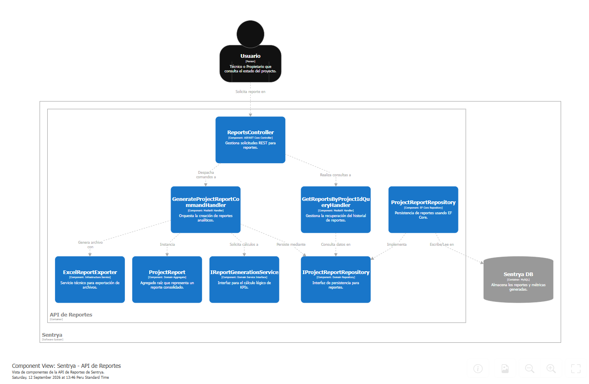

## 4.2.3.6. Bounded Context Software Architecture Code Level Diagrams

## 4.2.3.6.1. Bounded Context Domain Layer Class Diagrams

Descripción de Elementos del Diagrama

ProjectReport (Aggregate Root)

Es la entidad principal que representa un informe consolidado. Encapsula metadatos como el tipo de reporte (Técnico, Financiero o de Progreso) y la fecha de generación.

- Actúa como **raíz del agregado**.
- Gestiona la consistencia interna del reporte.
- Posee una relación de **composición** con sus métricas (MetricDetail).

---

MetricDetail (Entity)

Representa un indicador específico calculado dentro de un reporte.

Ejemplos:
- "Eficiencia Energética"
- "Porcentaje de Avance"

Características:
- Tiene identidad propia dentro del agregado.
- Contiene:
    - Valor numérico
    - Unidad de medida
- Depende del ciclo de vida del **ProjectReport**.

---

ReportPeriod (Value Object)

Objeto inmutable que define el rango de tiempo analizado en el reporte.

Características:
- Contiene:
    - Fecha de inicio
    - Fecha de fin
- Garantiza la validez del intervalo temporal.
- No posee identidad propia (se compara por valor).

---

IReportGenerationService (Domain Service)

Interfaz que define el contrato para los algoritmos de cálculo de reportes.

Responsabilidades:
- Interactuar con otros contextos (Proyectos, IoT, Pagos).
- Extraer y procesar datos.
- Construir el agregado **ProjectReport** con métricas calculadas.

---

IProjectReportRepository (Repository Interface)

Define los métodos necesarios para la persistencia de los reportes.

Responsabilidades:
- Almacenar reportes generados.
- Recuperar reportes por **ProjectId**.
- Mantener historial de análisis.

---

## Relación General del Modelo

- **ProjectReport** contiene múltiples **MetricDetail** (1:N).
- **ReportPeriod** es un objeto de valor utilizado por el reporte.
- **IReportGenerationService** construye el agregado.
- **IProjectReportRepository** gestiona su persistencia.

---

## Nota

Este modelo sigue los principios de **Domain-Driven Design (DDD)**:
- Separación clara entre entidades y objetos de valor.
- Uso de agregados para mantener consistencia.
- Servicios de dominio para lógica compleja.

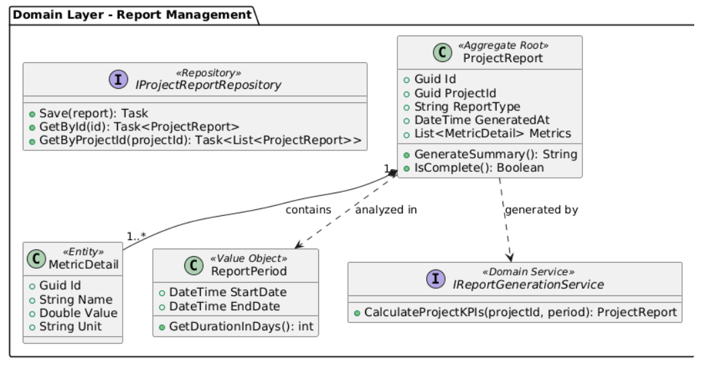

## 4.2.3.6.2. Bounded Context Database Design Diagrams

El esquema de base de datos para Report Management se ha diseñado para ofrecer una trazabilidad completa de los análisis realizados sobre los proyectos de remodelación.

La estructura permite almacenar datos agregados de sensores IoT y estados de obra, organizándolos en tablas relacionales que optimizan la consulta histórica de métricas de desempeño.

---

## Tabla: ProjectReports

Esta tabla almacena los metadatos de cada informe generado en la plataforma.

| Campo        | Tipo de Dato        | Restricción | Descripción |
|-------------|--------------------|-------------|-------------|
| Id          | Guid / Binary(16)  | PK          | Identificador único del reporte. |
| ProjectId   | Guid / Binary(16)  | FK          | Referencia al proyecto analizado (vínculo con Project BC). |
| ReportType  | Varchar(50)        | Not Null    | Categoría del informe (ej. "Técnico", "Financiero"). |
| GeneratedAt | DateTime           | Not Null    | Marca de tiempo exacta de la creación del informe. |

---

## Tabla: MetricDetails

Contiene los valores específicos de los indicadores calculados que componen un reporte.

| Campo     | Tipo de Dato        | Restricción | Descripción |
|----------|--------------------|-------------|-------------|
| Id       | Guid / Binary(16)  | PK          | Identificador único de la métrica. |
| ReportId | Guid / Binary(16)  | FK          | Referencia al reporte contenedor (Tabla ProjectReports). |
| Name     | Varchar(100)       | Not Null    | Nombre del indicador (ej. "Energy Efficiency"). |
| Value    | Double             | Not Null    | Valor numérico del KPI obtenido. |
| Unit     | Varchar(20)        | Not Null    | Unidad de medida (ej. "%", "kWh", "Days"). |

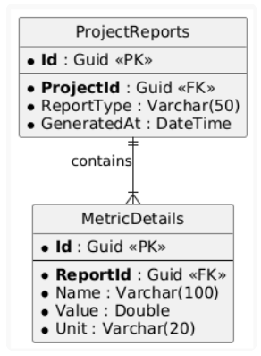

## 4.2.4. Bounded Context: Space Management

### 4.2.4.1. Domain Layer

La Domain Layer es el núcleo que gestiona las reglas de negocio relacionadas con la administración de espacios dentro de la plataforma Sentrya. En este contexto, entidades como Space y LinkedIoTDevice, junto con objetos de valor y servicios de dominio, permiten registrar espacios, actualizar su información, controlar su disponibilidad y vincular dispositivos IoT para el monitoreo posterior. Adicionalmente, el agregado Review permite a los usuarios calificar y comentar los espacios publicados.

Objetivo:

La capa de dominio tiene como objetivo representar los elementos fundamentales para la gestión de espacios, cubriendo desde la publicación de un nuevo espacio hasta la actualización de sus detalles, el control de su disponibilidad y la recopilación de retroalimentación de los usuarios a través de reseñas.

## 1. Aggregate: Space

**Descripción:**

El agregado Space actúa como la raíz del modelo y encapsula la información principal de un espacio registrado en Sentrya. Representa el ambiente físico que será publicado, editado, pausado o monitoreado dentro del sistema.

### Atributos

| Atributo           | Tipo   | Descripción                                                                 |
|--------------------|--------|-----------------------------------------------------------------------------|
| id                 | Guid   | Identificador único del espacio.                            |
| ownerId          | Guid   | Identificador del usuario propietario del espacio.               |
| name             | String  | Nombre del espacio registrado.                    |
| description             | String | Descripción general del espacio.                    |
| location  | SpaceLocation | Objeto de valor que representa la ubicación del espacio.           |
| dimensions          | SpaceDimensions   | Objeto de valor que representa las dimensiones físicas del espacio.                                   |
| status  | String | Estado actual del espacio: publicado, pausado o no disponible.                 |
| createdAt          | DateTime   | Fecha de creación del registro del espacio.                                  |

### Métodos

- `publish()` : Cambia el estado del espacio a publicado cuando contiene la información necesaria.
- `updateDetails(name, description, location)`: Actualiza los datos principales del espacio.
- `pauseAvailability()`: Pausa temporalmente la disponibilidad del espacio.
- `linkIoTDevice(device)` : Asocia un dispositivo IoT al espacio para permitir su monitoreo.
---

## 2. Value Object: SpaceLocation

**Descripción:**

El objeto de valor SpaceLocation representa la ubicación del espacio registrado. Permite mantener agrupados los datos relacionados con dirección, distrito y ciudad.

### Atributos

| Atributo | Tipo    | Descripción                     |
|----------|--------|---------------------------------|
| address   | String | Dirección principal del espacio.     |
| district | String  | Distrito donde se ubica el espacio. |
| city | String  | Ciudad correspondiente al espacio. |

### Métodos

- `getFullAddress()` : Retorna la dirección completa del espacio en formato legible.
- `isValid()` : Valida que la ubicación cuente con los datos mínimos requeridos.
---

## 3. Value Object: SpaceDimensions

**Descripción:**

El objeto de valor SpaceDimensions representa las medidas físicas del espacio. Esta información permite describir mejor el ambiente y apoyar decisiones relacionadas con remodelación o monitoreo.

### Atributos

| Atributo      | Tipo   | Descripción                                                   |
|---------------|--------|-----------------------------------------------------------------|
| width            | Decimal   | Ancho del espacio.                          |
| length     | Decimal   | Largo del espacio.         |
| area | Decimal | Área total calculada del espacio.              |

### Métodos

- `calculateArea()` : Calcula el área total del espacio a partir del ancho y largo.
- `isValid()` : Verifica que las dimensiones ingresadas sean mayores a cero.
---

## 4. Entity: LinkedIoTDevice

**Descripción:**

La entidad LinkedIoTDevice representa un dispositivo IoT vinculado a un espacio específico. Su función es registrar qué dispositivo está asociado al espacio para permitir el monitoreo operativo desde otro bounded context. Al ser una entidad dependiente, su ciclo de vida y persistencia están subordinados al agregado Space.

### Atributos

| Atributo      | Tipo   | Descripción                                                   |
|---------------|--------|-----------------------------------------------------------------|
| id            | Guid   | Identificador único del vínculo.                          |
| spaceId     | Guid   | Identificador del espacio asociado.         |
| deviceId | Guid | Identificador del dispositivo IoT vinculado.              |
| deviceType            | String   | Tipo de dispositivo o sensor asociado.                          |
| status     | String   | Estado del dispositivo vinculado.         |
| linkedAt | DateTime | Fecha en que el dispositivo fue asociado al espacio.              |

### Métodos

- `activate()` : Activa el dispositivo vinculado al espacio.
- `deactivate()` : Desactiva el dispositivo vinculado.
- `isLinkedTo(spaceId)` : Verifica si el dispositivo pertenece al espacio indicado.
---

## 5. Aggregate: Review

**Descripción:**

El agregado Review actúa como raíz independiente y representa la calificación y comentario que un usuario deja sobre un espacio publicado. Se modela como su propio Aggregate Root — y no como entidad dependiente de Space — porque una reseña tiene identidad, autoría y ciclo de vida propios (puede editarse o eliminarse sin afectar la consistencia del agregado Space), y porque su volumen de escritura/lectura es independiente del de los espacios.

### Atributos

| Atributo   | Tipo     | Descripción                                                        |
|------------|----------|----------------------------------------------------------------------|
| id         | Guid     | Identificador único de la reseña.                                   |
| spaceId    | Guid     | Referencia al espacio calificado (no navegación directa al agregado Space). |
| authorId   | Guid     | Referencia al usuario autor de la reseña (Bounded Context IAM).     |
| rating     | Integer  | Calificación numérica otorgada al espacio (rango 1-5).              |
| comment    | String   | Comentario textual asociado a la calificación.                      |
| createdAt  | DateTime | Fecha de creación de la reseña.                                     |

### Métodos

- `updateContent(rating, comment)` : Permite al autor editar la calificación y/o el comentario de su reseña.
- `belongsToSpace(spaceId)` : Verifica si la reseña corresponde al espacio indicado.
---

## 6. Domain Service: SpaceCommandService

**Descripción:**

El servicio SpaceCommandService encapsula reglas de negocio relacionadas con la publicación, actualización y disponibilidad de espacios dentro de Sentrya.

### Métodos

- `publishSpace(Space space)` : Valida y publica un nuevo espacio en la plataforma.
- `updateSpaceDetails(Space space)` : Coordina la actualización de información del espacio.
- `pauseSpaceAvailability(Guid spaceId)` : Cambia el estado del espacio a pausado.
- `linkDeviceToSpace(Guid spaceId, Guid deviceId)` : Valida y vincula un dispositivo IoT al espacio.
---

## 7. Repository: ISpaceRepository

**Descripción:**

El ISpaceRepository es una abstracción para la persistencia de espacios (y de sus dispositivos IoT vinculados, al ser entidades dependientes del agregado) dentro de la base de datos, permitiendo realizar operaciones de consulta y guardado de manera ordenada.

### Métodos

- `save(Space space)` : Guarda un nuevo espacio o actualiza uno existente, incluyendo los dispositivos IoT vinculados.
- `findById(Guid id)` : Recupera un espacio por su identificador único.
- `findByOwnerId(Guid ownerId)` : Recupera los espacios asociados a un propietario.
- `delete(Guid id)` : Elimina o desactiva un espacio registrado.
---

## 8. Repository: IReviewRepository

**Descripción:**

El IReviewRepository es una abstracción para la persistencia del agregado Review, independiente de ISpaceRepository dado que Review es su propia raíz de agregado.

### Métodos

- `save(Review review)` : Guarda una nueva reseña o actualiza una existente.
- `findById(Guid id)` : Recupera una reseña por su identificador único.
- `findBySpaceId(Guid spaceId)` : Recupera todas las reseñas asociadas a un espacio.
  En la Domain Layer de Sentrya, específicamente dentro del bounded context Space Management, se define la lógica principal para registrar, publicar, actualizar y pausar espacios dentro de la plataforma. La clase Space actúa como agregado raíz, mientras que SpaceLocation, SpaceDimensions y LinkedIoTDevice complementan la información necesaria para representar el espacio y su relación con el monitoreo IoT. El agregado Review, independiente de Space, permite capturar la retroalimentación de los usuarios sobre los espacios publicados. Las operaciones principales se coordinan mediante el servicio SpaceCommandService y la persistencia se abstrae a través de ISpaceRepository e IReviewRepository.

---

### 4.2.4.2. Interface Layer

La Interface Layer es la capa que expone los endpoints de la aplicación, permitiendo la interacción entre los usuarios y la gestión de espacios dentro de Sentrya. Los controladores son responsables de recibir las peticiones, validarlas y coordinar con los servicios correspondientes para registrar espacios, actualizar su información, controlar su disponibilidad, vincular dispositivos IoT y gestionar reseñas.

En esta capa no se implementan reglas de negocio, sino que se coordina la comunicación entre las solicitudes de los usuarios y la lógica del dominio.
 
---

## Controlador: SpacesController

**Descripción:**

El SpacesController maneja los endpoints relacionados con la creación, consulta, actualización y control de disponibilidad de los espacios registrados en la plataforma.

### Endpoints

| Método | Ruta                                   | Descripción |
|--------|----------------------------------------|-------------|
| POST   | /api/v1/spaces                       | Maneja la solicitud para publicar un nuevo espacio. Recibe un objeto CreateSpaceResource, lo convierte en un comando y llama al servicio de aplicación. |
| GET    | /api/v1/spaces/{spaceId}           | Recupera la información detallada de un espacio específico mediante su identificador. |
| GET    | /api/v1/owners/{ownerId}/spaces  | Obtiene la lista de espacios registrados por un propietario específico. |
| PUT    | /api/v1/spaces/{spaceId}           | Permite actualizar los datos principales de un espacio, como nombre, descripción, ubicación o dimensiones. |
| PATCH    | /api/v1/spaces/{spaceId}/pause  | Cambia el estado del espacio para pausar temporalmente su disponibilidad. |

### Dependencias

- **ISpaceCommandService**: Servicio que maneja los comandos de creación, actualización y pausa de espacios.
- **ISpaceQueryService**: Servicio encargado de gestionar las consultas de espacios registrados.
- **CreateSpaceCommandFromResourceAssembler**: Utilidad para convertir el recurso de creación en un comando procesable.
- **UpdateSpaceCommandFromResourceAssembler**: Utilidad para transformar el recurso de actualización en un comando.
- **SpaceResourceFromEntityAssembler**: Utilidad para convertir la entidad de dominio Space en un recurso de respuesta para la API.
---

## Controlador: SpaceDevicesController

**Descripción:**

El SpaceDevicesController maneja los endpoints relacionados con la vinculación, consulta y desvinculación de dispositivos IoT asociados a un espacio. Este controlador permite conectar la gestión del espacio con el posterior monitoreo IoT.

### Endpoints

| Método | Ruta                                   | Descripción |
|--------|----------------------------------------|-------------|
| POST    | /api/v1/spaces/{spaceId}/devices           | Permite vincular un dispositivo IoT a un espacio específico para habilitar su monitoreo. |
| GET    | /api/v1/spaces/{spaceId}/devices        | Recupera los dispositivos IoT asociados a un espacio registrado. |
| PATCH    | /api/v1/spaces/{spaceId}/devices/{deviceId}/deactivate        | Desactiva la vinculación de un dispositivo IoT cuando ya no será utilizado para el monitoreo del espacio. |

### Dependencias

- **ISpaceDeviceCommandService**: Servicio encargado de procesar comandos relacionados con la vinculación de dispositivos IoT.
- **ISpaceDeviceQueryService**: Servicio encargado de consultar dispositivos vinculados a espacios.
- **LinkIoTDeviceCommandFromResourceAssembler**: Utilidad para convertir el recurso de vinculación en un comando procesable.
- **LinkedIoTDeviceResourceFromEntityAssembler**: Utilidad para transformar la entidad LinkedIoTDevice en un recurso de respuesta.
---

## Controlador: SpaceReviewsController

**Descripción:**

El SpaceReviewsController maneja los endpoints relacionados con la creación y consulta de reseñas asociadas a un espacio publicado.

### Endpoints

| Método | Ruta                                   | Descripción |
|--------|----------------------------------------|-------------|
| POST   | /api/v1/spaces/{spaceId}/reviews       | Permite a un usuario registrar una nueva reseña (calificación y comentario) sobre un espacio. |
| GET    | /api/v1/spaces/{spaceId}/reviews       | Recupera todas las reseñas asociadas a un espacio específico. |

### Dependencias

- **IReviewCommandService**: Servicio encargado de procesar comandos de creación de reseñas.
- **IReviewQueryService**: Servicio encargado de consultar reseñas registradas.
- **AddReviewCommandFromResourceAssembler**: Utilidad para convertir el recurso de entrada en un comando procesable.
- **ReviewResourceFromEntityAssembler**: Utilidad para transformar la entidad de dominio Review en un recurso de respuesta.
---

## Flujo de Trabajo

### Gestión de Espacios
Los usuarios propietarios pueden registrar un nuevo espacio a través de la API, lo que invoca los servicios de comando para validar la información, crear la entidad correspondiente y persistirla en el sistema.

### Actualización y Disponibilidad
Una vez creado el espacio, el propietario puede modificar sus datos principales o pausar temporalmente su disponibilidad. Estas operaciones son recibidas por el controlador y delegadas a la capa de aplicación para mantener la consistencia del dominio.

### Vinculación de Dispositivos IoT
Cuando un espacio requiere monitoreo, el sistema permite vincular dispositivos IoT mediante endpoints específicos. Esta información queda asociada al espacio y sirve como base para que el contexto de IoT Monitoring and Notifications pueda procesar lecturas posteriormente.

### Reseñas de Espacios
Los usuarios pueden registrar una calificación y comentario sobre un espacio publicado, y consultar el historial de reseñas asociadas a dicho espacio.
 
---

En esta capa de Sentrya, los controladores se encargan de recibir las solicitudes HTTP, dirigirlas a los servicios apropiados y devolver una respuesta adecuada.

Estos controladores no contienen reglas de negocio, sino que delegan el procesamiento a la capa de dominio o a los servicios de aplicación, actuando como una interfaz entre los usuarios propietarios y la gestión interna de espacios.

Los controladores presentados permiten gestionar la publicación, actualización, disponibilidad, vinculación de dispositivos IoT y reseñas dentro del contexto Space Management.
 
---

### 4.2.4.3. Application Layer

Esta capa actúa como un orquestador. Recibe comandos y consultas desde la capa de interfaz y coordina la ejecución de la lógica asociada a la gestión de espacios dentro de Sentrya. Es el intermediario que traduce las solicitudes de los usuarios en acciones del dominio, asegurando que la creación, actualización, consulta y control de disponibilidad de los espacios, la vinculación y desvinculación de dispositivos IoT, y el registro de reseñas se apliquen correctamente.

### Commands & Queries Handlers

|Nombre|Descripcion|Resumen de Logica|
|------|---------|------|
| CreateSpaceCommandHandler        | Gestiona la creación de un nuevo espacio dentro del sistema.    | Valida los datos básicos del espacio, instancia el agregado Space y lo persiste mediante el repositorio correspondiente. | 
| UpdateSpaceDetailsCommandHandler        | Procesa la actualización de la información principal de un espacio.  | Recupera el espacio por su identificador, actualiza sus atributos permitidos y guarda los cambios en el repositorio. | 
| PauseSpaceAvailabilityCommandHandler        | Orquesta el cambio de estado de disponibilidad de un espacio.  | Busca el espacio, ejecuta la operación de pausa de disponibilidad en el dominio y persiste el nuevo estado. | 
| LinkIoTDeviceCommandHandler        | Gestiona la vinculación de un dispositivo IoT a un espacio.     | Recupera el agregado Space, ejecuta `space.linkIoTDevice(device)` y persiste el agregado completo mediante ISpaceRepository. | 
| DeactivateIoTDeviceCommandHandler        | Gestiona la desvinculación lógica de un dispositivo IoT asociado a un espacio.     | Recupera el agregado Space, invoca `LinkedIoTDevice.deactivate()` sobre el dispositivo correspondiente y persiste el agregado mediante ISpaceRepository. | 
| AddReviewCommandHandler        | Procesa el registro de una nueva reseña sobre un espacio.     | Valida que el espacio exista, instancia el agregado Review con el rating y comentario proporcionados, y lo persiste mediante IReviewRepository. | 
| GetSpaceByIdQueryHandler        | Recupera la información detallada de un espacio específico.   | Consulta ISpaceRepository utilizando el identificador único y devuelve el DTO correspondiente. | 
| GetSpacesByOwnerIdQueryHandler        | Obtiene la lista de espacios asociados a un propietario.   | Consulta ISpaceRepository por propietario y devuelve una colección resumida para visualización. | 
| GetLinkedDevicesBySpaceIdQueryHandler        | Recupera los dispositivos IoT vinculados a un espacio.   | Consulta ISpaceRepository utilizando el identificador del espacio y devuelve la colección de `LinkedIoTDevice` asociados al agregado. | 
| GetReviewsBySpaceIdQueryHandler        | Recupera las reseñas asociadas a un espacio.     | Consulta IReviewRepository utilizando el identificador del espacio y devuelve la colección de reseñas correspondiente. | 

### Internal DTOs (Data Transfer Objects)

| **Nombre** | **Descripción**  |  
| ------------ | --------- |
| SpaceDto        | Contiene la información principal del espacio, incluyendo identificador, nombre, tipo, estado y datos generales para uso interno.    | 
| SpaceAvailabilityDto        | Encapsula la información relacionada con la disponibilidad del espacio, incluyendo su estado actual y observaciones asociadas.   | 
| LinkedIoTDeviceDto        | Representa la información básica de un dispositivo IoT vinculado a un espacio para su consulta interna.     | 
| SpaceSummaryDto        | Provee una vista simplificada de los espacios registrados por un propietario, útil para listados y paneles de consulta.    | 
| ReviewDto        | Contiene la información de una reseña, incluyendo identificador, autor, calificación, comentario y fecha de creación.    | 

En la Application Layer de Sentrya, los handlers orquestan los flujos de gestión de espacios, dispositivos vinculados y reseñas, asegurando que cada operación sea validada y ejecutada correctamente antes de persistirse. La lógica se coordina a través de servicios de aplicación y repositorios, permitiendo mantener separado el dominio de la infraestructura y de la presentación.
 
---

### 4.2.4.4. Infrastructure Layer

En la Infrastructure Layer de Sentrya, específicamente para el contexto de Space Management, se implementan los detalles técnicos necesarios para la persistencia de espacios, dispositivos IoT vinculados y reseñas. Esta capa permite almacenar la información del espacio, configurar su mapeo con la base de datos y dar soporte técnico a las operaciones de creación, actualización, consulta, pausa de disponibilidad y registro de reseñas.

Esta capa se encarga de:

- La gestión de datos mediante Entity Framework Core (EFC).
- La configuración del mapeo de espacios, dispositivos vinculados y reseñas con la base de datos MySQL.
- La implementación de servicios técnicos de apoyo para la administración de disponibilidad e información del espacio.
  Estos componentes permiten que la lógica de gestión de espacios se ejecute sobre una infraestructura organizada y mantenible.

### Persistence (Repositories Implementation)

| **Nombre** | **Descripción**  |   Tecnologías / Herramientas  |
| ------------ | --------- | --------- |
| SpaceRepository        | Implementación concreta de ISpaceRepository que utiliza EFC para realizar operaciones CRUD sobre espacios y sus dispositivos IoT vinculados.      | Entity Framework Core, LINQ. | 
| ReviewRepository        | Implementación concreta de IReviewRepository que utiliza EFC para persistir y recuperar reseñas asociadas a los espacios.     | Entity Framework Core, LINQ. | 
| SpaceConfiguration        | Define el mapeo detallado entre la entidad Space y su tabla, incluyendo los objetos de valor embebidos SpaceLocation y SpaceDimensions.     | Fluent API (EFC). | 
| LinkedIoTDeviceConfiguration        | Configura el mapeo de LinkedIoTDevice como entidad dependiente dentro del agregado Space, estableciendo la relación con la tabla de espacios.     | Fluent API (EFC). |  
| ReviewConfiguration        | Configura el mapeo de la entidad Review, incluyendo la referencia (no navegación) hacia SpaceId y AuthorId.     | Fluent API (EFC). |  

### Technical Services Implementation

| **Nombre** | **Descripción**  |   Resumen de Implementación  |
| ------------ | --------- | --------- | 
| SpaceAvailabilityService      | Servicio técnico de apoyo para actualizar el estado de disponibilidad de un espacio.     | Gestiona cambios de estado como publicado, pausado o no disponible, persistiendo la actualización mediante el repositorio. | 
| SpaceDeviceLinkingService        | Servicio encargado de apoyar la vinculación técnica entre espacios y dispositivos IoT.   |Registra la asociación entre un espacio y un dispositivo, dejando la información lista para que sea utilizada por el contexto de monitoreo IoT. | 

En la Infrastructure Layer de Sentrya, dentro del bounded context Space Management, se implementan los repositorios y configuraciones necesarias para almacenar espacios, dispositivos vinculados y reseñas. Asimismo, los servicios técnicos permiten apoyar la disponibilidad del espacio y su relación con dispositivos IoT, manteniendo separados los detalles de infraestructura de la lógica principal del dominio.

### 4.2.4.5. Bounded Context Software Architecture Component Level Diagrams

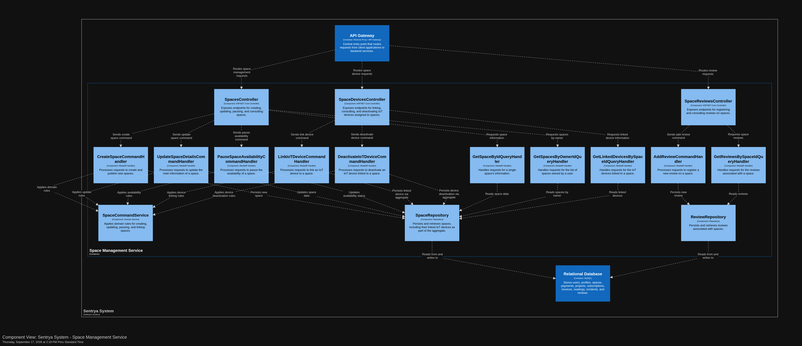

### 4.2.4.6. Bounded Context Software Architecture Code Level Diagrams

### 4.2.4.6.1. Bounded Context Domain Layer Class Diagrams

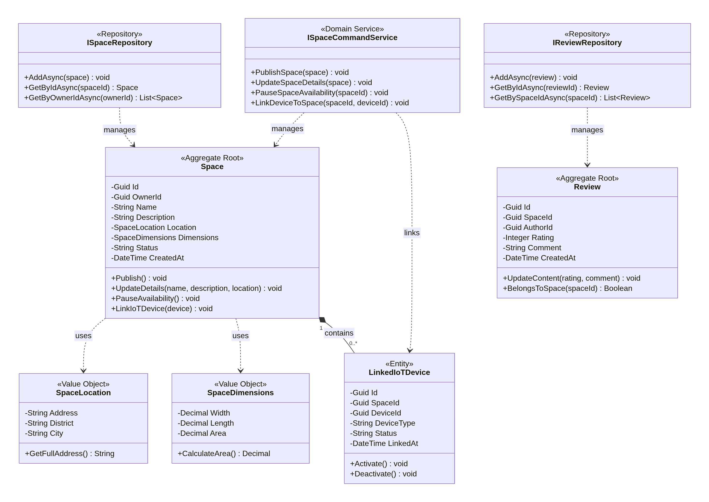

### 4.2.4.6.2. Bounded Context Database Design Diagrams

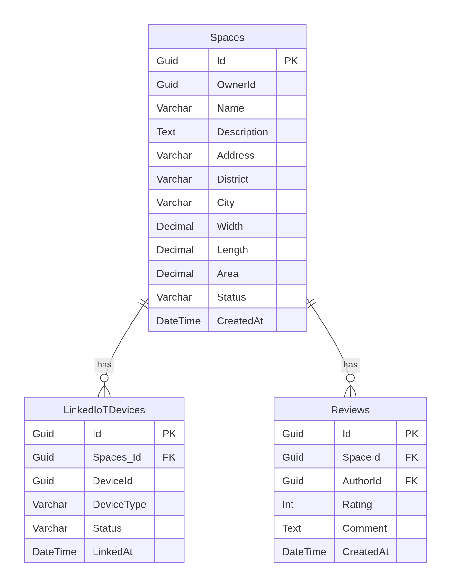

## 4.2.5. Bounded Context: IoT Monitoring and Notifications

### 4.2.5.1 Domain Layer

La capa de dominio de IoT Monitoring and Notifications encapsula la lógica principal para la supervisión de dispositivos IoT, recepción de lecturas, validación de datos y generación de alertas cuando se detectan valores fuera de rango.

### Aggregates

| **Atributo** | **Nombre**  | **Descripción**                                       |
| ------------ | --------- | ----------------------------------------------------- |
| Aggregate Root         | IoTDevice     | Representa el dispositivo IoT registrado en el sistema, asociado a un espacio específico y encargado de emitir lecturas para el monitoreo.       |

**Métodos:**
- IoTDevice.activate: Cambia el estado del dispositivo a activo para permitir la recepción de lecturas.
- IoTDevice.deactivate: Desactiva el dispositivo y evita que siga enviando información al sistema.
- IoTDevice.isActive: Verifica si el dispositivo se encuentra habilitado para operar.

### Entities

| **Atributo** | **Nombre**  | **Descripción**                                       |
| ------------ | --------- | ----------------------------------------------------- |
| ReadingId, DeviceId, MetricType, Value, Unit, ReceivedAt, Status       | Reading      | Entidad que representa una lectura enviada por un dispositivo IoT, incluyendo el tipo de métrica, valor registrado y estado de validación.      |
| AlertId, ReadingId, Severity, Status, CreatedAt          | Alert              | Entidad que representa una alerta generada cuando una lectura se encuentra fuera de los límites permitidos.                  |

### Value Objects

| **Atributo** | **Nombre**  | **Descripción**                                       |
| ------------ | --------- | ----------------------------------------------------- |
| MinValue, MaxValue, Unit  |  ThresholdRange   | Define el rango permitido para una métrica monitoreada.  |
| Value        | SeverityLevel      | Representa el nivel de gravedad de una alerta: baja, media, alta o crítica.      |
| Value        | ReadingStatus      | Indica el estado de una lectura: recibida, validada o fuera de rango.      |
| Value        | AlertStatus      | Indica el estado de una alerta: creada, enviada, reconocida o cerrada.      |

### Commands & Queries

| **Atributo** | **Nombre**  | **Tipo**                                       |
| ------------ | --------- | ----------------------------------------------------- |
| DeviceId, MetricType, Value, Unit       | IngestReadingCommand     | Command      |
| AlertId       | AcknowledgeAlertCommand      | Command      |
| AlertId       | CloseAlertCommand      | Command      |
| SpaceId       | GetAlertsBySpaceQuery      | Query      |
| SpaceId       | GetReadingsBySpaceQuery      | Query      |

### Domain Services

| **Nombre** | **Funcion**  | **Metodos**                                       |
| ------------ | --------- | ----------------------------------------------------- |
| IMonitoringDomainService        |Define las reglas para validar lecturas, detectar valores fuera de rango y generar alertas.      | ValidateReading, DetectOutOfRange, CreateAlert     |
| IAlertPolicyService        | Define criterios para clasificar la severidad de una alerta según el valor detectado.      | EvaluateSeverity, CanDispatchAlert      |

**Métodos:**

- IMonitoringDomainService.ValidateReading: Verifica que la lectura provenga de un dispositivo registrado y activo.

- IMonitoringDomainService.DetectOutOfRange: Evalúa si el valor recibido está fuera del rango permitido.

- IMonitoringDomainService.CreateAlert: Genera una alerta cuando se detecta una lectura anómala.

- IAlertPolicyService.EvaluateSeverity: Determina la severidad de la alerta según la métrica y el valor registrado.

- IAlertPolicyService.CanDispatchAlert: Valida si una alerta puede ser enviada al usuario responsable.

### Repositories

| **Nombre** | **Descripción**  | 
| ------------ | --------- |
| IIoTDeviceRepository        |Interfaz para la persistencia y recuperación de dispositivos IoT registrados.      |
| IReadingRepository        | Interfaz para almacenar y consultar lecturas recibidas desde los dispositivos.      |
| IAlertRepository        | Interfaz para gestionar el almacenamiento y consulta de alertas generadas.      |

En la Domain Layer de Sentrya, dentro del bounded context IoT Monitoring and Notifications, se define la lógica central para monitorear dispositivos, procesar lecturas y generar alertas ante condiciones fuera de rango. La clase IoTDevice actúa como el agregado raíz, mientras que Reading y Alert representan los eventos operativos principales del monitoreo. Finalmente, la validación de lecturas, detección de anomalías y persistencia de información se gestionan mediante servicios de dominio y repositorios especializados.

### 4.2.5.2. Interface Layer

En la Interface Layer de Sentrya, específicamente para el contexto de IoT Monitoring and Notifications, se definen los puntos de entrada que permiten la comunicación externa con las funcionalidades de monitoreo. Esta capa utiliza controladores REST, recursos DTOs y ensambladores para recibir lecturas IoT, consultar información de monitoreo y gestionar alertas, desacoplando el modelo de dominio de las representaciones externas.

### Resources

| **Nombre** | **Descripción**  |  
| ------------ | --------- | 
| IngestReadingResource        | DTO que encapsula los datos de entrada de una lectura IoT, incluyendo DeviceId, MetricType, Value y Unit.      | 
| ReadingResource        | DTO de salida que representa la información de una lectura registrada, como identificador, dispositivo, métrica, valor, unidad, fecha y estado.      | 
| AlertResource        | DTO de salida que representa una alerta generada por una lectura fuera de rango, incluyendo identificador, severidad, estado y mensaje.     | 
| AcknowledgeAlertResource        | DTO que transporta la información necesaria para reconocer una alerta pendiente.     | 
| CloseAlertResource        | DTO que permite cerrar una alerta luego de haber sido revisada o atendida.     | 

### Controllers

| **Nombre** | **Método HTTP**  | **Parámetro / Resource**  | **Descripción** |
| ------------ | --------- | --------- | --------- |
| IoTMonitoringController        | POST    |IngestReadingResource   | Expone el endpoint para recibir una nueva lectura enviada por un dispositivo IoT.   |
| IoTMonitoringController        | GET     |  SpaceId |  Recupera las lecturas registradas para un espacio monitoreado.  |
| AlertController        | GET      | SpaceId  |  Recupera las alertas asociadas a un espacio específico.  |
| AlertController        | PATCH     |  AcknowledgeAlertResource |  Permite marcar una alerta como reconocida por el usuario responsable.  |
| AlertController        | PATCH     |  CloseAlertResource |  Permite cerrar una alerta cuando ya fue atendida.  |

### Transformers / Assemblers

| **Nombre** | **Descripción**  |  
| ------------ | --------- | 
| IngestReadingCommandFromResourceAssembler        | Transforma los datos recibidos en IngestReadingResource en un comando IngestReadingCommand procesable por la capa de aplicación.   | 
| ReadingResourceFromEntityAssembler        | Convierte la entidad de dominio Reading en un objeto ReadingResource para su envío a través de la API.      | 
| AlertResourceFromEntityAssembler        | Convierte la entidad de dominio Alert en un objeto AlertResource para mostrar la información de la alerta en la aplicación.     | 
| AcknowledgeAlertCommandFromResourceAssembler        | Convierte el recurso AcknowledgeAlertResource en un comando para reconocer una alerta.    | 
| CloseAlertCommandFromResourceAssembler        | Convierte el recurso CloseAlertResource en un comando para cerrar una alerta.     | 

En la Interface Layer de Sentrya, específicamente para el contexto de IoT Monitoring and Notifications, los controladores reciben las solicitudes HTTP relacionadas con lecturas y alertas, las transforman mediante recursos y ensambladores, y las delegan a los servicios correspondientes. Esta capa no contiene reglas de negocio, sino que actúa como puente entre la aplicación móvil, los dispositivos IoT y la lógica interna del sistema de monitoreo.

### 4.2.5.3. Application Layer

En la Application Layer de Sentrya, específicamente para el contexto de IoT Monitoring and Notifications, los handlers se encargan de procesar los comandos y consultas relacionados con la recepción de lecturas IoT, la validación de datos y la gestión de alertas. Esta capa actúa como intermediaria entre la interfaz y el dominio, coordinando las operaciones necesarias para registrar lecturas, detectar valores fuera de rango, generar alertas y consultar información de monitoreo sin incluir directamente detalles de infraestructura.

### Commands & Queries Handlers

| **Nombre** | **Descripción**  |   Resumen de Lógica  |
| ------------ | --------- | --------- | 
| IngestReadingCommandHandler        | Procesa la recepción de nuevas lecturas enviadas por dispositivos IoT.      | Valida que el dispositivo exista y esté activo, registra la lectura recibida, evalúa si el valor está fuera del rango permitido y, si corresponde, genera una alerta asociada. | 
| AcknowledgeAlertCommandHandler        | Gestiona el reconocimiento de una alerta pendiente.     | Busca la alerta por su identificador, valida que pueda ser reconocida y actualiza su estado para indicar que el usuario ya tomó conocimiento del evento. | 
| CloseAlertCommandHandler        | Gestiona el cierre de una alerta atendida.  | Recupera la alerta registrada, valida su estado actual y la marca como cerrada cuando ya fue revisada o solucionada. | 
| GetReadingsBySpaceQueryHandler        | Recupera las lecturas asociadas a un espacio monitoreado.     | Consulta el repositorio de lecturas usando el identificador del espacio y devuelve la información organizada para su visualización. | 
| GetAlertsBySpaceQueryHandler        | Recupera las alertas generadas dentro de un espacio específico.   | Consulta las alertas asociadas al espacio, filtrando eventos pendientes, reconocidos o cerrados según sea necesario. | 

### Internal DTOs (Data Transfer Objects)

| **Nombre** | **Descripción**  |  
| ------------ | --------- | 
| ReadingDto        | Objeto que transporta la información principal de una lectura IoT, incluyendo dispositivo, tipo de métrica, valor, unidad, fecha de recepción y estado.    | 
| AlertDto        | DTO que representa una alerta generada por el sistema, incluyendo identificador, mensaje, severidad, estado y fecha de creación.    | 
| MonitoringSummaryDto        | Estructura resumida que agrupa información de monitoreo de un espacio, como cantidad de lecturas recientes, alertas activas y estado general del monitoreo.     | 

### 4.2.5.4. Infrastructure Layer

En la Infrastructure Layer de Sentrya, específicamente para el contexto de IoT Monitoring and Notifications, se implementan los detalles técnicos necesarios para persistir dispositivos, lecturas y alertas, así como para integrarse con servicios externos relacionados con la recepción de datos IoT y el envío de notificaciones. Esta capa permite que la lógica del dominio se ejecute sobre una infraestructura concreta, manteniendo separadas las reglas de negocio de los mecanismos técnicos de almacenamiento y comunicación.

### Persistence (Repositories Implementation)

| **Nombre** | **Descripción**  |   Tecnologías / Herramientas  |
| ------------ | --------- | --------- | 
| IoTDeviceRepository        | Implementación concreta de IIoTDeviceRepository encargada de registrar, actualizar y consultar dispositivos IoT asociados a los espacios monitoreados.     | Entity Framework Core, LINQ | 
| ReadingRepository        | Implementación de IReadingRepository encargada de almacenar las lecturas recibidas desde los dispositivos y consultarlas por espacio, dispositivo o fecha.    | Entity Framework Core, LINQ | 
| AlertRepository        | Implementación de IAlertRepository encargada de persistir alertas generadas, actualizar su estado y recuperar alertas pendientes o históricas.    | Entity Framework Core, LINQ | 
| IoTDeviceConfiguration        | Define el mapeo entre la entidad IoTDevice y la tabla correspondiente en la base de datos, incluyendo restricciones y relaciones.  | Fluent API | 
| ReadingConfiguration        | Configura el esquema de base de datos para las lecturas IoT, incluyendo tipos de datos, relación con dispositivos y fecha de recepción.   | Fluent API | 
| AlertConfiguration        | Configura el mapeo de las alertas, sus estados, severidad y relación con la lectura que originó la alerta.     | Fluent API | 

## Security Services Implementation

|Nombre|Desripcion |Resumen de Implementacion|
|------|-----------|-------------------------|
| IoTBrokerAdapter      | Adaptador encargado de recibir datos provenientes del broker IoT o dispositivos externos.     | Recibe lecturas externas, normaliza su formato y las transforma en datos procesables por la capa de aplicación. | 
| NotificationDispatcherService        |Servicio técnico encargado de enviar alertas o mensajes hacia los usuarios cuando ocurre un evento importante.   |Integra el sistema con un servicio externo de correo o notificaciones para comunicar alertas generadas por el monitoreo. | 
| ReadingNormalizerService        |Servicio de apoyo encargado de limpiar y estandarizar los valores recibidos desde sensores.    | Convierte unidades, valida estructura básica de datos y prepara la lectura antes de ser enviada al dominio. | 

### 4.2.5.5. Bounded Context Software Architecture Component Level Diagrams

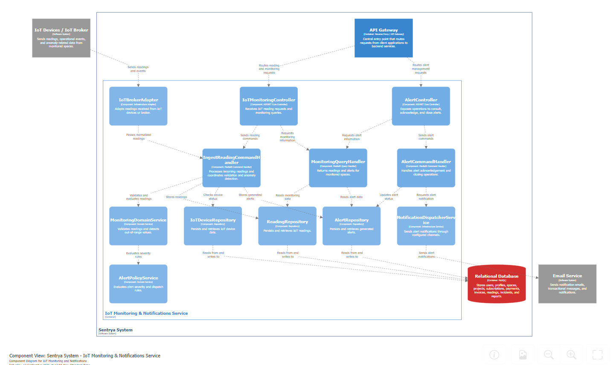

### 4.2.5.6. Bounded Context Software Architecture Code Level Diagrams

### 4.2.5.6.1. Bounded Context Domain Layer Class Diagrams

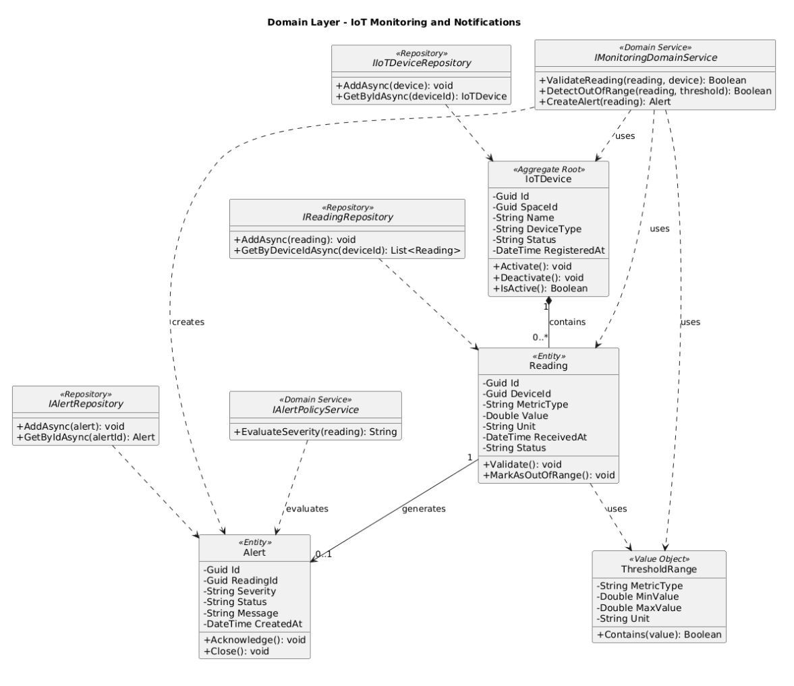

### 4.2.5.6.2. Bounded Context Database Design Diagrams

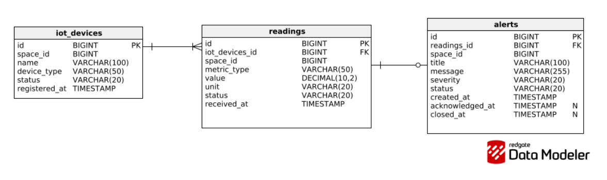

---

### Conclusiones

1. El análisis de la problemática, desarrollado mediante la técnica de las 5W y 2H y respaldado por indicadores del INEI y recomendaciones de Osinergmin, confirmó que existe una necesidad real de centralizar la implementación, el monitoreo y la administración de soluciones IoT en viviendas peruanas, tanto para los dueños de hogar como para los implementadores especializados.

2. El proceso de Lean UX permitió validar que la propuesta de valor de Setrya se sostiene sobre tres núcleos de protección —detección acústica y visual, monitoreo térmico y protección eléctrica inteligente— y que estos pueden ampliarse de forma modular sin reemplazar las soluciones ya instaladas, lo cual responde directamente a las hipótesis y suposiciones planteadas en el Capítulo I.

3. Las entrevistas, el needfinding y el análisis competitivo del Capítulo II evidenciaron que, a diferencia de alternativas como Samsung SmartThings, Home Assistant o Google Home, la principal oportunidad de diferenciación de Setrya no está en el control de dispositivos aislados, sino en integrar en una misma plataforma el monitoreo, las alertas, los históricos y la comunicación entre dueños de hogar e implementadores.

4. La especificación de requisitos del Capítulo III, compuesta por 12 épicas y 25 historias de usuario derivadas del Impact Mapping, tradujo de manera consistente los objetivos de negocio de ambos segmentos objetivo en funcionalidades concretas y priorizables dentro del Product Backlog.

5. El diseño estratégico y táctico del Capítulo IV, mediante Domain-Driven Design, permitió delimitar cinco bounded contexts (Identity & Access Management, Space Management, Payment Management, IoT Monitoring and Notifications, y Report Management) con responsabilidades claras, lo que reduce el acoplamiento entre módulos y facilita la evolución independiente de cada uno conforme el ecosistema de dispositivos se amplíe.

6. En conjunto, los cuatro capítulos muestran una trazabilidad coherente entre la problemática identificada, las hipótesis de negocio, los requisitos funcionales y la arquitectura de software propuesta, lo que sustenta la viabilidad de Setrya como solución para la gestión integral de hogares inteligentes.

### Recomendaciones

1. Validar con dueños de hogar reales las hipótesis planteadas en el Lean UX Canvas —en especial las asociadas al dashboard centralizado y al centro de alertas— antes de escalar el desarrollo de nuevos módulos IoT.

2. Priorizar en los primeros sprints las épicas de Registro y Autenticación (EP01), Dashboard Centralizado (EP02) y Centro de Alertas (EP06), dado que constituyen la base sobre la cual dependen funcionalmente el resto de módulos del backlog.

3. Establecer métricas de adopción y retención (por ejemplo, frecuencia de consulta del dashboard y tiempo de respuesta ante alertas) que permitan contrastar en producción los Business Outcomes definidos en el Impact Mapping del Capítulo III.

4. Mantener la separación de bounded contexts definida en el Capítulo IV al momento de implementar nuevas soluciones IoT, evitando dependencias directas entre los módulos de dominio y favoreciendo la comunicación a través de los contratos ya definidos en el Context Mapping.

5. Incorporar pruebas de integración y de carga sobre el módulo de IoT Monitoring and Notifications antes de ampliar el catálogo de dispositivos compatibles, considerando que este bounded context concentra el procesamiento de eventos y alertas en tiempo real.

6. Evaluar, en una siguiente iteración, la incorporación de nuevas categorías de dispositivos (por ejemplo, iluminación o sensores de movimiento) siguiendo el mismo enfoque modular validado para los tres núcleos iniciales, de modo que la expansión no afecte las soluciones ya instaladas por los usuarios.

### Bibliografía

- Instituto Nacional de Estadística e Informática. (2026). *Estadísticas de las tecnologías de información y comunicación en los hogares: Informe técnico N.º 1, primer trimestre de 2026*. INEI. https://www.gob.pe/inei

- Organismo Supervisor de la Inversión en Energía y Minería. (s.f.). *Recomendaciones para el uso seguro de la electricidad en el hogar*. Osinergmin. https://www.osinergmin.gob.pe

- Evans, E. (2003). *Domain-Driven Design: Tackling Complexity in the Heart of Software*. Addison-Wesley.

- Vernon, V. (2013). *Implementing Domain-Driven Design*. Addison-Wesley.

- Gothelf, J., & Seiden, J. (2016). *Lean UX: Designing Great Products with Agile Teams* (2.ª ed.). O'Reilly Media.

- Adzic, G. (2012). *Impact Mapping: Making a Big Impact with Software Products and Projects*. Provoking Thoughts.

- Samsung Electronics. (s.f.). *SmartThings*. https://www.smartthings.com

- Home Assistant. (s.f.). *Home Assistant: Awaken your home*. https://www.home-assistant.io

- Google. (s.f.). *Google Home*. https://home.google.com

## Anexos
#### Anexo A: Enlaces de Repositorios

A continuación se listan los enlaces a  los repositorios de código fuente utilizados en el proyecto.

| Recurso                                         | URL                                                                                                                                      |
|-------------------------------------------------|------------------------------------------------------------------------------------------------------------------------------------------|
| **Repositorio Project Report**                  | [https://github.com/SpaceUp-UPC/Proyect-Report](https://github.com/SpaceUp-UPC/Proyect-Report) |
| **Repositorio Frontend** | [https://github.com/SpaceUp-UPC/Setrya-Frontend](https://github.com/SpaceUp-UPC/Setrya-Frontend)                                                                         |
| **Repositorio Backend**                         | [https://github.com/SpaceUp-UPC/Setrya-Backend](https://github.com/SpaceUp-UPC/Setrya-Backend)                                 |
| **Repositorio Mobile**                          | [https://github.com/SpaceUp-UPC/MultiPlatform-App-Sentrya-Flutter](https://github.com/SpaceUp-UPC/MultiPlatform-App-Sentrya-Flutter)                           |

#### Anexo B: Videos de Exposiciones

Registro histórico de las exposiciones durante el ciclo académico 2026-20.

| Entrega / Hito              | Plataforma       | URL                                                |
|-----------------------------|------------------|----------------------------------------------------|
| **Video de Entrevistas** | Microsoft Stream | [Entrevistas Unidas](https://upcedupe-my.sharepoint.com/:v:/g/personal/u202313458_upc_edu_pe/IQCbt_6Mzl12SJq6qsfCFuxqAR2Ywpzb010_STXjIGtgn6c?nav=eyJyZWZlcnJhbEluZm8iOnsicmVmZXJyYWxBcHAiOiJTdHJlYW1XZWJBcHAiLCJyZWZlcnJhbFZpZXciOiJTaGFyZURpYWxvZy1MaW5rIiwicmVmZXJyYWxBcHBQbGF0Zm9ybSI6IldlYiIsInJlZmVycmFsTW9kZSI6InZpZXcifX0%3D&e=c4k3Wn ) |
| **Video de Exposición AV1** | Microsoft Stream | [Video de Exposicion AV1](https://upcedupe-my.sharepoint.com/:v:/g/personal/u202313458_upc_edu_pe/IQDW-q_HEu45Sp9Wbm3C4Zg7Ac9C_V1c2xJLPtEqpcPUyfQ?nav=eyJyZWZlcnJhbEluZm8iOnsicmVmZXJyYWxBcHAiOiJTdHJlYW1XZWJBcHAiLCJyZWZlcnJhbFZpZXciOiJTaGFyZURpYWxvZy1MaW5rIiwicmVmZXJyYWxBcHBQbGF0Zm9ybSI6IldlYiIsInJlZmVycmFsTW9kZSI6InZpZXcifX0%3D&e=ssoFne) |
