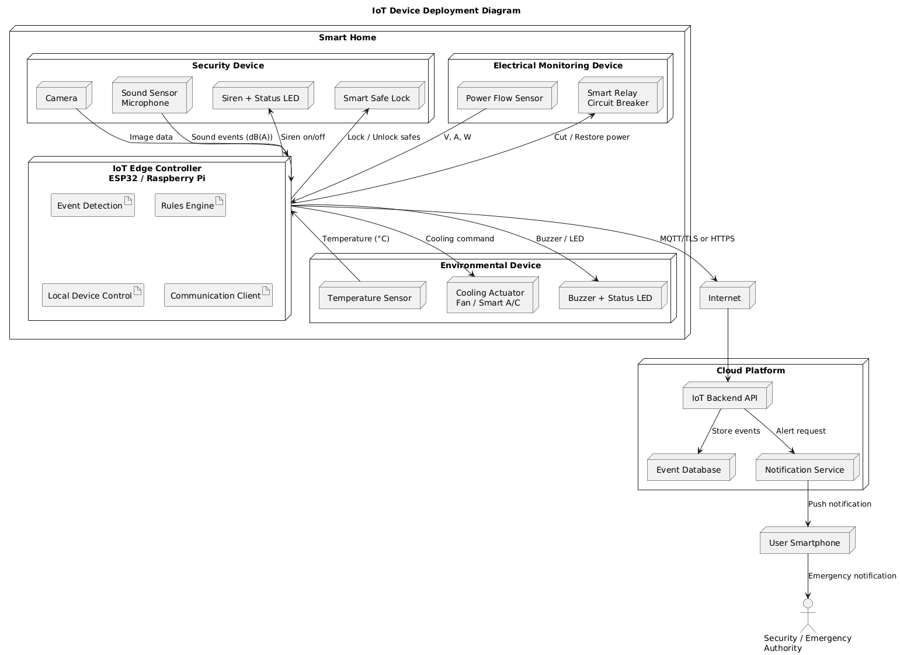
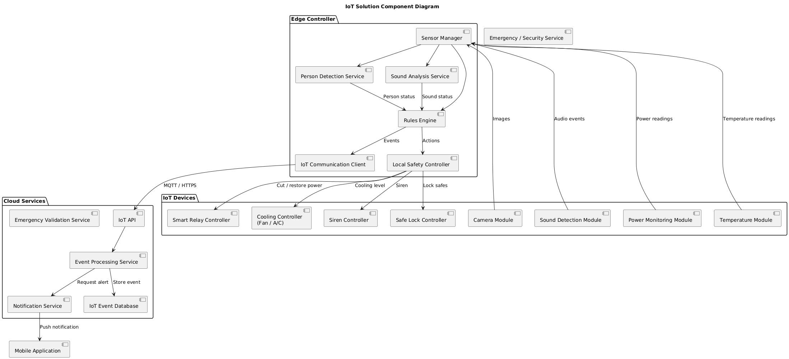
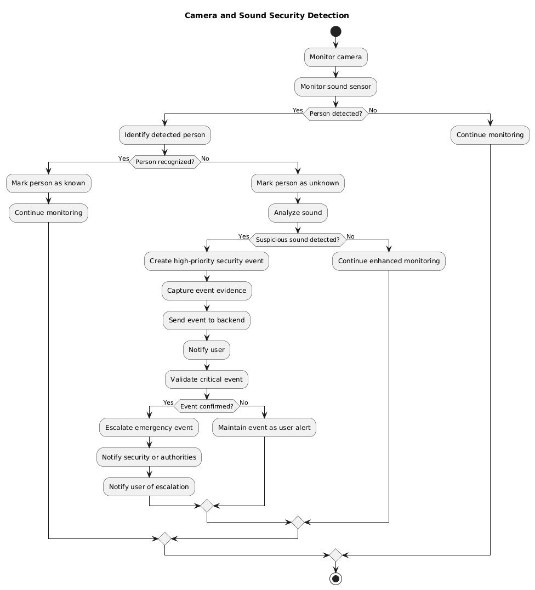
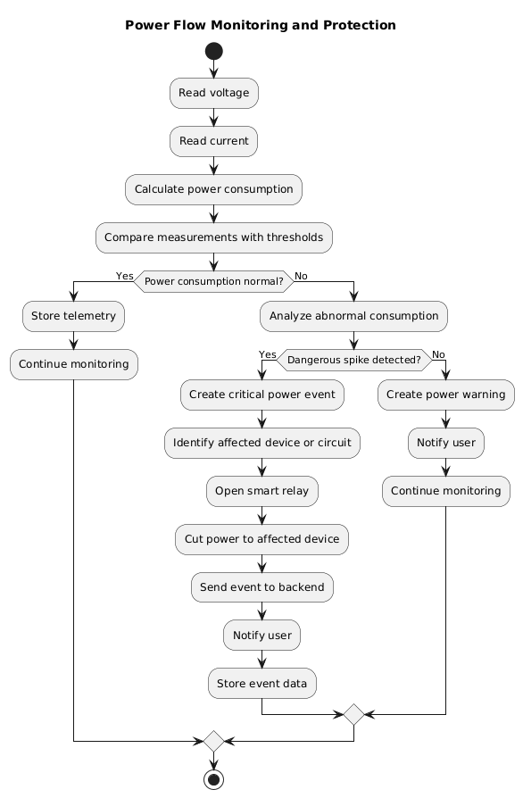
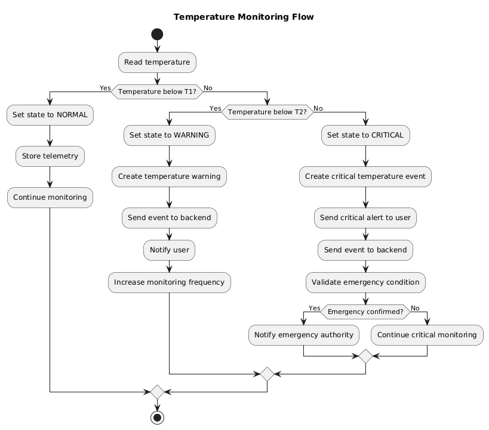
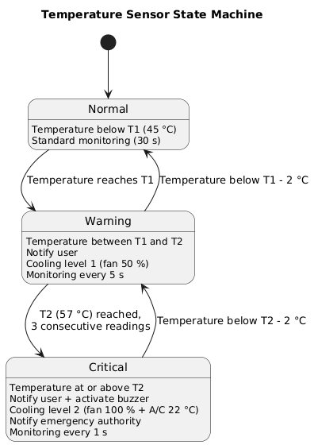
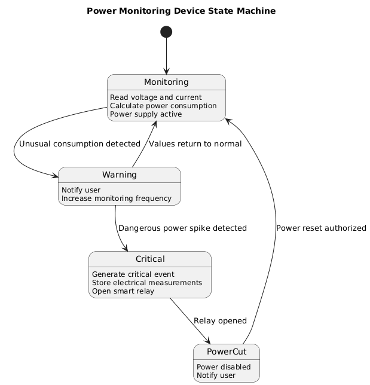
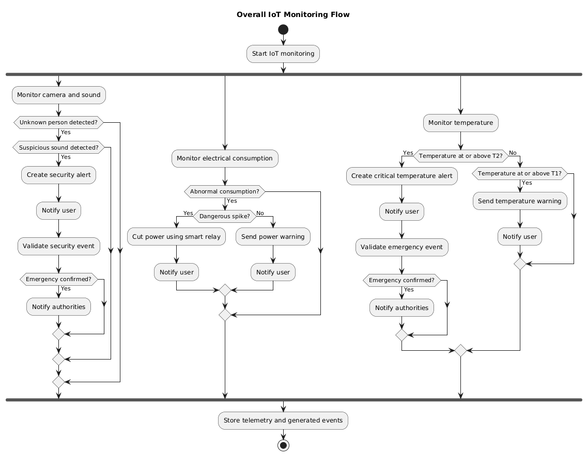
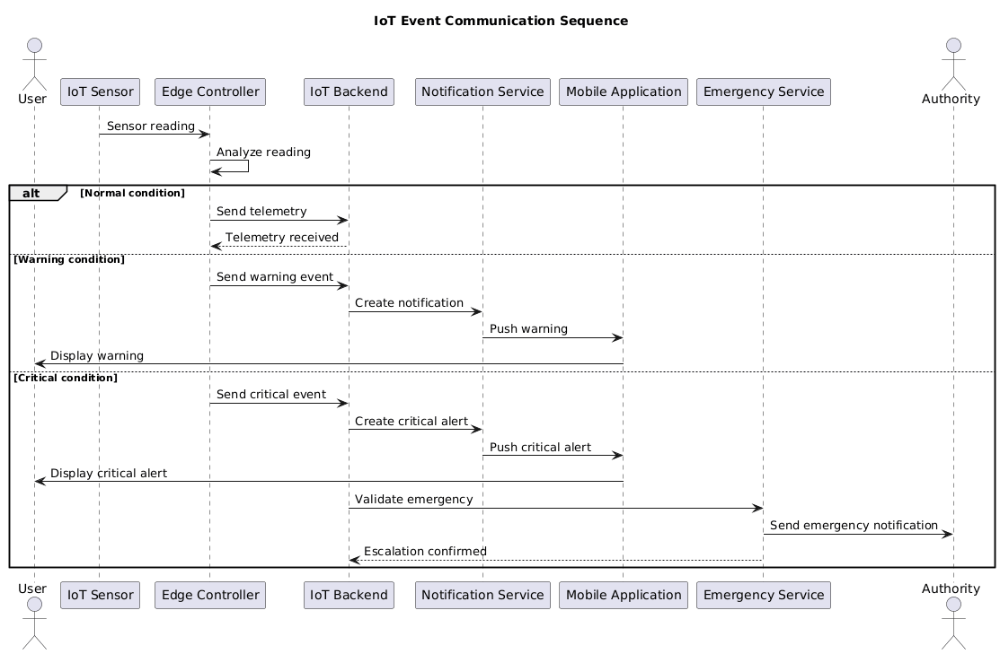

# Capítulo V: Solution UI/UX Design 
## 5.1. Style Guidelines. 
### 5.1.1. General Style Guidelines. 
### 5.1.2. Web, Mobile and IoT Style Guidelines. 
## 5.2. Information Architecture. 
### 5.2.1. Organization Systems. 
### 5.2.2. Labeling Systems. 
### 5.2.3. SEO Tags and Meta Tags 
### 5.2.4. Searching Systems. 
### 5.2.5. Navigation Systems. 
## 5.3. Landing Page UI Design. 
### 5.3.1. Landing Page Wireframe. 
### 5.3.2. Landing Page Mock-up. 
## 5.4. Applications UX/UI Design. 
###5.4.1. Applications Wireframes. 
### 5.4.2. Applications Wireflow Diagrams. 
### 5.4.2. Applications Mock-ups. 
### 5.4.3. Applications User Flow Diagrams. 
## 5.5. Applications Prototyping. 
## 5.6. IoT Device Design.
La solución IoT propuesta está orientada al monitoreo preventivo de seguridad, consumo eléctrico y condiciones ambientales dentro de una vivienda. El diseño considera tres dispositivos principales: un sistema de detección mediante cámara y sonido, un sensor de flujo/consumo eléctrico y un sensor de temperatura.
Las decisiones de diseño se basan principalmente en los siguientes criterios:
- Procesamiento en el borde (Edge Computing): las lecturas críticas y reglas de emergencia se procesan localmente para reducir la dependencia de la conexión a Internet.
- Baja latencia: las situaciones consideradas críticas requieren que el dispositivo pueda actuar inmediatamente.
- Disponibilidad: ciertas acciones, como interrumpir la alimentación eléctrica, pueden ejecutarse localmente aun cuando el servicio cloud no se encuentre disponible.
- Privacidad: el procesamiento de imágenes y sonido debe realizarse preferentemente en el dispositivo Edge, enviándose al backend únicamente eventos y evidencias estrictamente necesarias.
- Seguridad: toda comunicación entre los dispositivos IoT y el backend debe utilizar conexiones autenticadas y cifradas, por ejemplo MQTT sobre TLS o HTTPS.
- Interacción mínima: siguiendo los principios de IoT Device Physical Interfaces, el dispositivo debe comunicar sus estados mediante indicadores simples como LEDs, sonidos o notificaciones en la aplicación.
- Prevención de falsos positivos: las acciones de escalamiento externo, particularmente aquellas relacionadas con servicios de emergencia, requieren la correlación y validación de múltiples señales antes de ejecutarse.
La arquitectura considera un IoT Edge Controller como elemento central encargado de recibir información de los sensores, aplicar reglas locales y comunicarse con la plataforma backend.

### 5.6.1 UML Deployment Diagram
Este diagrama representa físicamente dónde se encuentran los sensores y cómo se comunican con el Edge Controller y la infraestructura cloud.




Los tres dispositivos se encuentran dentro de la vivienda y se comunican con un IoT Edge Controller.
El Edge Controller permite que determinadas decisiones críticas se ejecuten localmente. Por ejemplo, si existe un incremento peligroso de consumo eléctrico, el controlador puede abrir el relé sin esperar una respuesta del servidor.

### 5.6.2 UML Component Diagram
El diagrama de componentes muestra la organización lógica de la solución IoT y las responsabilidades de cada módulo. Los dispositivos físicos capturan información del entorno y la envían al controlador Edge, donde se ejecutan servicios de análisis, detección y aplicación de reglas. Posteriormente, los eventos relevantes son enviados al backend, el cual se encarga del almacenamiento, generación de notificaciones y escalamiento de situaciones críticas. Esta separación facilita el mantenimiento y permite desacoplar la lógica de sensores, procesamiento y servicios cloud.



Aquí la parte importante de la arquitectura es el Rules Engine.
Por ejemplo:

```IF unknown_person = true
AND suspicious_sound = true
THEN SECURITY_ALERT
```


Mientras que para temperatura:


```
IF temperature >= WARNING_THRESHOLD
    -> WARNING
```

```IF temperature >= CRITICAL_THRESHOLD
    -> CRITICAL_ALERT
```


Y para consumo eléctrico:

```IF power > NORMAL_THRESHOLD
OR sudden_power_spike = true
    -> CUT_POWER
    -> ALERT_USER
```


### 5.6.3 Camera + Sound Detector
Este diagrama describe el flujo de detección de posibles incidentes de seguridad utilizando información proveniente de la cámara y del sensor de sonido. El sistema analiza primero si existe una persona en el área supervisada y determina si esta puede ser reconocida. En caso de tratarse de una persona desconocida, se analiza adicionalmente el entorno sonoro. Cuando ambas condiciones, persona desconocida y sonido sospechoso, ocurren de manera simultánea, se genera un evento de alta prioridad, se notifica al usuario y se inicia un proceso de validación antes de realizar un posible escalamiento hacia las autoridades:




### 5.6.4 Power Flow Sensor
Este diagrama representa el proceso de monitoreo del consumo eléctrico de los dispositivos conectados. El sensor obtiene valores de voltaje y corriente, a partir de los cuales se calcula el consumo energético. Si se detecta una variación anómala, el sistema determina si se trata únicamente de un consumo inusual o de un pico potencialmente peligroso. En el segundo caso, el controlador Edge puede abrir el relé inteligente para interrumpir de manera inmediata la alimentación del dispositivo afectado y posteriormente notificar al usuario:




### 5.6.5 Temperature Sensor
El diagrama muestra el comportamiento del sistema de monitoreo de temperatura considerando dos niveles configurables de alerta. Mientras la temperatura permanezca por debajo del primer umbral, el sistema continúa operando en estado normal. Al superar el primer nivel, se genera una advertencia dirigida al usuario y se incrementa la frecuencia de monitoreo. Si la temperatura alcanza el segundo umbral, el evento pasa a ser crítico, generándose una alerta prioritaria y un proceso de validación para determinar si es necesario realizar un escalamiento hacia los servicios de emergencia:



### 5.6.6 Temperature Device

Este diagrama de estados representa la transición del sensor de temperatura entre los estados Normal, Warning y Critical. Las transiciones dependen directamente de los valores de temperatura comparados con los umbrales T1 y T2. El modelo permite visualizar de forma clara cómo el dispositivo cambia su comportamiento en función de las condiciones detectadas, incluyendo el envío de alertas y el incremento de la frecuencia de monitoreo ante situaciones anómalas.




### 5.6.7 Power Sensor

El diagrama representa los diferentes estados operativos del sistema de monitoreo eléctrico. Inicialmente, el dispositivo permanece en estado de monitoreo continuo. Ante la detección de un consumo inusual, cambia a un estado de advertencia. Si posteriormente se identifica un pico peligroso de energía, el sistema entra en estado crítico y ejecuta el corte eléctrico mediante el relé inteligente. Finalmente, el suministro puede ser restablecido una vez que la situación ha sido validada y autorizada.




### 5.6.8 Overall IoT Interaction

El diagrama presenta una visión integrada del funcionamiento de los tres subsistemas IoT. Cada sensor opera de manera concurrente, supervisando de forma independiente la seguridad, el consumo eléctrico y la temperatura. Cuando se detecta una condición anómala, el subsistema correspondiente ejecuta las acciones definidas, tales como generar alertas, interrumpir la alimentación eléctrica o solicitar una validación de emergencia. Finalmente, los eventos generados y la telemetría son almacenados para su posterior consulta y análisis:



Este diagrama de secuencia muestra el intercambio de mensajes entre un sensor IoT, el controlador Edge, el backend, el servicio de notificaciones y la aplicación móvil. Dependiendo de la severidad del evento, el flujo puede limitarse al registro de telemetría, generar una advertencia o escalar hacia una situación crítica. La comunicación permite evidenciar cómo los eventos detectados en el entorno físico son procesados y convertidos en acciones visibles para el usuario:




