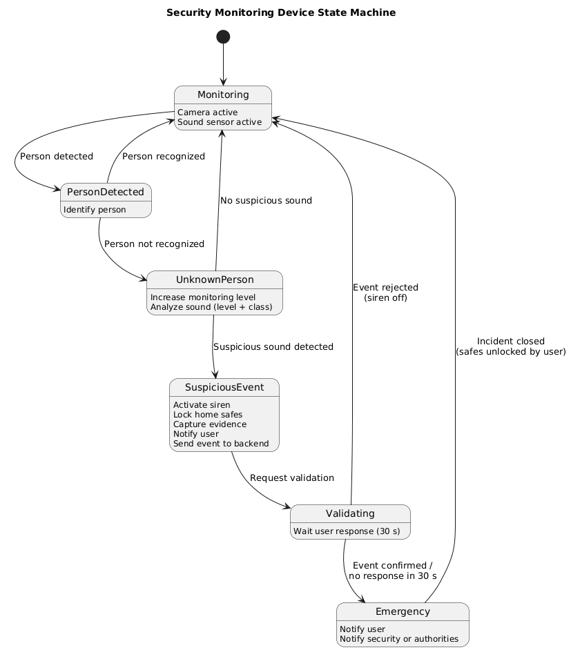

# Capítulo V: Solution UI/UX Design 
## 5.1. Style Guidelines. 
### 5.1.1. General Style Guidelines. 
### 5.1.2. Web, Mobile and IoT Style Guidelines. 
## 5.2. Information Architecture. 
### 5.2.1. Organization Systems. 
### 5.2.2. Labeling Systems. 
### 5.2.3. SEO Tags and Meta Tags 
### 5.2.4. Searching Systems. 
### 5.2.5. Navigation Systems. 
## 5.3. Landing Page UI Design. 
### 5.3.1. Landing Page Wireframe. 
### 5.3.2. Landing Page Mock-up. 
## 5.4. Applications UX/UI Design. 
###5.4.1. Applications Wireframes. 
### 5.4.2. Applications Wireflow Diagrams. 
### 5.4.2. Applications Mock-ups. 
### 5.4.3. Applications User Flow Diagrams. 
## 5.5. Applications Prototyping. 
## 5.6. IoT Device Design.
La solución IoT propuesta está orientada al monitoreo preventivo de seguridad, consumo eléctrico y condiciones ambientales dentro de una vivienda. El diseño considera tres dispositivos principales: un sistema de detección mediante cámara y sonido, un sensor de flujo/consumo eléctrico y un sensor de temperatura.
Las decisiones de diseño se basan principalmente en los siguientes criterios:
- Procesamiento en el borde (Edge Computing): las lecturas críticas y reglas de emergencia se procesan localmente para reducir la dependencia de la conexión a Internet.
- Baja latencia: las situaciones consideradas críticas requieren que el dispositivo pueda actuar inmediatamente.
- Disponibilidad: ciertas acciones, como interrumpir la alimentación eléctrica, pueden ejecutarse localmente aun cuando el servicio cloud no se encuentre disponible.
- Privacidad: el procesamiento de imágenes y sonido debe realizarse preferentemente en el dispositivo Edge, enviándose al backend únicamente eventos y evidencias estrictamente necesarias.
- Seguridad: toda comunicación entre los dispositivos IoT y el backend debe utilizar conexiones autenticadas y cifradas, por ejemplo MQTT sobre TLS o HTTPS.
- Interacción mínima: siguiendo los principios de IoT Device Physical Interfaces, el dispositivo debe comunicar sus estados mediante indicadores simples como LEDs, sonidos o notificaciones en la aplicación.
- Prevención de falsos positivos: las acciones de escalamiento externo, particularmente aquellas relacionadas con servicios de emergencia, requieren la correlación y validación de múltiples señales antes de ejecutarse.
La arquitectura considera un IoT Edge Controller como elemento central encargado de recibir información de los sensores, aplicar reglas locales y comunicarse con la plataforma backend.

### 5.6.1 UML Deployment Diagram
Este diagrama representa físicamente dónde se encuentran los sensores y cómo se comunican con el Edge Controller y la infraestructura cloud.


Los tres dispositivos se encuentran dentro de la vivienda y se comunican con un IoT Edge Controller.
El Edge Controller permite que determinadas decisiones críticas se ejecuten localmente. Por ejemplo, si existe un incremento peligroso de consumo eléctrico, el controlador puede abrir el relé sin esperar una respuesta del servidor.

### 5.6.2 UML Component Diagram
Este diagrama muestra cómo se relacionan los principales componentes lógicos.


Aquí la parte importante de la arquitectura es el Rules Engine.
Por ejemplo:

```IF unknown_person = true
AND suspicious_sound = true
THEN SECURITY_ALERT
```


Mientras que para temperatura:


```
IF temperature >= WARNING_THRESHOLD
    -> WARNING
```

```IF temperature >= CRITICAL_THRESHOLD
    -> CRITICAL_ALERT
```


Y para consumo eléctrico:

```IF power > NORMAL_THRESHOLD
OR sudden_power_spike = true
    -> CUT_POWER
    -> ALERT_USER
```


### 5.6.3 Camera + Sound Detector
Este es el flujo más importante del prototipo.


El sistema no considera suficiente únicamente detectar una persona.
La condición crítica se produce cuando:
 - Persona desconocida + sonido sospechoso = posible incidente.

### 5.6.4 Power Flow Sensor
Para este dispositivo se necesita tanto el sensor como un actuador.
El sensor puede medir:
- voltaje;
- corriente;
- potencia;
- consumo acumulado.
Mientras que un Smart Relay permite interrumpir físicamente la alimentación.


La diferencia importante es que este dispositivo utiliza un actuador físico.
Por tanto:
```Power Sensor → Edge Controller → Smart Relay → Electrical Device```

El corte de energía debe ejecutarse localmente para que no dependa de:
```Sensor → Internet → Backend → Internet → Relay ```

porque una pérdida de conexión podría impedir la acción de seguridad.


### 5.6.5 Temperature Sensor
Los thresholds puede representarse:
```Normal:
Temperature < T1

Warning:
T1 <= Temperature < T2

Critical:
Temperature >= T2
```
Donde los valores T1 y T2 son configurables en lugar de estar fijos en el dispositivo.


### 5.6.6 Temperature Device


### 5.6.7 Power Sensor


### 5.6.8 Security Sensor



### 5.6.9 Overall IoT Interaction


En conjunto, la solución queda conceptualmente así:


