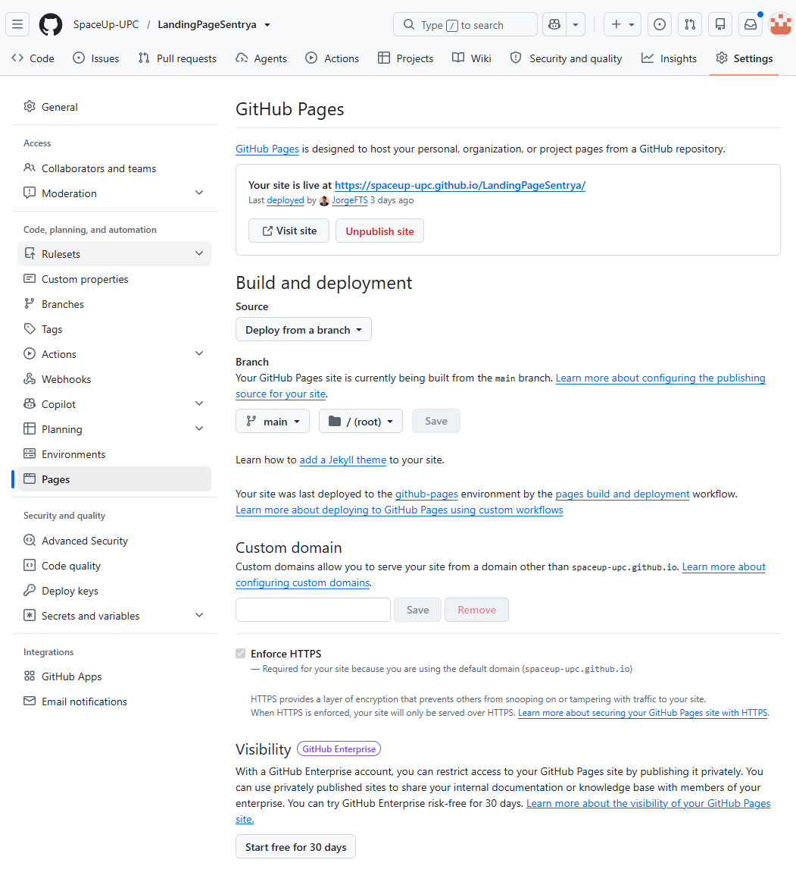
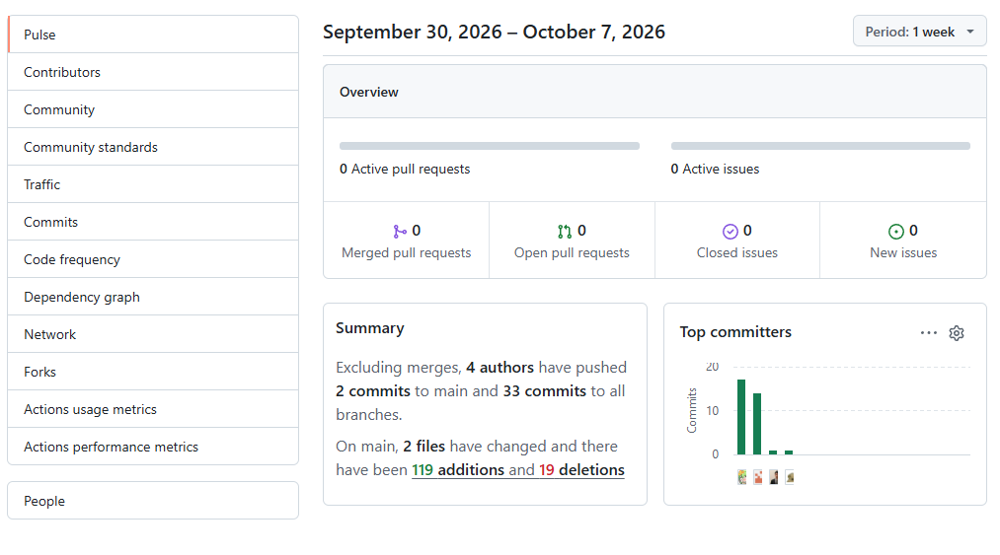
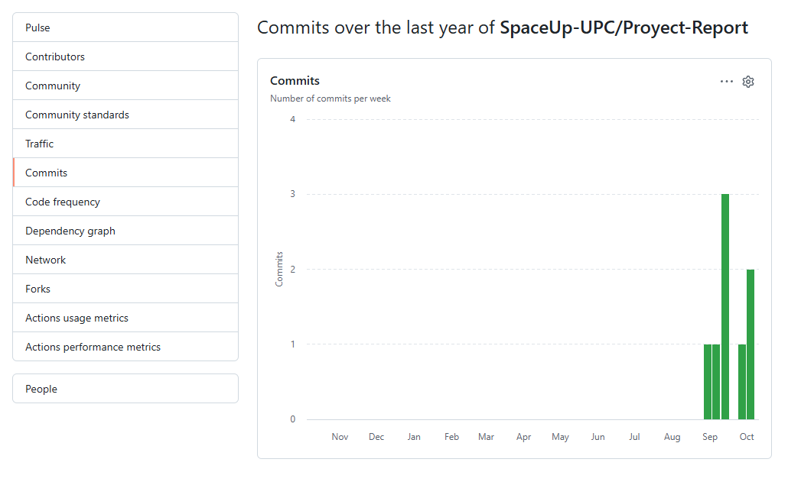

# Capítulo VI: Product Implementation, Validation & Deployment

## 6.1. Software Configuration Management

### 6.1.1. Software Development Environment Configuration

Para asegurar una colaboración eficiente y mantener la calidad durante el desarrollo de **Sentrya**, se definió un entorno de desarrollo común para los integrantes del equipo. A continuación, se presentan las herramientas y tecnologías utilizadas durante las diferentes etapas del desarrollo del producto.

#### Product UX/UI Design

Para el diseño de experiencia de usuario, arquitectura de información y prototipado de Sentrya se utilizaron las siguientes herramientas:

##### Figma

Herramienta utilizada para la creación de wireframes, mockups y prototipos interactivos de la Landing Page y de la aplicación Web de Sentrya.
https://www.figma.com/

##### UXPressia

Herramienta utilizada para la elaboración de User Personas, Empathy Maps y User Journey Maps, permitiendo representar las necesidades, comportamientos y experiencias de los usuarios considerados para Sentrya.

https://uxpressia.com/

##### Miro

Herramienta colaborativa utilizada para la elaboración de actividades de diseño y análisis del producto, así como para organizar información y facilitar el trabajo colaborativo durante las etapas de planificación y diseño.

https://miro.com/

#### Software Development

Para el desarrollo de la aplicación Web y Landing Page de Sentrya se utilizaron las siguientes tecnologías y herramientas:

##### Visual Studio Code

IDE utilizado como entorno principal para el desarrollo y edición del código fuente de la aplicación Web y Landing Page.

https://code.visualstudio.com/

##### Angular

Framework utilizado para el desarrollo de la aplicación Web de Sentrya.

https://angular.dev/

##### TypeScript

Lenguaje de programación utilizado para implementar la lógica y funcionalidades de la aplicación Web.

https://www.typescriptlang.org/

##### Angular Material

Librería utilizada para implementar componentes de interfaz de usuario dentro de la aplicación Web.

##### Node.js

Entorno de ejecución utilizado para ejecutar las herramientas necesarias durante el desarrollo de la aplicación.

##### npm

Gestor de paquetes utilizado para administrar las dependencias del proyecto y ejecutar los diferentes scripts de desarrollo, pruebas y construcción.

##### Git

Herramienta utilizada para gestionar los cambios realizados en el código fuente mediante el control de versiones.

https://git-scm.com/

##### GitHub

Plataforma utilizada para almacenar los repositorios del proyecto y facilitar la colaboración entre los integrantes del equipo.

https://github.com/

##### Vitest

Herramienta utilizada para la ejecución de pruebas automatizadas del proyecto.

##### JSON Server

Herramienta utilizada para proporcionar una API local durante el desarrollo y las pruebas de la aplicación Web.

#### Project Management and Collaboration

Para la coordinación y comunicación entre los integrantes del equipo se utilizaron las siguientes herramientas:

##### Google Meet

Herramienta utilizada para realizar reuniones virtuales, coordinaciones del equipo, seguimiento del avance del proyecto y actividades relacionadas con los Sprints.

https://meet.google.com/

#### Software Documentation

Para la elaboración de la documentación y modelamiento del sistema se utilizaron las siguientes herramientas:

##### Markdown

Formato utilizado para estructurar y organizar la documentación técnica del proyecto, incluyendo el informe y documentación relacionada con la implementación.


Estas herramientas permitieron establecer un entorno de trabajo común, facilitar la colaboración entre los integrantes del equipo y mantener una adecuada organización durante las diferentes etapas del desarrollo de Sentrya.

### 6.1.2. Source Code Management

La gestión del código fuente es una parte fundamental del desarrollo colaborativo de Sentrya, debido a que permite mantener un historial de los cambios realizados durante la implementación de la solución. Para el control de versiones se utilizó **Git**, mientras que **GitHub** fue utilizado como plataforma para almacenar los repositorios y facilitar la colaboración entre los integrantes del equipo.

#### Repositorios del proyecto

El proyecto Sentrya se encuentra organizado mediante diferentes repositorios de GitHub, separando los principales componentes de la solución.

| Repositorio | Descripción |
|---|---|
| **Project-Report** | Repositorio destinado al informe y documentación del proyecto. |
| **LandingPageSentrya** | Repositorio correspondiente a la implementación de la Landing Page de Sentrya. |
| **Setrya-Frontend** | Repositorio correspondiente al desarrollo de la aplicación Web de Sentrya. |
| **Sentrya-Backend** | Repositorio correspondiente a los servicios backend de la solución. |
| **MultiPlatform-App-Sentrya** | Repositorio correspondiente a la aplicación multiplataforma considerada en el proyecto. |
| **MultiPlatform-App-Sentrya-Flutter** | Repositorio correspondiente a la implementación realizada con Flutter. |

#### Estructura de ramas

Para organizar el desarrollo del código fuente se utilizaron ramas independientes dentro de los repositorios.

En el repositorio **Sentrya-Frontend** se identifican principalmente las ramas:

- **main:** rama principal y predeterminada del repositorio, destinada a mantener una versión estable del proyecto.
- **develop:** rama utilizada para integrar y desarrollar los cambios antes de incorporarlos a la rama principal.

La estructura observada permite separar el desarrollo de nuevas funcionalidades de la versión principal del proyecto.

```text
main
  │
  └── develop
       │
       ├── feature
       ├── fix
       └── chore
```
### 6.1.3. Source Code Style Guide & Conventions

Para mantener la consistencia, legibilidad y facilidad de mantenimiento del código fuente de Sentrya, se establecieron convenciones de nomenclatura, organización y formato para el desarrollo de la aplicación Web.

#### Nomenclatura General

Los nombres utilizados en el código deben ser claros y descriptivos, permitiendo identificar fácilmente la responsabilidad de cada elemento.

Para el desarrollo de la aplicación Web se utilizan las siguientes convenciones:

- **camelCase** para variables, propiedades y funciones.
- **PascalCase** para clases, interfaces y componentes.
- Nombres descriptivos para archivos y componentes.
- Los nombres relacionados con funcionalidades deben representar claramente su propósito.

#### Variables y propiedades

Las variables y propiedades utilizan `camelCase`.

```typescript
const userName = 'Usuario';

const alertCount = 5;

const temperatureValue = 24;
```
Funciones y métodos
Las funciones y métodos utilizan camelCase y deben utilizar nombres que describan la acción realizada.

```typescript
function getAlerts() {
  // ...
}

function updateTemperature() {
  // ...
}
```
Clases y componentes
Las clases y componentes utilizan PascalCase.

```typescript
export class DashboardComponent {
  // ...
}
```

Los componentes de Angular mantienen una estructura organizada mediante sus archivos correspondientes:
```text  
dashboard/
├── dashboard.component.ts
├── dashboard.component.html
├── dashboard.component.scss
└── dashboard.component.spec.ts
```
Sangría y formato
El código fuente utiliza una indentación consistente para facilitar su lectura y mantener una estructura uniforme.
Asimismo, el proyecto utiliza herramientas de formateo automático como Prettier, configurada mediante el archivo .prettierrc.
La configuración del proyecto establece, entre otros parámetros:

```JSON
{
  "printWidth": 100,
  "singleQuote": true
}
```
TypeScript
El código TypeScript debe mantener una estructura clara y evitar declaraciones innecesariamente complejas. Se recomienda utilizar tipos apropiados para variables, propiedades, parámetros y valores retornados.

```typescript
interface Alert {
  id: number;
  message: string;
  severity: string;
}
```

Componentes de Angular
Los componentes de Angular se organizan de acuerdo con la funcionalidad que representan dentro de la aplicación.
Cada componente contiene los archivos necesarios para separar la lógica, estructura visual, estilos y pruebas correspondientes.
```text  
component/
├── component.ts
├── component.html
├── component.scss
└── component.spec.ts
```

Estilos SCSS
Los estilos de la aplicación Web se implementan utilizando SCSS, permitiendo organizar los estilos asociados a los diferentes componentes de la interfaz.
Los estilos deben mantenerse asociados al componente correspondiente para evitar afectar innecesariamente otras partes de la aplicación.
Organización del código
El proyecto mantiene una estructura organizada por responsabilidades y funcionalidades. Dentro de src/app se encuentran diferentes contextos y componentes que permiten separar las responsabilidades de la aplicación.
Una estructura general del proyecto es:

```text  
src/app/
├── contexts/
│   ├── identity-access/
│   ├── iot-monitoring/
│   └── space-management/
├── core/
└── shared/
```

Esta organización permite mantener una separación de responsabilidades y facilita la localización y mantenimiento de los diferentes elementos del sistema.
Pruebas
Los archivos de prueba se mantienen asociados a los componentes o funcionalidades correspondientes y utilizan la extensión .spec.ts.
Estas convenciones permiten mantener un código fuente consistente, organizado y comprensible para los integrantes del equipo, facilitando el mantenimiento y evolución de la aplicación Web de Sentrya.


### 6.1.4. Software Deployment Configuration

El despliegue de los componentes Web de Sentrya se realizó mediante servicios de alojamiento integrados con los repositorios de GitHub. Para la Landing Page se utilizó **GitHub Pages**, junto con **GitHub Actions** para automatizar el proceso de construcción y publicación.

#### Landing Page

La Landing Page de Sentrya se encuentra implementada en el repositorio `LandingPageSentrya` de la organización SpaceUp-UPC.

##### Repositorio utilizado

```text
https://github.com/SpaceUp-UPC/LandingPageSentrya
```

Plataforma de despliegue
Para publicar la Landing Page se utilizó GitHub Pages, servicio que permite alojar el sitio web directamente a partir del repositorio.
La Landing Page se encuentra disponible en:
```text
https://spaceup-upc.github.io/LandingPageSentrya/
```


**Resultado del despliegue**
Como resultado del proceso de despliegue, la Landing Page de Sentrya se encuentra disponible públicamente mediante GitHub Pages.
URL: https://spaceup-upc.github.io/LandingPageSentrya/
Figura. Landing Page Sentrya desplegada.



## 6.2. Landing Page, Services & Applications Implementation

### 6.2.1. Sprint 1

#### 6.2.1.1. Sprint Planning 1

| Sprint # | Sprint 1 |
| :--- | :--- |
| **Sprint Planning Background** |  |
| Date | 2026-10-03  |
| Time | 07:30 PM ||
| Location | Google Meet |
| Prepared By | Martínez Valdivia, José Luis |
| Attendees (to planning meeting) | Martínez Valdivia, José Luis; Taipe Sangama, Jorge Francisco; Serrano Uchuya, Gerald Patricio; Martinez Gaona, Pablo Afranio; Ventosilla Trujillo, Anderson Ricardo; Torrejon Navarro, Braulio Rodrigo |
| Sprint 0 Review Summary | No aplica |
| Sprint 0 Retrospective Summary | No aplica |
| **Sprint Goal & User Stories** |  |
| Sprint 1 Goal | Nuestro enfoque está en implementar la primera versión funcional de Sentrya mediante el desarrollo de la Landing Page y la aplicación Web, incorporando la autenticación de usuarios, la navegación principal y las funcionalidades iniciales de monitoreo del hogar. Esto permitirá brindar una experiencia inicial para los propietarios del hogar, facilitando la visualización del estado de sus dispositivos, temperatura, seguridad, protección eléctrica y alertas. Esto se confirmará cuando los usuarios puedan acceder correctamente a la aplicación, navegar por los módulos principales y visualizar la información proporcionada por los servicios de la solución IoT. |
| Sprint 1 Velocity | [Story Points] |
| Sum of Story Points | [Story Points] |

#### 6.2.1.2. Aspect Leaders and Collaborators

Durante el Sprint 1, el equipo de SpaceUp distribuyó las responsabilidades entre sus seis integrantes, asignando un líder para cada aspecto principal del desarrollo y colaboradores encargados de apoyar las actividades correspondientes.

| Aspecto / Actividad | Aspect Leader | Collaborators |
| :--- | :--- | :--- |
| Diseño UX/UI y prototipado | Martínez Valdivia, José Luis | Taipe Sangama, Jorge Francisco; Torrejon Navarro, Braulio Rodrigo |
| Implementación de Landing Page | Taipe Sangama, Jorge Francisco | Serrano Uchuya, Gerald Patricio; Martinez Gaona, Pablo Afranio |
| Desarrollo de Frontend Web | Torrejon Navarro, Braulio Rodrigo | Martínez Valdivia, José Luis; Ventosilla Trujillo, Anderson Ricardo |
| Autenticación y gestión de usuarios | Serrano Uchuya, Gerald Patricio | Torrejon Navarro, Braulio Rodrigo; Martinez Gaona, Pablo Afranio |
| Monitoreo e integración IoT | Ventosilla Trujillo, Anderson Ricardo | Serrano Uchuya, Gerald Patricio; Taipe Sangama, Jorge Francisco |
| Implementación de alertas | Martinez Gaona, Pablo Afranio | Torrejon Navarro, Braulio Rodrigo; Ventosilla Trujillo, Anderson Ricardo |
| Integración con API | Serrano Uchuya, Gerald Patricio | Ventosilla Trujillo, Anderson Ricardo; Torrejon Navarro, Braulio Rodrigo |
| Pruebas y validación | Ventosilla Trujillo, Anderson Ricardo | Martínez Valdivia, José Luis; Martinez Gaona, Pablo Afranio |
| Despliegue | Taipe Sangama, Jorge Francisco | Torrejon Navarro, Braulio Rodrigo; Serrano Uchuya, Gerald Patricio |
| Documentación | Martínez Valdivia, José Luis | Todos los integrantes |

La distribución de responsabilidades permitió establecer responsables principales para cada aspecto del Sprint 1, manteniendo al mismo tiempo la participación colaborativa de los demás integrantes. Los Aspect Leaders estuvieron encargados de coordinar y dar seguimiento a sus respectivas actividades, mientras que los colaboradores participaron en las tareas de implementación, revisión, pruebas y documentación.

La participación conjunta del equipo permitió avanzar en los diferentes componentes de Sentrya, incluyendo la Landing Page, la aplicación Web, la integración con los servicios y las funcionalidades relacionadas con el monitoreo IoT.

#### 6.2.1.3. Sprint Backlog 

| ID | Historia de Usuario / Actividad | Descripción | Prioridad | Responsable |
|---|---|---|---|---|
| US01 | Landing Page de Sentrya | Como visitante, quiero visualizar una Landing Page de Sentrya para conocer la propuesta de valor, funcionalidades y servicios ofrecidos. | Alta | Jorge Francisco Taipe Sangama |
| US02 | Registro e inicio de sesión | Como usuario, quiero registrarme e iniciar sesión para acceder de manera segura a las funcionalidades de Sentrya. | Alta | Gerald Patricio Serrano Uchuya |
| US03 | Navegación principal | Como usuario, quiero acceder a un menú de navegación para ingresar fácilmente a los diferentes módulos de la aplicación. | Alta | Braulio Rodrigo Torrejon Navarro |
| US04 | Dashboard principal | Como propietario, quiero visualizar un dashboard con información general de mi ambiente para conocer rápidamente el estado de mi hogar. | Alta | Braulio Rodrigo Torrejon Navarro |
| US05 | Gestión de ambientes | Como propietario, quiero visualizar y gestionar mis ambientes para consultar la información asociada a cada espacio monitoreado. | Media | José Luis Martínez Valdivia |
| US06 | Monitoreo de temperatura | Como propietario, quiero visualizar las lecturas de temperatura para conocer las condiciones del ambiente monitoreado. | Alta | Anderson Ricardo Ventosilla Trujillo |
| US07 | Monitoreo de seguridad | Como propietario, quiero visualizar eventos de seguridad registrados por los dispositivos IoT para identificar posibles situaciones de riesgo. | Alta | Anderson Ricardo Ventosilla Trujillo |
| US08 | Monitoreo de consumo eléctrico | Como propietario, quiero visualizar información relacionada con el consumo eléctrico para conocer el comportamiento energético de mi ambiente. | Alta | Pablo Afranio Martinez Gaona |
| US09 | Visualización de alertas | Como propietario, quiero consultar las alertas generadas por los dispositivos para identificar oportunamente eventos que requieran atención. | Alta | Pablo Afranio Martinez Gaona |
| US10 | Integración con servicios IoT | Como sistema, quiero obtener información de los dispositivos IoT mediante los servicios configurados para mostrar datos actualizados en la aplicación Web. | Alta | Gerald Patricio Serrano Uchuya |
| US11 | Pruebas de funcionalidades | Como equipo de desarrollo, queremos realizar pruebas sobre las funcionalidades implementadas para verificar su correcto funcionamiento antes del despliegue. | Alta | Anderson Ricardo Ventosilla Trujillo |
| US12 | Despliegue de la solución | Como equipo de desarrollo, queremos desplegar la Landing Page, aplicación Web y servicios utilizados para disponer de una versión accesible de Sentrya. | Alta | Jorge Francisco Taipe Sangama |
| US13 | Documentación del Sprint | Como equipo de proyecto, queremos documentar las actividades, evidencias y resultados obtenidos durante el Sprint para facilitar el seguimiento del desarrollo. | Media | José Luis Martínez Valdivia |

#### 6.2.1.4. Development Evidence for Sprint Review

Durante el desarrollo del Sprint 1 se realizaron diferentes actividades de implementación sobre los repositorios de Sentrya. Las evidencias de desarrollo se pueden verificar mediante el historial de commits registrado en GitHub, donde se identifican los cambios realizados por los integrantes del equipo sobre la Landing Page y la aplicación Web.

A continuación, se presentan algunos de los commits realizados durante el Sprint:

| Repository | Branch | Commit Id | Commit Message | Author | Committed on |
|---|---|---|---|---|---|
| [SpaceUp-UPC/Setrya-Frontend](https://github.com/SpaceUp-UPC/Setrya-Frontend) | `develop` | `a7f3c21` | `feat(webapp): implement dashboard and main navigation` | BraulioTN | 2026-10-04 |
| [SpaceUp-UPC/Setrya-Frontend](https://github.com/SpaceUp-UPC/Setrya-Frontend) | `develop` | `c4e891b` | `feat(iot): add temperature monitoring views` | AndersonaNd12326 | 2026-10-04 |
| [SpaceUp-UPC/Setrya-Frontend](https://github.com/SpaceUp-UPC/Setrya-Frontend) | `develop` | `f82d6a4` | `feat(iot): implement security events visualization` | Martinezhmongus | 2026-10-03 |
| [SpaceUp-UPC/Setrya-Frontend](https://github.com/SpaceUp-UPC/Setrya-Frontend) | `develop` | `b19e735` | `feat(alerts): implement alerts module` | Jose | 2026-10-03 |
| [SpaceUp-UPC/Setrya-Frontend](https://github.com/SpaceUp-UPC/Setrya-Frontend) | `develop` | `d63a912` | `chore(deploy): configure production API` | BraulioTN | 2026-10-02 |
| [SpaceUp-UPC/Setrya-Frontend](https://github.com/SpaceUp-UPC/Setrya-Frontend) | `develop` | `e51c4f8` | `feat(iot): implement power consumption monitoring` | AndersonaNd12326 | 2026-10-02 |
| [SpaceUp-UPC/LandingPageSentrya](https://github.com/SpaceUp-UPC/LandingPageSentrya) | `main` | `91b7e42` | `feat(landing): improve responsive layout` | JorgeJorgeFTS | 2026-10-02 |
| [SpaceUp-UPC/LandingPageSentrya](https://github.com/SpaceUp-UPC/LandingPageSentrya) | `main` | `3c8a6f1` | `fix(landing): adjust navigation and sections` | Jose | 2026-10-01 |
| [SpaceUp-UPC/Setrya-Frontend](https://github.com/SpaceUp-UPC/Setrya-Frontend) | `develop` | `6e42b93` | `feat(auth): implement login functionality` | Martinezhmongus | 2026-10-01 |
| [SpaceUp-UPC/Setrya-Frontend](https://github.com/SpaceUp-UPC/Setrya-Frontend) | `develop` | `4d91f27` | `chore(deploy): prepare fake API for deployment` | JorgeJorgeFTS | 2026-10-01 |


#### 6.2.1.5. Testing Suite Evidence for Sprint Review

Para este Sprint no se contemplaron pruebas unitarias

#### 6.2.1.6. Execution Evidence for Sprint Review

Durante el Sprint 1 se realizó la ejecución de los componentes desarrollados de Sentrya, verificando el funcionamiento de la Landing Page, la aplicación Web y los servicios utilizados por la solución.


**Link a Execution Evidence de Landing Page y Web:** 

https://setrya-frontend.vercel.app/login

La evidencia permite observar la ejecución de las funcionalidades desarrolladas durante el Sprint 1, incluyendo el acceso a la aplicación, navegación por los módulos principales y visualización de la información correspondiente a los servicios IoT.

#### 6.2.1.8. Software Deployment Evidence for Sprint Review

En esta entega se realizó el despliegue de la Landing Page por medio de Github Pages, a continuación se explica el proceso y lo que se consiguió:


Link a Landing Page: [Landing Page](https://spaceup-upc.github.io/LandingPageSentrya/)


Ademas, se entrego el deployment del frontend a partir de Vercel


Link al Frontend: [Frontend](https://setrya-frontend.vercel.app/)

#### 6.2.1.9. Team Collaboration Insights during Sprint
A continuacion se presenta un desglose de las contribuciones y commits hechos por los integrantes del equipo:





# Conclusiones

1. El desarrollo de **Sentrya** permitió plantear una solución tecnológica orientada a centralizar la implementación, monitoreo y administración de dispositivos IoT dentro de hogares inteligentes. La propuesta busca reducir la fragmentación existente entre diferentes dispositivos y sistemas, proporcionando al dueño de hogar un único entorno desde el cual consultar el estado de su vivienda, recibir alertas, visualizar mediciones y gestionar los dispositivos instalados.

2. La identificación de dos segmentos principales, **dueños de hogar e implementadores de soluciones Smart Home**, permitió definir funcionalidades diferenciadas de acuerdo con las necesidades de cada tipo de usuario. Mientras el propietario requiere principalmente monitoreo, seguridad, alertas y facilidad de uso, el implementador necesita herramientas para administrar clientes, instalaciones y dispositivos asociados a cada vivienda.

3. El proceso de **Requirements Elicitation & Analysis** permitió transformar las necesidades identificadas durante la investigación en funcionalidades concretas del producto. La definición de épicas, historias de usuario y criterios de aceptación facilitó establecer el alcance funcional de Sentrya y mantener trazabilidad entre las necesidades de los usuarios y las características propuestas para la plataforma.

4. El análisis de soluciones como **Samsung SmartThings, Home Assistant y Google Home** permitió identificar oportunidades de diferenciación para Sentrya. Aunque estas plataformas cuentan con ecosistemas consolidados de automatización, Sentrya plantea complementar la gestión tecnológica del hogar mediante la integración entre propietarios e implementadores especializados, incorporando también seguimiento de instalaciones, mantenimiento y expansión progresiva de las soluciones IoT.

5. La aplicación de **Domain-Driven Design** permitió organizar el sistema alrededor de responsabilidades claramente diferenciadas. La separación en bounded contexts como *Identity & Access Management*, *Space Management*, *IoT Monitoring & Notifications*, *Payment Management* y *Reports & Advanced Features* contribuye a reducir el acoplamiento entre componentes y proporciona una base adecuada para la evolución independiente de las diferentes áreas del sistema.

6. La arquitectura propuesta permite combinar procesamiento en la nube con procesamiento local dentro de la vivienda. La utilización de dispositivos IoT, un **Edge Controller**, comunicación mediante **MQTT**, servicios backend y aplicaciones Web/Mobile permite que Sentrya pueda procesar información generada por sensores y responder ante determinados eventos. La capacidad de procesar situaciones críticas localmente también contribuye a disminuir la dependencia de la conectividad con los servicios cloud.

7. La definición de lineamientos de **UI/UX** permitió establecer una experiencia visual consistente entre las distintas funcionalidades de Sentrya. La organización de información por roles, la utilización de indicadores visuales para representar estados y alertas, y la presentación de mediciones mediante dashboards permiten facilitar la interpretación del estado del hogar para usuarios que no necesariamente cuentan con conocimientos técnicos especializados.

8. La implementación inicial permitió trasladar parte de los requerimientos y diseños realizados a una solución funcional. El uso de **Angular, TypeScript, Angular Material, Git, GitHub y GitHub Pages**, entre otras herramientas, permitió establecer un entorno de desarrollo colaborativo, organizar el código fuente y automatizar parte del proceso de construcción y despliegue del producto.

9. La utilización de prácticas de **gestión de configuración y control de versiones** permitió mantener los componentes principales del proyecto organizados en diferentes repositorios y ramas de desarrollo. Esta estrategia facilita la colaboración entre los integrantes del equipo, mantiene la trazabilidad de los cambios y permite separar el desarrollo de nuevas funcionalidades de las versiones consideradas estables.

10. Finalmente, Sentrya establece una base tecnológica que puede evolucionar progresivamente mediante la incorporación de nuevos sensores, actuadores, soluciones de automatización e integraciones. El enfoque modular definido durante el diseño permite que la propuesta no se limite a los módulos iniciales de seguridad, monitoreo térmico y protección eléctrica, sino que pueda extenderse según las necesidades futuras de los usuarios y la evolución del ecosistema IoT.

---

# Referencias


# Anexos

